# Contributing to cyber-trackr-live

Thank you for your interest in contributing to cyber-trackr-live! This project provides an OpenAPI specification and Ruby client for the cyber.trackr.live API.

## 🚀 Quick Start

```bash
# Fork and clone
git clone https://github.com/YOUR_USERNAME/cyber-trackr-live.git
cd cyber-trackr-live

# Install dependencies
bundle install              # Ruby dependencies
npm install                # Node dependencies (optional - for docs)

# Run tests
bundle exec rake test      # Unit tests
bundle exec rake test:all  # All tests including integration
```

## 🛠️ Development Setup

### Prerequisites

- Ruby 3.2+ (check `.ruby-version`)
- Node.js 22+ (check `.nvmrc`) - optional, only for OpenAPI docs
- Docker (for client generation)

### Environment Setup

```bash
# Using rbenv
rbenv install 3.3.0
rbenv local 3.3.0

# Using nvm (for docs development)
nvm install
nvm use

# Or using asdf
asdf install
```

## 📝 Development Workflows

### Working on the OpenAPI Specification

The OpenAPI spec is the source of truth for the API documentation and client generation.

```bash
# 1. Edit the spec
vi openapi/openapi.yaml

# 2. Validate your changes
npm run docs:validate

# 3. Preview the docs
npm run docs:dev
# Opens at http://localhost:4000

# 4. Regenerate the Ruby client (if needed)
./scripts/generate_client.sh

# 5. Run tests to ensure compatibility
bundle exec rake test
```

#### OpenAPI Best Practices

- Use OpenAPI 3.1.1 features (proper null handling with `anyOf`)
- Include examples for all schemas
- Add operation IDs for clean client generation
- Document all error responses
- Keep descriptions clear and concise

### Ruby Client Development

#### Generated Code

The Ruby client in `lib/cyber_trackr_client/` is generated from the OpenAPI spec. **Do not edit these files directly**.

To fix issues in generated code:
1. Update the OpenAPI spec if the issue is in the API definition
2. Use RuboCop cops in `lib/rubocop/cop/` for post-generation fixes
3. Add helper methods in `lib/cyber_trackr_helper/`

#### Helper Development

```bash
# Work on helper methods
vi lib/cyber_trackr_helper.rb

# Run tests
bundle exec ruby test/cyber_trackr_helper_test.rb

# Test interactively
bundle exec irb -I lib -r cyber_trackr_helper
client = CyberTrackrHelper::Client.new
client.list_stigs
```

#### Testing

```bash
# OpenAPI validation (Node.js/Spectral)
npm run docs:validate

# Ruby testing
bundle exec rake test           # Core gem tests (fast - default)
bundle exec rake test:all       # All tests including live API
bundle exec rake test:stage2b   # Live API integration only

# Run specific test file
bundle exec ruby test/cyber_trackr_helper_test.rb
```

### Documentation Development

#### API Documentation (Scalar)

```bash
# Start local docs server
npm run docs:dev

# Build static docs
npm run docs:build

# Update Scalar configuration
vi scalar.config.json
```

#### Ruby Documentation (YARD)

```bash
# Generate YARD docs
bundle exec yard doc

# Preview at http://localhost:8808
bundle exec yard server

# Update documentation
vi lib/cyber_trackr_helper.rb  # Add YARD comments
```

## 🧪 Testing Guidelines

### Test Architecture

We use a **two-tier testing approach** with clear separation of concerns:

```mermaid
graph TD
    subgraph tier1 ["🔧 Tier 1: Static Validation (Spectral)"]
        A["📋 OpenAPI Specification"]
        A --> A1["✅ OpenAPI 3.1.1 compliance"]
        A --> A2["✅ Syntax validation"]
        A --> A3["✅ Best practices"]
        A --> A4["✅ Custom DISA rules"]
        A --> A5["✅ Professional patterns"]
        A1 --> B["📊 Static Analysis Results"]
        A2 --> B
        A3 --> B
        A4 --> B
        A5 --> B
    end
    
    subgraph tier2 ["💎 Tier 2: Dynamic Testing (Ruby)"]
        C["🌐 Live API Testing"]
        C --> C1["📦 Core gem functionality"]
        C --> C2["🛠️ Helper methods"]
        C --> C3["🔗 Integration tests"]
        C --> C4["📋 Business logic"]
        C --> C5["🧪 Cross-platform"]
        C1 --> D["🧪 Dynamic Test Results"]
        C2 --> D
        C3 --> D
        C4 --> D
        C5 --> D
    end
    
    B --> E["✅ Complete Validation"]
    D --> E
    
    style tier1 fill:#fff5e6,stroke:#fd7e14,stroke-width:2px
    style tier2 fill:#e8f5e8,stroke:#28a745,stroke-width:2px
    style A fill:#fd7e14,stroke:#e55100,stroke-width:2px,color:#000000
    style C fill:#28a745,stroke:#1e7e34,stroke-width:2px,color:#ffffff
    style E fill:#007bff,stroke:#0056b3,stroke-width:2px,color:#ffffff
```



### Test Structure

```
test/
├── cyber_trackr_helper_test.rb  # Core gem functionality
└── live_api_validation_test.rb  # Live API integration
```

### Writing Tests

```ruby
# Unit test example
class HelperTest < Minitest::Test
  def test_list_stigs_filters_srgs
    mock_documents_list  # Use test helpers
    
    stigs = @client.list_stigs
    
    assert_equal 2, stigs.size
    refute stigs.key?(:Application_Security_Requirements_Guide)
  end
end
```

### Mocking API Responses

Always use the test helpers from `test/test_helper.rb`:

```ruby
# Good - uses proper mock structure
mock_documents_list(sample_document_list)

# Bad - incomplete mock missing required fields
stub_request(:get, url).to_return(body: {}.to_json)
```

## 📋 Contribution Types

### Bug Reports 🐛

Use GitHub Issues with:
- Clear reproduction steps
- Version information (Ruby, gem version)
- Error messages and stack traces
- Minimal code example

### Feature Requests 💡

- Open an issue first to discuss
- Explain the use case
- Consider API compatibility
- Propose implementation approach

### Pull Requests 🔄

1. **Fork and branch** from `main`
2. **Make focused changes** - one feature/fix per PR
3. **Add tests** for new functionality
4. **Update docs** as needed
5. **Run all checks**:
   ```bash
   npm run docs:validate      # OpenAPI validation
   bundle exec rake test      # Ruby tests  
   bundle exec rubocop        # Code style
   ```
6. **Update changelogs**:
   - `CHANGELOG-GEM.md` for Ruby changes
   - `CHANGELOG-OPENAPI.md` for spec changes
7. **Version updates** (maintainers only):
   - Do NOT bump version in PRs
   - Versions are bumped during release process
   - If you modified `openapi/openapi.yaml`, regenerate client

## 🌍 Cross-Platform Development

This gem supports multiple platforms and architectures:

### Supported Platforms
- **Linux**: x86_64, aarch64 (ARM), musl (Alpine)
- **macOS**: Intel (x86_64), ARM (arm64)
- **Windows**: x64 (mingw-ucrt)
- **Ruby**: Generic Ruby platform

### Adding Platform Support

When adding new dependencies that have native extensions, update `Gemfile.lock` for all platforms:

```bash
# Add common platforms
bundle lock --add-platform x86_64-linux
bundle lock --add-platform x86_64-darwin
bundle lock --add-platform arm64-darwin-24
bundle lock --add-platform x64-mingw-ucrt
bundle lock --add-platform aarch64-linux
bundle lock --add-platform x86_64-linux-musl
bundle lock --add-platform ruby

# Verify all platforms are present
grep -A 10 "PLATFORMS" Gemfile.lock
```

### CI/CD Testing Matrix

Our CI tests across multiple platforms and Ruby versions:

```yaml
strategy:
  matrix:
    os: [ubuntu-latest, windows-latest, macos-latest]
    ruby-version: ['3.2', '3.3', '3.4']
```

This ensures the gem works correctly across all supported environments.

### Platform-Specific Issues

Common issues and solutions:

**Bundle installation fails on CI:**
```bash
# Error: "Your bundle only supports platforms ['arm64-darwin-24'] but your local platform is x86_64-linux"
# Solution: Add the missing platform to Gemfile.lock
bundle lock --add-platform x86_64-linux
```

**Native extension compilation fails:**
- Check if the gem has platform-specific versions
- Ensure all required platforms are in Gemfile.lock
- Update gem to a version that supports the target platform

### HTTP Client Architecture

This project uses **Faraday** as the HTTP client for maximum compatibility:

```ruby
# ✅ Good - Uses Faraday (built into Ruby)
gem 'faraday', '~> 2.0'
gem 'faraday-multipart', '~> 1.0'

# ❌ Avoided - typhoeus (requires libcurl.dll on Windows)
# gem 'typhoeus'
```

**Benefits of Faraday:**
- **No external dependencies** - Pure Ruby using Net::HTTP
- **Windows compatible** - No libcurl.dll required
- **Widely adopted** - More stable and mature
- **Consistent** - Same HTTP client used in tests and generated client

**OpenAPI Client Generation:**
The generated client uses Faraday via the `--library=faraday` flag:
```bash
./scripts/generate_client.sh  # Automatically uses Faraday
```

## 🚦 CI/CD Pipeline

All PRs must pass:

- **Unit Tests** - Ruby tests must pass on Linux, macOS, and Windows
- **Linting** - RuboCop with no violations
- **OpenAPI Validation** - Spec must be valid
- **Security Checks** - No vulnerable dependencies
- **Documentation** - Must build successfully

## 📦 Release Process

Maintainers handle releases:

1. **Version Bump**
   - Use rake tasks to bump version:
     - `bundle exec rake version:major` - For breaking changes (2.0.0)
     - `bundle exec rake version:minor` - For new features (1.1.0)
     - `bundle exec rake version:patch` - For bug fixes (1.0.1)
   - Regenerate client: `make generate`
   - This updates `lib/cyber_trackr_client/version.rb` automatically
   - Commit all changes together

2. **Update Changelogs**
   - Add entries to `CHANGELOG-GEM.md` for Ruby/gem changes
   - Add entries to `CHANGELOG-OPENAPI.md` for API spec changes
   - Follow [Keep a Changelog](https://keepachangelog.com/) format

3. **Create Release**
   - Run: `bundle exec rake prepare_release`
   - This checks version consistency and creates a tag
   - Push the tag: `git push origin v{version}`
   - GitHub Actions automatically:
     - Publishes gem to RubyGems.org
     - Deploys docs to GitHub Pages
     - Creates GitHub release

### Version Management

**IMPORTANT**: The version in `openapi/openapi.yaml` is the single source of truth.

```yaml
# openapi/openapi.yaml
info:
  version: 1.0.0  # Update this version
```

Never manually edit `lib/cyber_trackr_client/version.rb` - it's generated!

## 🔒 Security

- Never commit credentials or tokens
- Report security issues to saf-security@mitre.org
- Run `bundle audit` before submitting PRs
- Be cautious with user input handling

## 📚 Resources

- [OpenAPI 3.1.1 Specification](https://spec.openapis.org/oas/v3.1.0)
- [Scalar Documentation](https://github.com/scalar/scalar)
- [RuboCop Style Guide](https://rubocop.org/)
- [cyber.trackr.live API](https://cyber.trackr.live)

## 🤝 Code of Conduct

Please follow our [Code of Conduct](/project/code-of-conduct) in all interactions.

## 📄 License

By contributing, you agree that your contributions will be licensed under the Apache-2.0 license.