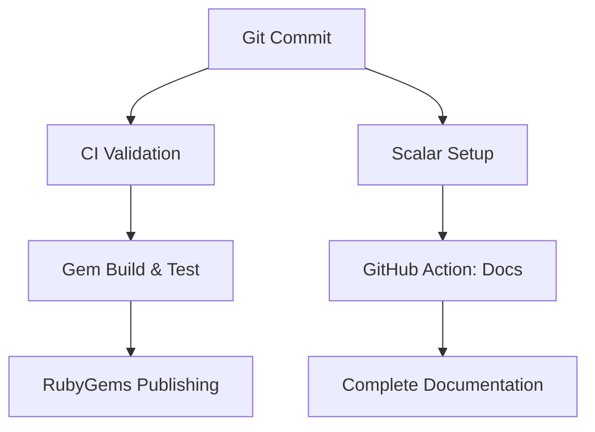

# Task Matrix: cyber-trackr-live Completion

## Current State: Ready for Initial Commit

### Repository Structure Status ✅
```
cyber-trackr-live/
├── .github/workflows/      ✅ CI/CD (updated from train-juniper)
├── openapi/               ✅ OpenAPI spec moved from root
├── lib/
│   ├── cyber_trackr_client/  ✅ Generated client (reorganized)
│   ├── cyber_trackr_helper/  ✅ Helper utilities
│   └── rubocop/             ✅ Custom cops for post-gen fixes
├── test/                    ✅ Tests organized (needs mock fixes)
├── scripts/                 ✅ Generation scripts updated
│   └── debug/              ✅ Debug utilities moved from test/
├── examples/               ✅ Usage examples
├── docs/                   ✅ Documentation
└── [gem files]            ✅ gemspec, Rakefile, etc.
```

### Recent Updates Completed
- ✅ Updated `scripts/generate_client.sh` to generate to `lib/cyber_trackr_client/`
- ✅ Fixed CI workflow to use `cyber_trackr_live.gemspec`
- ✅ Removed unused coverage analysis from CI
- ✅ Updated Rakefile with correct test paths (unit, openapi, integration)
- ✅ Moved scripts out of test directory to `scripts/debug/`
- ✅ Fixed test helper requires and load paths

## Overview
This matrix organizes remaining work across 2-3 sessions to complete the cyber-trackr-live project.

## Known Issues to Address 🔧

1. **Test Mocks Need Headers Fix**
   - Tests fail because mocked responses don't have proper headers structure
   - This is a test infrastructure issue, not a code issue
   - Need to update WebMock stubs to include headers property

2. **GitHub Actions Not Tested**
   - Workflows copied from train-juniper
   - May need adjustments for our structure
   - Will validate after initial push

## Session 2: Documentation & Final Prep (COMPLETED TODAY)

| Task | Migration Step | Priority | Status | Notes |
|------|----------------|----------|--------|-------|
| **Test Organization** | Step 3 support | 🔴 Critical | ✅ Done | Removed duplicate test, renamed files |
| **Fix Rakefile** | Step 3 support | 🔴 Critical | ✅ Done | Updated test paths, added release tasks |
| **Update Scripts** | Step 3 support | 🔴 Critical | ✅ Done | Fixed generate_client.sh paths |
| **CI/CD: Fix References** | **Step 4** | 🔴 Critical | ✅ Done | Removed train-juniper references |
| **Dot Files** | Step 5 support | 🟡 High | ✅ Done | Added .nvmrc, .tool-versions, etc |
| **Documentation Split** | Step 5 support | 🟡 High | ✅ Done | README.md, README-GEM.md, CONTRIBUTING.md |
| **Changelog Split** | Step 5 support | 🟡 High | ✅ Done | CHANGELOG-GEM.md, CHANGELOG-OPENAPI.md |
| **OpenAPI Docs Config** | **Step 5** | 🔴 Critical | ✅ Done | scalar.config.json, package.json, docs.yml uses CLI |
| **Version Management** | Step 6 support | 🟡 High | ✅ Done | Single source in openapi.yaml |
| **Release Process** | Step 6 support | 🟡 High | ✅ Done | version:major/minor/patch tasks |

## Session 3: Initial Commit & Deployment (NEXT PRIORITY)

| Task | Migration Step | Priority | Estimated Time | Dependencies | Success Criteria |
|------|----------------|----------|----------------|--------------|------------------|
| **Git: Initial Commit & Push** | Step 3 (final) | 🔴 Critical | 15 min | None | Repository visible on GitHub |
| **GitHub Actions: Verify CI** | **Step 4** | 🔴 Critical | 30 min | Git push | All workflows pass |
| **GitHub Pages: Enable** | **Step 5** | 🔴 Critical | 15 min | Git push | Pages settings configured |
| **Scalar Docs: Deploy** | **Step 5** | 🔴 Critical | 30 min | Pages enabled | Docs live at GitHub Pages |
| **Test Generation Script** | Step 3 validation | 🟡 High | 20 min | Docker | `./scripts/generate_client.sh` works |

**Session 2 Goal**: Functional repository with documentation and working CI

## Session 3: Complete Migration Steps 6-7 + Polish (MEDIUM PRIORITY)

| Task | Migration Step | Priority | Estimated Time | Dependencies | Success Criteria |
|------|----------------|----------|----------------|--------------|------------------|
| **RubyGems: Publishing Setup** | **Step 6** | 🔴 Critical | 45 min | Working gem | Release workflow configured |
| **Gem: Build & Test** | Step 6 prereq | 🔴 Critical | 30 min | Gemspec complete | `gem build` succeeds |
| **Release: Initial Version** | **Step 7** | 🔴 Critical | 30 min | RubyGems setup | v1.0.0 tagged and ready |
| **YARD: Ruby Client Docs** | Step 5 enhancement | 🟡 High | 45 min | Working structure | API docs generated |
| **Examples: Update & Test** | Step 3 validation | 🟡 High | 30 min | Working gem | All examples run |
| **Integration: Fix Test Issues** | Step 4 support | 🟠 Medium | 45 min | API access | Integration tests pass |
| **Version: Release Strategy** | Step 6 support | 🟠 Medium | 20 min | Gem working | Clear versioning plan |

**Session 3 Goal**: Publication-ready gem with comprehensive documentation

## Session 4: Advanced & Future (NICE TO HAVE)

| Task | Priority | Estimated Time | Dependencies | Success Criteria |
|------|----------|----------------|--------------|------------------|
| **RubyGems: Publishing Setup** | 🟠 Medium | 30 min | Working gem | Ready to publish |
| **OpenAPI: Add Missing Examples** | 🟠 Medium | 45 min | Working spec | 29 schema properties have examples |
| **Performance: Optimization** | 🟢 Low | 60 min | Working code | Faster generation |
| **Multi-language: Research** | 🟢 Low | 45 min | Working OpenAPI | Plan for Python/Go clients |
| **Examples: Advanced Usage** | 🟢 Low | 45 min | Working gem | Comprehensive examples |
| **Documentation: User Guides** | 🟢 Low | 60 min | Working docs | Complete user documentation |

**Session 4 Goal**: Production-ready with advanced features

## Priority Legend
- 🔴 **Critical**: Must complete for basic functionality
- 🟡 **High**: Important for quality release  
- 🟠 **Medium**: Nice to have for completeness
- 🟢 **Low**: Future enhancement

## Blocking Relationships



## Session Estimates
- **Session 2**: ~3 hours (Core functionality)
- **Session 3**: ~3.5 hours (Polish & prepare)  
- **Session 4**: ~4 hours (Advanced features)

## Success Metrics

### Session 2 Complete When:
- [x] Repository structure matches plan ✅ (DONE)
- [ ] Git repository committed and pushed
- [ ] Scalar docs generating and deploying
- [ ] GitHub Actions all green
- [ ] README shows gem installation/usage

### Session 3 Complete When:  
- [ ] `gem build cyber_trackr_live.gemspec` succeeds
- [ ] All unit tests passing
- [ ] Integration tests working or properly skipped
- [ ] Complete API documentation available
- [ ] Examples all functional

### Session 4 Complete When:
- [ ] Published to RubyGems (or ready to publish)
- [ ] Comprehensive documentation site
- [ ] Performance optimized
- [ ] Ready for production use by inspec-xccdf-mapper

## Critical Path to Original Goal

Remember: This enables the **InSpec Juniper resource documentation** goal!

```
cyber-trackr-live (Session 2-4) → 
inspec-xccdf-mapper (uses gem) → 
Fetch STIGs reliably → 
Generate InSpec resources → 
Documentation generation (ORIGINAL GOAL!)
```

## Risk Mitigation

### High Risk
- **Scalar docs**: May need alternative if Scalar doesn't work well
- **GitHub Actions**: May need significant customization from train-juniper version

### Medium Risk  
- **Integration tests**: API data quality issues may persist
- **Gem publishing**: RubyGems setup may have complexities

### Low Risk
- **Basic functionality**: Core code is working
- **Structure**: Matches proven train-juniper pattern