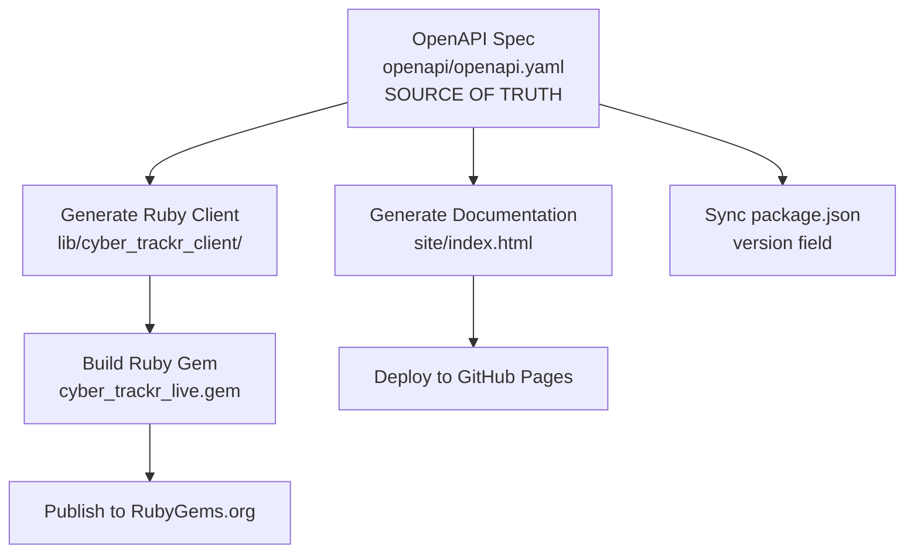

# Release Process

This document describes the release process for the cyber-trackr-live project.

## Overview

The cyber-trackr-live project uses an OpenAPI-first release process where the OpenAPI specification serves as the single source of truth for versioning. All other components (Ruby gem, documentation, package.json) are synchronized from this source.

## Project Architecture



## Prerequisites

1. **Ensure you're on the main branch and up to date**:
   ```bash
   git checkout main
   git pull origin main
   git status  # Should show no changes
   ```

2. **Ensure all tests pass**:
   ```bash
   bundle exec rake test
   bundle exec rubocop
   npm run docs:validate
   ```

3. **Verify Docker is available** (for client generation):
   ```bash
   docker --version
   ```

4. **Verify trusted publishing is configured** on RubyGems.org:
   - Go to https://rubygems.org/gems/cyber_trackr_live/trusted_publishers
   - Should show: GitHub Repository: `mitre/cyber-trackr-live`, Workflow: `release.yml`

## Release Workflow

### 1. Choose Version Bump Type

Decide on the version bump based on [Semantic Versioning](https://semver.org/):
- **Patch** (1.0.0 → 1.0.1): Bug fixes, minor OpenAPI updates
- **Minor** (1.0.0 → 1.1.0): New endpoints, new features, backward compatible
- **Major** (1.0.0 → 2.0.0): Breaking API changes, incompatible updates

### 2. Prepare the Release

Execute the appropriate rake task to prepare the release:

```bash
# For patch release (bug fixes, minor updates)
bundle exec rake release:patch

# For minor release (new features, new endpoints)
bundle exec rake release:minor

# For major release (breaking changes)
bundle exec rake release:major
```

This rake task will automatically:
- ✅ Update `openapi/openapi.yaml` with the new version (SOURCE OF TRUTH)
- ✅ Sync `package.json` version from OpenAPI spec
- ✅ Regenerate Ruby client with `make generate`
- ✅ Update `Gemfile.lock` with the new version
- ✅ Validate version consistency across all files
- ✅ Run all tests to ensure everything works
- ✅ Run linting to ensure code quality
- ✅ Update both `CHANGELOG-OPENAPI.md` and `CHANGELOG-GEM.md`
- ✅ Create release notes in `docs/release-notes/v{version}.md`
- ✅ Regenerate documentation with `npm run docs:build`
- ✅ Commit all changes with message "Bump version to {version}"

### 3. Review Changes

Before releasing, review what was changed:

```bash
# Review the commit
git show

# Check version consistency
bundle exec rake version_check

# Check the updated changelogs
cat CHANGELOG-OPENAPI.md
cat CHANGELOG-GEM.md

# Check the release notes
cat docs/release-notes/v{version}.md

# Verify documentation was regenerated
ls -la site/
```

### 4. Push Changes

Push your commits to GitHub:

```bash
git push origin main
```

### 5. Create Tag and Publish

Use our custom release process:

```bash
bundle exec rake release
```

This will:
- ✅ Create tag `v{version}`
- ✅ Push the tag to GitHub
- ⏭️ Trigger GitHub Actions to build and publish everything

### 6. Automated Publication

Once the tag is pushed, GitHub Actions will automatically:
1. Run the full test suite
2. Validate OpenAPI specification
3. Run security audits
4. Run linting checks
5. Deploy documentation to GitHub Pages
6. Create a GitHub Release using the pre-generated release notes
7. Build the gem
8. Publish to RubyGems.org using trusted publishing (OIDC authentication)

Monitor the release workflow at: https://github.com/mitre/cyber-trackr-live/actions

## Version Management

### Single Source of Truth

**`openapi/openapi.yaml`** is the ONLY place where version should be manually updated:

```yaml
info:
  version: 1.0.0  # Change ONLY here
```

### Automatic Synchronization

All other version references are automatically synchronized:

- **`lib/cyber_trackr_client/version.rb`** - Generated by OpenAPI Generator
- **`cyber_trackr_live.gemspec`** - Reads from version.rb  
- **`package.json`** - Synced by rake task
- **Git tags** - Created from OpenAPI version

### Version Consistency Validation

Before any build or release, run:

```bash
bundle exec rake version_check
```

This validates that all version references match the OpenAPI specification.

## Development Workflow

### Correct Order for Changes

1. **Edit OpenAPI specification** (`openapi/openapi.yaml`)
2. **Validate immediately**: `npm run docs:validate`
3. **If valid, regenerate everything**:
   ```bash
   npm run docs:build      # Documentation
   make generate           # Ruby client
   ```
4. **Test the regenerated code**: `bundle exec rake test`
5. **Fix any issues and repeat from step 2**

### When Making API Changes

```bash
# 1. Edit the OpenAPI spec
vim openapi/openapi.yaml

# 2. Validate immediately  
npm run docs:validate

# 3. Regenerate client and docs
make generate
npm run docs:build

# 4. Test everything
bundle exec rake test
bundle exec rubocop

# 5. Commit changes
git add .
git commit -m "feat: add new endpoint for XYZ"
```

## Release Types and Examples

### Patch Release (1.0.0 → 1.0.1)
- Bug fixes in helper code
- Documentation improvements
- Test improvements
- Minor OpenAPI spec clarifications

### Minor Release (1.0.0 → 1.1.0)
- New OpenAPI endpoints
- New helper methods
- New features (backward compatible)
- Enhanced documentation

### Major Release (1.0.0 → 2.0.0)
- Breaking changes to OpenAPI spec
- Removing deprecated endpoints
- Major refactoring
- Incompatible changes

## Troubleshooting

### "Working directory is not clean"
- Commit or stash your changes first
- Run `git status` to see what's changed

### "Must be on main branch"
- Switch to main: `git checkout main`
- Ensure it's up to date: `git pull origin main`

### Version consistency check fails
- Something is out of sync
- Run `bundle exec rake version_check` to see details
- May need to regenerate client: `make generate`

### Tests failing after regeneration
- Check if OpenAPI spec has issues
- Verify all required fields are present
- Check that examples are valid

### Client generation fails
- Ensure Docker is running
- Check that OpenAPI spec is valid: `npm run docs:validate`
- Review generation logs for specific errors

### GitHub Actions failing
- Check the [Actions tab](https://github.com/mitre/cyber-trackr-live/actions)
- Ensure trusted publishing is configured on RubyGems.org
- Verify all tests pass locally first

## Manual Steps (if needed)

### Regenerate Client Manually
```bash
make generate
```

### Sync Package.json Version Manually
```bash
# Get version from OpenAPI
VERSION=$(ruby -ryaml -e "puts YAML.load_file('openapi/openapi.yaml')['info']['version']")

# Update package.json
npm version $VERSION --no-git-tag-version
```

### Create GitHub Release Manually

If the automated release fails:

1. Go to https://github.com/mitre/cyber-trackr-live/releases/new
2. Choose the tag you just pushed
3. Copy content from `docs/release-notes/v{version}.md`
4. Publish the release

### Publish Gem Manually

If gem publication fails:

```bash
gem build cyber_trackr_live.gemspec
gem push cyber_trackr_live-{version}.gem
```

## File Dependencies

Understanding what depends on what:

```
openapi/openapi.yaml (SOURCE OF TRUTH)
    ├── lib/cyber_trackr_client/ (GENERATED - never edit manually)
    │   └── version.rb (GENERATED from OpenAPI)
    ├── cyber_trackr_live.gemspec (reads from version.rb)
    ├── package.json (synced by rake task)
    ├── site/index.html (GENERATED - Scalar docs)
    └── git tags (created from OpenAPI version)
```

## Best Practices

1. **Never edit generated files manually** - Always regenerate
2. **Always validate OpenAPI before regenerating** - Prevents broken clients
3. **Test immediately after regeneration** - Catch issues early
4. **Version consistently** - Use semantic versioning principles
5. **Document breaking changes** - Be explicit in changelog and release notes
6. **Monitor CI/CD** - Ensure releases complete successfully

## Integration with Other Projects

This gem is designed to be used by other MITRE projects:

- **inspec-xccdf-mapper** - Uses this gem to fetch STIG data reliably
- **Future projects** - Can depend on this stable API client

The release process ensures reliability for downstream consumers.

## Version History

See the changelogs for complete version history:
- [OpenAPI Changes](/reference/changelog-openapi)
- [Ruby Gem Changes](/reference/changelog-ruby)