# Client Generation Guide

Generate API clients in any language from our OpenAPI 3.1.1 specification. This guide covers everything you need to create production-ready clients for the cyber.trackr.live API.

## 🎯 **Why Generate Clients?**

```mermaid
graph TB
    A["🎯 OpenAPI 3.1.1 Specification<br/>Single Source of Truth"] --> B["🔧 OpenAPI Generator<br/>Industry Standard Tool"]
    B --> C["💎 Ruby Client<br/>Production Ready"]
    B --> D["🔮 TypeScript Client<br/>Web Applications"]
    B --> E["🐍 Python Client<br/>Data Science"]
    B --> F["🚀 Go Client<br/>High Performance"]
    B --> G["☕ Java Client<br/>Enterprise Apps"]
    B --> H["🔥 More Languages<br/>Community Driven"]
    
    style A fill:#007bff,stroke:#0056b3,stroke-width:3px,color:#ffffff
    style B fill:#fd7e14,stroke:#e55100,stroke-width:2px,color:#000000
    style C fill:#28a745,stroke:#1e7e34,stroke-width:2px,color:#ffffff
```



**Benefits of Generated Clients:**
- 🎯 **Type Safety** - Compile-time error checking
- 🔄 **Always Up-to-Date** - Generated from latest specification
- 📚 **Comprehensive Coverage** - All endpoints and models included
- 🧪 **Consistent Testing** - Same patterns across all languages
- 🚀 **Quick Integration** - Install and use immediately

## 🔧 **OpenAPI Generator**

We use [OpenAPI Generator](https://openapi-generator.tech/) - the industry-standard tool for generating API clients from OpenAPI specifications.

### **Installation**

```bash
# Option 1: Docker (Recommended)
docker pull openapitools/openapi-generator-cli

# Option 2: NPM
npm install -g @openapitools/openapi-generator-cli

# Option 3: Homebrew (macOS)
brew install openapi-generator

# Option 4: Download JAR
wget https://repo1.maven.org/maven2/org/openapitools/openapi-generator-cli/7.2.0/openapi-generator-cli-7.2.0.jar
```

### **Basic Usage**

```bash
# Generate client using Docker
docker run --rm -v "${PWD}:/local" openapitools/openapi-generator-cli generate \\
  -i https://raw.githubusercontent.com/mitre/cyber-trackr-live/main/openapi/openapi.yaml \\
  -g <generator-name> \\
  -o /local/generated-client

# Generate client using NPM
openapi-generator-cli generate \\
  -i https://raw.githubusercontent.com/mitre/cyber-trackr-live/main/openapi/openapi.yaml \\
  -g <generator-name> \\
  -o ./generated-client
```

## 🌐 **Supported Languages**

### **✅ Production Ready**

#### **Ruby**
```bash
# Our reference implementation
docker run --rm -v "${PWD}:/local" openapitools/openapi-generator-cli generate \\
  -i https://raw.githubusercontent.com/mitre/cyber-trackr-live/main/openapi/openapi.yaml \\
  -g ruby \\
  --library=faraday \\
  --additional-properties=gemName=cyber_trackr_live,gemVersion=1.0.0 \\
  -o /local/ruby-client
```

#### **TypeScript/JavaScript**
```bash
# For web applications and Node.js
docker run --rm -v "${PWD}:/local" openapitools/openapi-generator-cli generate \\
  -i https://raw.githubusercontent.com/mitre/cyber-trackr-live/main/openapi/openapi.yaml \\
  -g typescript-fetch \\
  --additional-properties=npmName=cyber-trackr-live,npmVersion=1.0.0 \\
  -o /local/typescript-client
```

#### **Python**
```bash
# For data science and automation
docker run --rm -v "${PWD}:/local" openapitools/openapi-generator-cli generate \\
  -i https://raw.githubusercontent.com/mitre/cyber-trackr-live/main/openapi/openapi.yaml \\
  -g python \\
  --additional-properties=packageName=cyber_trackr_live,packageVersion=1.0.0 \\
  -o /local/python-client
```

#### **Go**
```bash
# For high-performance microservices
docker run --rm -v "${PWD}:/local" openapitools/openapi-generator-cli generate \\
  -i https://raw.githubusercontent.com/mitre/cyber-trackr-live/main/openapi/openapi.yaml \\
  -g go \\
  --additional-properties=packageName=cybertrackrlive,packageVersion=1.0.0 \\
  -o /local/go-client
```

#### **Java**
```bash
# For enterprise applications
docker run --rm -v "${PWD}:/local" openapitools/openapi-generator-cli generate \\
  -i https://raw.githubusercontent.com/mitre/cyber-trackr-live/main/openapi/openapi.yaml \\
  -g java \\
  --library=okhttp-gson \\
  --additional-properties=groupId=live.trackr.cyber,artifactId=cyber-trackr-client,apiPackage=live.trackr.cyber.api,modelPackage=live.trackr.cyber.model \\
  -o /local/java-client
```

### **🔧 Community Supported**

#### **C#**
```bash
docker run --rm -v "${PWD}:/local" openapitools/openapi-generator-cli generate \\
  -i https://raw.githubusercontent.com/mitre/cyber-trackr-live/main/openapi/openapi.yaml \\
  -g csharp \\
  --additional-properties=packageName=CyberTrackrLive,packageVersion=1.0.0 \\
  -o /local/csharp-client
```

#### **PHP**
```bash
docker run --rm -v "${PWD}:/local" openapitools/openapi-generator-cli generate \\
  -i https://raw.githubusercontent.com/mitre/cyber-trackr-live/main/openapi/openapi.yaml \\
  -g php \\
  --additional-properties=packageName=CyberTrackrLive,packageVersion=1.0.0 \\
  -o /local/php-client
```

#### **Rust**
```bash
docker run --rm -v "${PWD}:/local" openapitools/openapi-generator-cli generate \\
  -i https://raw.githubusercontent.com/mitre/cyber-trackr-live/main/openapi/openapi.yaml \\
  -g rust \\
  --additional-properties=packageName=cyber_trackr_live,packageVersion=1.0.0 \\
  -o /local/rust-client
```

## 🎛️ **Advanced Configuration**

### **Custom Generator Options**

```bash
# List available generators
openapi-generator-cli list

# Get help for specific generator
openapi-generator-cli config-help -g python

# Generate with custom configuration
openapi-generator-cli generate \\
  -i https://raw.githubusercontent.com/mitre/cyber-trackr-live/main/openapi/openapi.yaml \\
  -g python \\
  -c custom-config.json \\
  -o ./python-client
```

### **Configuration Files**

Create a `config.json` file for consistent generation:

```json
{
  "packageName": "cyber_trackr_live",
  "packageVersion": "1.0.0",
  "packageCompany": "MITRE Corporation",
  "packageAuthors": "MITRE Corporation",
  "packageCopyright": "Copyright 2025 MITRE Corporation",
  "packageDescription": "Python client for cyber.trackr.live API - DISA cybersecurity data",
  "packageUrl": "https://github.com/mitre/cyber-trackr-live",
  "projectName": "cyber-trackr-live",
  "clientPackage": "cyber_trackr_live",
  "packageKeywords": ["cybersecurity", "compliance", "stig", "disa", "api"]
}
```

### **Template Customization**

```bash
# Download templates for customization
openapi-generator-cli author template -g python -o ./python-templates

# Generate with custom templates
openapi-generator-cli generate \\
  -i https://raw.githubusercontent.com/mitre/cyber-trackr-live/main/openapi/openapi.yaml \\
  -g python \\
  -t ./python-templates \\
  -o ./python-client
```

## 🔄 **Generation Workflow**

### **Development Workflow**


### **Automated Generation**

```bash
#!/bin/bash
# generate-all-clients.sh

set -e

SPEC_URL="https://raw.githubusercontent.com/mitre/cyber-trackr-live/main/openapi/openapi.yaml"
VERSION="1.0.0"

echo "🔄 Generating all clients from OpenAPI specification..."

# Ruby (Reference Implementation)
echo "📦 Generating Ruby client..."
docker run --rm -v "${PWD}:/local" openapitools/openapi-generator-cli generate \\
  -i $SPEC_URL -g ruby --library=faraday \\
  --additional-properties=gemName=cyber_trackr_live,gemVersion=$VERSION \\
  -o /local/clients/ruby

# TypeScript
echo "📦 Generating TypeScript client..."
docker run --rm -v "${PWD}:/local" openapitools/openapi-generator-cli generate \\
  -i $SPEC_URL -g typescript-fetch \\
  --additional-properties=npmName=cyber-trackr-live,npmVersion=$VERSION \\
  -o /local/clients/typescript

# Python
echo "📦 Generating Python client..."
docker run --rm -v "${PWD}:/local" openapitools/openapi-generator-cli generate \\
  -i $SPEC_URL -g python \\
  --additional-properties=packageName=cyber_trackr_live,packageVersion=$VERSION \\
  -o /local/clients/python

# Go
echo "📦 Generating Go client..."
docker run --rm -v "${PWD}:/local" openapitools/openapi-generator-cli generate \\
  -i $SPEC_URL -g go \\
  --additional-properties=packageName=cybertrackrlive,packageVersion=$VERSION \\
  -o /local/clients/go

echo "✅ All clients generated successfully!"
```

## 📚 **Language-Specific Guides**

### **Ruby Client Usage**

```ruby
# Generated Ruby client usage
require 'cyber_trackr_live'

# Initialize client
client = CyberTrackrLive::DefaultApi.new

# List STIGs
stigs = client.list_stigs
puts "Found #{stigs.count} STIGs"

# Get specific STIG
stig = client.get_stig('Juniper_SRX_Services_Gateway_ALG', '3', '3')
puts "STIG: #{stig.title}"
```

### **TypeScript Client Usage**

```typescript
// Generated TypeScript client usage
import { DefaultApi, Configuration } from 'cyber-trackr-live';

const config = new Configuration({
  basePath: 'https://cyber.trackr.live'
});

const client = new DefaultApi(config);

// List STIGs
const stigs = await client.listStigs();
console.log(`Found ${stigs.length} STIGs`);

// Get specific STIG
const stig = await client.getStig('Juniper_SRX_Services_Gateway_ALG', '3', '3');
console.log(`STIG: ${stig.title}`);
```

### **Python Client Usage**

```python
# Generated Python client usage
import cyber_trackr_live
from cyber_trackr_live.rest import ApiException

# Initialize client
configuration = cyber_trackr_live.Configuration(
    host = "https://cyber.trackr.live"
)
client = cyber_trackr_live.DefaultApi(
    cyber_trackr_live.ApiClient(configuration)
)

# List STIGs
try:
    stigs = client.list_stigs()
    print(f"Found {len(stigs)} STIGs")
except ApiException as e:
    print(f"Error: {e}")

# Get specific STIG
try:
    stig = client.get_stig('Juniper_SRX_Services_Gateway_ALG', '3', '3')
    print(f"STIG: {stig.title}")
except ApiException as e:
    print(f"Error: {e}")
```

### **Go Client Usage**

```go
// Generated Go client usage
package main

import (
    "context"
    "fmt"
    "log"
    
    cybertrackrlive "github.com/your-username/go-client"
)

func main() {
    cfg := cybertrackrlive.NewConfiguration()
    cfg.BasePath = "https://cyber.trackr.live"
    
    client := cybertrackrlive.NewAPIClient(cfg)
    
    // List STIGs
    stigs, _, err := client.DefaultApi.ListStigs(context.Background())
    if err != nil {
        log.Fatal(err)
    }
    fmt.Printf("Found %d STIGs\\n", len(stigs))
    
    // Get specific STIG
    stig, _, err := client.DefaultApi.GetStig(context.Background(), 
        "Juniper_SRX_Services_Gateway_ALG", "3", "3")
    if err != nil {
        log.Fatal(err)
    }
    fmt.Printf("STIG: %s\\n", stig.Title)
}
```

## 🧪 **Testing Generated Clients**

### **Basic Functionality Test**

```bash
# Test script for any generated client
#!/bin/bash
echo "🧪 Testing generated client..."

# Test 1: Client can be imported/required
echo "✅ Testing client import..."

# Test 2: Client can connect to API
echo "✅ Testing API connection..."

# Test 3: Client can fetch data
echo "✅ Testing data fetching..."

# Test 4: Client handles errors gracefully
echo "✅ Testing error handling..."

echo "✅ All tests passed!"
```

### **Integration Testing**

```yaml
# GitHub Actions workflow for client testing
name: Test Generated Clients
on: [push, pull_request]

jobs:
  test-clients:
    runs-on: ubuntu-latest
    strategy:
      matrix:
        language: [ruby, python, typescript, go]
    
    steps:
      - uses: actions/checkout@v3
      
      - name: Generate ${{ matrix.language }} client
        run: |
          docker run --rm -v "${PWD}:/local" openapitools/openapi-generator-cli generate \\
            -i /local/openapi/openapi.yaml \\
            -g ${{ matrix.language }} \\
            -o /local/test-client
      
      - name: Test ${{ matrix.language }} client
        run: |
          cd test-client
          # Language-specific test commands
          ./test-client.sh
```

## 🔄 **Version Management**

### **Version Synchronization**

All generated clients follow the same versioning as the OpenAPI specification:

```bash
# Update all clients to new version
VERSION="1.1.0"

# Update specification version
sed -i "s/version: .*/version: $VERSION/" openapi/openapi.yaml

# Regenerate all clients with new version
./scripts/generate-all-clients.sh $VERSION
```

### **Client Release Process**

1. **Update OpenAPI specification** version
2. **Validate specification** with Spectral
3. **Generate all clients** with new version
4. **Test generated clients** against live API
5. **Update documentation** with new features
6. **Tag and release** clients

## 📊 **Generator Comparison**

| Language | Generator | Library | Type Safety | Async Support | Community |
|----------|-----------|---------|-------------|---------------|-----------|
| Ruby | ruby | faraday | ⭐⭐⭐ | ✅ | ⭐⭐⭐⭐⭐ |
| TypeScript | typescript-fetch | fetch | ⭐⭐⭐⭐⭐ | ✅ | ⭐⭐⭐⭐⭐ |
| Python | python | requests | ⭐⭐⭐ | ✅ | ⭐⭐⭐⭐⭐ |
| Go | go | net/http | ⭐⭐⭐⭐⭐ | ✅ | ⭐⭐⭐⭐ |
| Java | java | okhttp-gson | ⭐⭐⭐⭐⭐ | ✅ | ⭐⭐⭐⭐⭐ |

## 🔧 **Troubleshooting**

### **Common Issues**

**Issue**: Generator not found
```bash
# Solution: Update generator list
openapi-generator-cli list | grep python
```

**Issue**: Invalid specification
```bash
# Solution: Validate specification first
spectral lint openapi/openapi.yaml
```

**Issue**: Generated client compilation errors
```bash
# Solution: Check generator version compatibility
openapi-generator-cli version
```

### **Debug Mode**

```bash
# Enable debug output
openapi-generator-cli generate \\
  -i openapi/openapi.yaml \\
  -g python \\
  --enable-post-process-file \\
  --global-property=debugModels,debugOperations \\
  -o ./debug-client
```

## 🌟 **Best Practices**

### **Generator Selection**

- ✅ **Use stable generators** - Prefer generators marked as stable
- ✅ **Test before production** - Always test generated clients
- ✅ **Version consistency** - Keep all clients on same spec version
- ✅ **Documentation** - Generate documentation with clients
- ✅ **Error handling** - Implement proper error handling

### **Customization**

- 🎯 **Custom templates** - Modify templates for specific needs
- 🎯 **Configuration files** - Use JSON config for consistency
- 🎯 **Post-processing** - Add custom logic after generation
- 🎯 **Package metadata** - Include proper package information

## 📚 **Resources**

### **Documentation**
- **[OpenAPI Generator Documentation](https://openapi-generator.tech/docs/)**
- **[Generator List](https://openapi-generator.tech/docs/generators)**
- **[Configuration Options](https://openapi-generator.tech/docs/configuration)**

### **Community**
- **[GitHub Repository](https://github.com/OpenAPITools/openapi-generator)**
- **[Stack Overflow](https://stackoverflow.com/questions/tagged/openapi-generator)**
- **[Discord Community](https://discord.gg/openapi-generator)**

---

**Generate clients in your preferred language and start using the cyber.trackr.live API immediately!** All clients are generated from the same OpenAPI specification, ensuring consistency and reliability across language implementations.