# Client Generation Overview

Generate API clients in any language from our OpenAPI 3.1.1 specification. This guide covers everything you need to create production-ready clients for the cyber.trackr.live API.

## 🎯 **Why Generate Clients?**

```mermaid
graph TB
    A["🎯 OpenAPI 3.1.1 Specification<br/>Single Source of Truth"] --> B["🔧 OpenAPI Generator<br/>Industry Standard Tool"]
    B --> C["💎 Ruby Client<br/>Production Ready"]
    B --> D["🔮 TypeScript Client<br/>Web Applications"]
    B --> E["🐍 Python Client<br/>Data Science"]
    B --> F["🚀 Go Client<br/>High Performance"]
    B --> G["☕ Java Client<br/>Enterprise Apps"]
    B --> H["🔥 More Languages<br/>Community Driven"]
    
    style A fill:#007bff,stroke:#0056b3,stroke-width:3px,color:#ffffff
    style B fill:#fd7e14,stroke:#e55100,stroke-width:2px,color:#000000
    style C fill:#28a745,stroke:#1e7e34,stroke-width:2px,color:#ffffff
```



**Benefits of Generated Clients:**
- 🎯 **Type Safety** - Compile-time error checking
- 🔄 **Always Up-to-Date** - Generated from latest specification
- 📚 **Comprehensive Coverage** - All endpoints and models included
- 🧪 **Consistent Testing** - Same patterns across all languages
- 🚀 **Quick Integration** - Install and use immediately

## 🔧 **OpenAPI Generator**

We use [OpenAPI Generator](https://openapi-generator.tech/) - the industry-standard tool for generating API clients from OpenAPI specifications.

### **Installation**

```bash
# Option 1: Docker (Recommended)
docker pull openapitools/openapi-generator-cli

# Option 2: NPM
npm install -g @openapitools/openapi-generator-cli

# Option 3: Homebrew (macOS)
brew install openapi-generator

# Option 4: Download JAR
wget https://repo1.maven.org/maven2/org/openapitools/openapi-generator-cli/7.2.0/openapi-generator-cli-7.2.0.jar
```

### **Basic Usage**

```bash
# Generate client using Docker
docker run --rm -v "${PWD}:/local" openapitools/openapi-generator-cli generate \
  -i https://raw.githubusercontent.com/mitre/cyber-trackr-live/main/openapi/openapi.yaml \
  -g <generator-name> \
  -o /local/generated-client

# Generate client using NPM
openapi-generator-cli generate \
  -i https://raw.githubusercontent.com/mitre/cyber-trackr-live/main/openapi/openapi.yaml \
  -g <generator-name> \
  -o ./generated-client
```

## 📚 **Next Steps**

Ready to generate your first client? Choose your path:

- **[Language Commands](./languages.md)** - Ready-to-use generation commands for all supported languages
- **[Advanced Configuration](./advanced.md)** - Custom templates, automation, and enterprise features
- **[Usage Examples](./usage.md)** - See generated clients in action with practical examples
- **[Reference Guide](./reference.md)** - Troubleshooting, best practices, and complete documentation

## 🚀 **Quick Start**

For the impatient, here's a one-liner to generate a Ruby client:

```bash
docker run --rm -v "${PWD}:/local" openapitools/openapi-generator-cli generate \
  -i https://raw.githubusercontent.com/mitre/cyber-trackr-live/main/openapi/openapi.yaml \
  -g ruby --library=faraday \
  --additional-properties=gemName=my_cyber_client,gemVersion=1.0.0 \
  -o /local/my-ruby-client
```

More languages and detailed configuration available in [Language Commands](./languages.md).