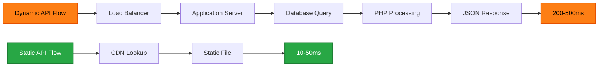

# Static API Generation Guide

High-performance static file generation for read-heavy APIs - transforming dynamic APIs into blazing-fast static file delivery with infinite scalability.

## 🎯 **When Static Generation is Perfect**

Static API generation works exceptionally well for APIs with specific characteristics:

### **Ideal API Characteristics**

```mermaid
graph TD
    A["Evaluate Your API"] --> B["Read-Heavy Traffic<br/>95%+ GET requests"]
    A --> C["Stable Data<br/>Infrequent updates"]
    A --> D["Public Access<br/>No complex auth"]
    A --> E["Performance Critical<br/>Speed matters"]
    
    B --> F["✅ Perfect Fit for Static Generation"]
    C --> F
    D --> F
    E --> F
    
    F --> G["4x Performance Improvement"]
    F --> H["Infinite Scalability"]
    F --> I["Lower Costs"]
    
    style A fill:#007bff,stroke:#0056b3,stroke-width:2px,color:#ffffff
    style F fill:#28a745,stroke:#1e7e34,stroke-width:2px,color:#ffffff
    style G fill:#28a745,stroke:#1e7e34,stroke-width:2px,color:#ffffff
    style H fill:#28a745,stroke:#1e7e34,stroke-width:2px,color:#ffffff
    style I fill:#28a745,stroke:#1e7e34,stroke-width:2px,color:#ffffff
```



### **Perfect Candidates**
- **Compliance Data APIs** (STIGs, SRGs, CCIs) - Updated weekly/monthly
- **Reference Data APIs** - Product catalogs, documentation sites
- **Archive APIs** - Historical data that rarely changes
- **Public APIs** - Open data that benefits from global CDN distribution

## 🚀 **Performance Benefits**

### **Static vs Dynamic Comparison**

| **Metric** | **Dynamic API** | **Static API** | **Improvement** |
|------------|-----------------|----------------|-----------------|
| **Response Time** | 200-500ms | 10-50ms | **4-10x faster** |
| **Scalability** | Database limits | CDN limits | **Infinite** |
| **Server Load** | High CPU/DB | Minimal | **95% reduction** |
| **Global Access** | Single region | CDN worldwide | **Global** |
| **Uptime** | 99.5% (DB deps) | 99.99% (CDN) | **Higher** |

### **Real-World Performance**



## 🏗️ **Implementation Approaches**

### **Laravel Implementation**

For Laravel APIs, create a console command to generate static files:

```php
// app/Console/Commands/BuildStaticApi.php
<?php

namespace App\Console\Commands;

use Illuminate\Console\Command;

class BuildStaticApi extends Command
{
    protected $signature = 'build:static-api {--force}';
    protected $description = 'Build static API files from dynamic data';

    public function handle()
    {
        $this->info('Building static API files...');
        
        // Create output directory
        $apiPath = public_path('api');
        if ($this->option('force') && is_dir($apiPath)) {
            $this->info('Removing existing API files...');
            shell_exec("rm -rf {$apiPath}");
        }
        
        if (!is_dir($apiPath)) {
            mkdir($apiPath, 0755, true);
        }
        
        // Generate each endpoint
        $this->buildEndpoints();
        
        $this->info('Static API build complete!');
    }
    
    private function buildEndpoints()
    {
        // Build main endpoints
        $this->buildDocumentsList();
        $this->buildStigs();
        $this->buildSrgs();
        $this->buildCcis();
        $this->buildRmfControls();
        
        // Build individual document endpoints
        $this->buildIndividualDocuments();
    }
    
    private function buildDocumentsList()
    {
        $this->info('Building /api/stig endpoint...');
        
        $documents = $this->collectAllDocuments();
        
        file_put_contents(
            public_path('api/stig.json'),
            json_encode($documents, JSON_PRETTY_PRINT | JSON_UNESCAPED_SLASHES)
        );
        
        $this->info("Generated stig.json with " . count($documents) . " documents");
    }
    
    private function buildStigs()
    {
        $this->info('Building individual STIG endpoints...');
        
        $stigs = $this->getDocumentsByType('stig');
        
        foreach ($stigs as $stigId => $versions) {
            foreach ($versions as $version => $releases) {
                foreach ($releases as $release => $data) {
                    $this->buildStigEndpoint($stigId, $version, $release, $data);
                }
            }
        }
    }
    
    private function buildStigEndpoint($stigId, $version, $release, $data)
    {
        // Create directory structure: /api/stig/{id}/{version}/{release}/
        $dir = public_path("api/stig/{$stigId}/{$version}/{$release}");
        if (!is_dir($dir)) {
            mkdir($dir, 0755, true);
        }
        
        // Generate metadata endpoint
        file_put_contents(
            "{$dir}/index.json",
            json_encode($data['metadata'], JSON_PRETTY_PRINT)
        );
        
        // Generate requirements endpoint
        file_put_contents(
            "{$dir}/requirements.json",
            json_encode($data['requirements'], JSON_PRETTY_PRINT)
        );
        
        $this->info("Generated {$stigId} v{$version}.{$release}");
    }
}
```

### **Build Process Integration**

```bash
#!/bin/bash
# scripts/build-static-api.sh

echo "🔄 Updating source data..."
# Download latest DISA releases
wget -O storage/xml/latest-stigs.xml https://disa.mil/latest-stigs.xml
wget -O storage/xml/latest-srgs.xml https://disa.mil/latest-srgs.xml

echo "🏗️ Building static API..."
php artisan build:static-api --force

echo "🔍 Validating generated files..."
# Validate JSON syntax
find public/api -name "*.json" -exec php -l {} \;

echo "📊 Generating statistics..."
echo "Generated files: $(find public/api -name "*.json" | wc -l)"
echo "Total size: $(du -sh public/api)"

echo "🚀 Deployment ready!"
```

## 🌐 **Deployment Strategies**

### **GitHub Pages Deployment**

Perfect for open source projects with public data:

```yaml
# .github/workflows/build-api.yml
name: Build Static API

on:
  schedule:
    - cron: '0 2 * * 1'  # Weekly builds
  push:
    paths: ['data/**', 'scripts/**']
  workflow_dispatch:

jobs:
  build:
    runs-on: ubuntu-latest
    steps:
      - uses: actions/checkout@v4
      
      - name: Setup PHP
        uses: shivammathur/setup-php@v2
        with:
          php-version: '8.2'
          
      - name: Install dependencies
        run: composer install --no-dev --optimize-autoloader
        
      - name: Build static API
        run: php artisan build:static-api --force
        
      - name: Deploy to GitHub Pages
        uses: peaceiris/actions-gh-pages@v3
        with:
          github_token: ${{ secrets.GITHUB_TOKEN }}
          publish_dir: ./public/api
          destination_dir: api
```

### **CDN Deployment**

For maximum performance with global distribution:

```bash
#!/bin/bash
# deploy-to-cdn.sh

echo "🏗️ Building static API..."
php artisan build:static-api --force

echo "🌐 Deploying to CDN..."
# AWS S3 + CloudFront
aws s3 sync public/api/ s3://your-api-bucket/api/ \
  --delete \
  --cache-control "max-age=3600" \
  --metadata-directive REPLACE

# Invalidate CloudFront cache
aws cloudfront create-invalidation \
  --distribution-id YOUR_DISTRIBUTION_ID \
  --paths "/api/*"

echo "✅ Deployment complete!"
echo "API available at: https://your-cdn-domain.com/api/"
```

### **Hybrid Approach**

Maintain dynamic API for administration while serving static files for public access:

```nginx
# nginx.conf
server {
    listen 443 ssl;
    server_name api.yoursite.com;
    
    # Static API for public endpoints
    location /api/stig {
        root /var/www/static;
        try_files $uri $uri.json @dynamic;
        
        # Cache headers for static files
        expires 1h;
        add_header Cache-Control "public, immutable";
    }
    
    # Dynamic API for admin/write operations
    location @dynamic {
        proxy_pass http://laravel-backend;
        proxy_set_header Host $host;
    }
    
    # Admin endpoints always dynamic
    location /admin {
        proxy_pass http://laravel-backend;
    }
}
```

## 🔄 **Data Update Workflows**

### **Automated Updates**

```php
// app/Console/Kernel.php
protected function schedule(Schedule $schedule)
{
    // Check for DISA updates weekly
    $schedule->command('data:check-updates')
             ->weekly()
             ->mondays()
             ->at('02:00');
             
    // Rebuild API if updates found
    $schedule->command('build:static-api --force')
             ->weekly()
             ->mondays()
             ->at('03:00')
             ->when(function () {
                 return cache()->has('data_updates_available');
             });
}
```

### **Update Detection**

```php
// app/Console/Commands/CheckDataUpdates.php
class CheckDataUpdates extends Command
{
    public function handle()
    {
        $this->info('Checking for DISA data updates...');
        
        $currentHash = $this->getCurrentDataHash();
        $remoteHash = $this->getRemoteDataHash();
        
        if ($currentHash !== $remoteHash) {
            $this->info('Updates detected! Flagging for rebuild...');
            cache()->put('data_updates_available', true, now()->addDays(7));
            
            // Optional: Trigger immediate rebuild
            if ($this->option('auto-rebuild')) {
                $this->call('build:static-api', ['--force' => true]);
            }
        } else {
            $this->info('No updates found.');
        }
    }
}
```

## 📊 **Monitoring & Analytics**

### **Performance Monitoring**

```javascript
// Add to static files for client-side monitoring
(function() {
    const startTime = performance.now();
    
    // Track API response times
    window.addEventListener('load', function() {
        const loadTime = performance.now() - startTime;
        
        // Send metrics to analytics
        fetch('/api/metrics', {
            method: 'POST',
            body: JSON.stringify({
                endpoint: window.location.pathname,
                loadTime: loadTime,
                timestamp: Date.now()
            })
        });
    });
})();
```

### **Usage Analytics**

```bash
# Log analysis for static API usage
# /var/log/nginx/api-access.log

# Most requested endpoints
awk '{print $7}' api-access.log | sort | uniq -c | sort -nr | head -10

# Response time distribution
awk '{print $10}' api-access.log | sort -n | head -1000 | tail -1

# Geographic distribution (with CloudFlare headers)
awk '{print $12}' api-access.log | sort | uniq -c | sort -nr
```

## 🎯 **Success Metrics**

### **Performance Improvements**
- **Response Time**: Measure P50, P95, P99 latencies
- **Throughput**: Requests per second capacity
- **Global Performance**: Response times from different regions

### **Operational Benefits**
- **Server Load**: CPU and memory usage reduction
- **Cost Savings**: Infrastructure cost comparison
- **Uptime**: Availability improvements with CDN

### **Developer Experience**
- **Documentation Quality**: Interactive docs always current
- **Client Integration**: Easier integration with generated clients
- **API Consistency**: Specification-driven development benefits

## 🚀 **Next Steps**

### **Getting Started**
1. **Assess Your API** - Use our evaluation criteria
2. **Prototype Build** - Create basic static generation
3. **Performance Test** - Compare static vs dynamic response times
4. **Plan Migration** - Develop rollout strategy

### **Advanced Features**
- **Incremental Updates** - Only rebuild changed data
- **A/B Testing** - Compare static vs dynamic performance
- **Edge Caching** - Advanced CDN optimization
- **API Versioning** - Multiple API versions support

---

**Ready to implement static generation?** Start with our [OpenAPI-First Methodology](./openapi-first.md) and [Laravel Migration Guide](./laravel-migration.md) for complete implementation guidance.