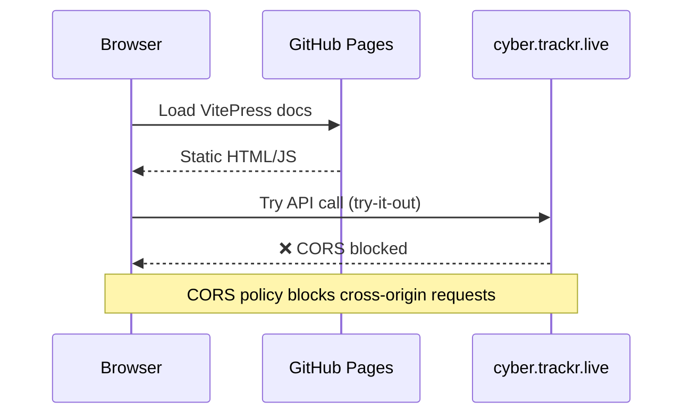
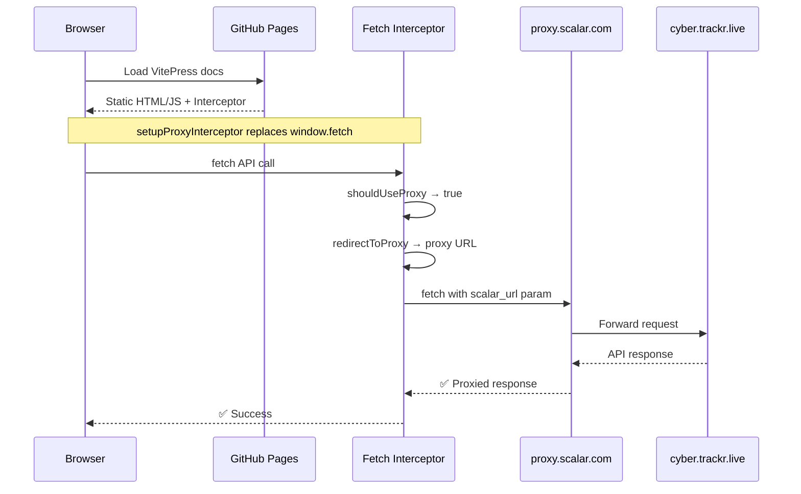
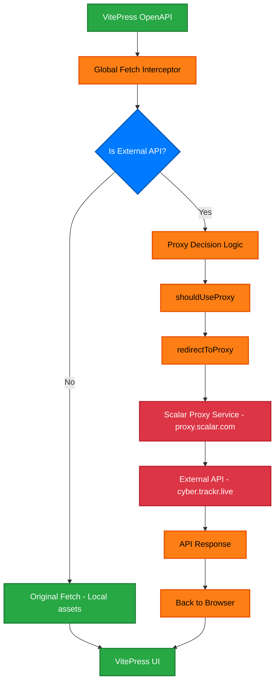

# CORS Proxy Solution for Static Site Documentation

## Overview

Interactive OpenAPI documentation on static hosting platforms (like GitHub Pages) faces CORS limitations when trying to make API calls. Our solution uses a global fetch interceptor with Scalar's proven proxy methodology.

## The CORS Problem



## Our Solution: Global Fetch Interceptor



## Implementation Architecture



## Key Components

### 1. Proxy Detection Logic
```javascript
function shouldUseProxy(proxyUrl, url) {
  // Don't proxy localhost/relative URLs
  if (isRelativePath(url) || isLocalUrl(url)) return false
  
  // Proxy external APIs through remote proxy service
  return !isLocalUrl(proxyUrl) && !isLocalUrl(url)
}
```

### 2. URL Transformation  
```javascript
function redirectToProxy(proxyUrl, url) {
  const newUrl = new URL(proxyUrl)
  newUrl.searchParams.append('scalar_url', url)
  return newUrl.toString()
}
```

### 3. Global Fetch Replacement
```javascript
const originalFetch = window.fetch
window.fetch = async function(input, init) {
  const url = typeof input === 'string' ? input : input.url
  
  if (shouldUseProxy(proxyUrl, url)) {
    return fetchWithProxyFallback(url, proxyUrl, originalFetch)
  }
  
  return originalFetch.call(this, input, init)
}
```

## Benefits

### ✅ **Production Ready**
- Works on any static hosting platform
- No server-side configuration required
- Uses proven Scalar proxy infrastructure

### ✅ **Transparent Operation**
- VitePress OpenAPI sees original server URLs
- No URL manipulation in documentation  
- Automatic proxy routing for external APIs

### ✅ **Development Friendly**
- Same code works in development and production
- Easy to enable/disable for debugging
- Comprehensive logging for troubleshooting

### ✅ **Scalable Solution**
- Handles simple and complex API endpoints
- Graceful fallback if proxy fails
- No performance impact on local resources

## Real-World Example

### Original API Call:
```
https://cyber.trackr.live/api/stig/Juniper_SRX_Services_Gateway_ALG/3/3
```

### Intercepted and Proxied:
```
https://proxy.scalar.com/?scalar_url=https%3A%2F%2Fcyber.trackr.live%2Fapi%2Fstig%2FJuniper_SRX_Services_Gateway_ALG%2F3%2F3
```

### Result:
- ✅ API call succeeds  
- ✅ Response data identical
- ✅ Try-it-out functionality works
- ✅ CORS completely handled

## Universal Pattern

This solution works for **any OpenAPI project** needing interactive documentation on static hosting:

1. **Copy the proxy interceptor plugin**
2. **Configure for your API endpoints**  
3. **Deploy to GitHub Pages/Netlify/etc.**
4. **Interactive docs work perfectly**

The pattern eliminates the fundamental limitation of static site hosting for API documentation, making it possible to have full-featured interactive docs without server infrastructure.