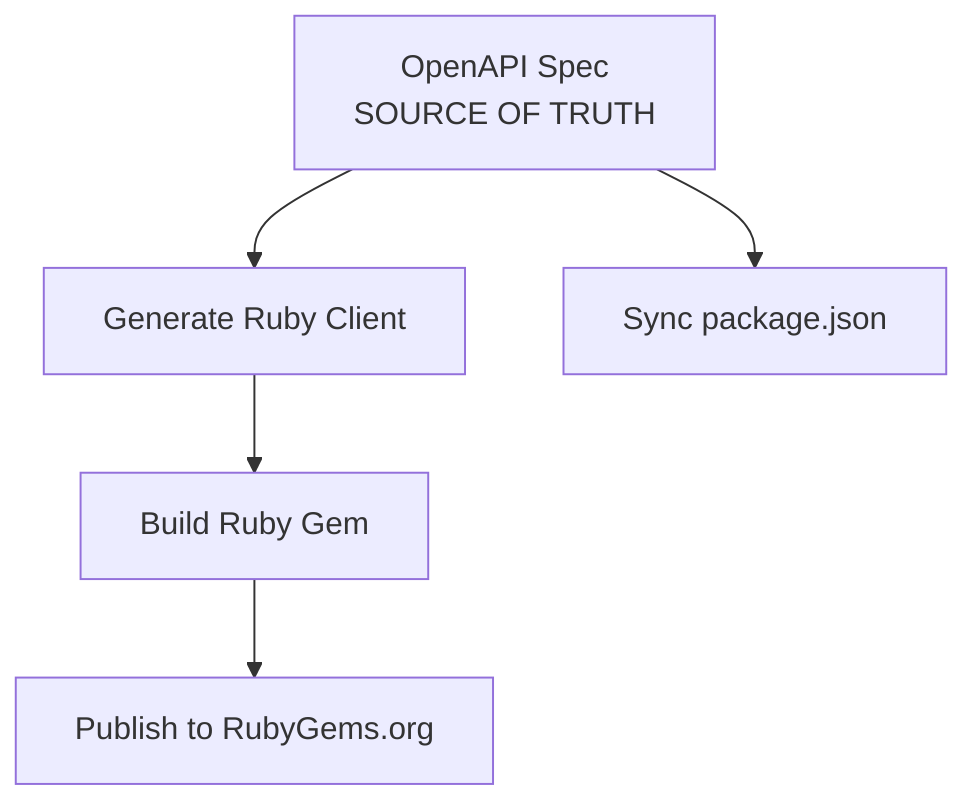
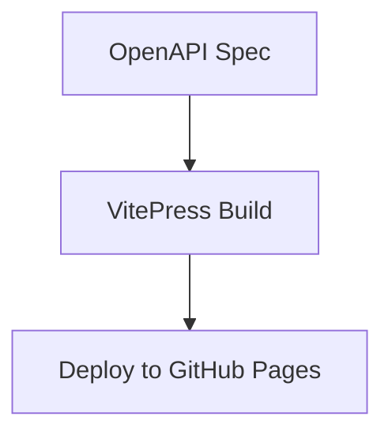
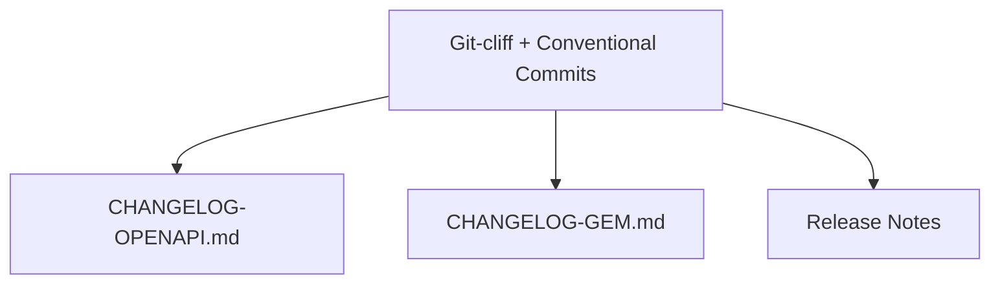
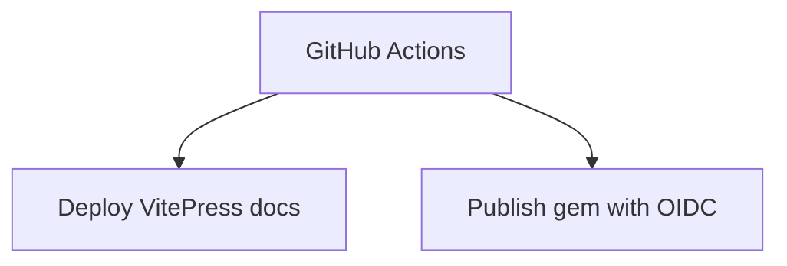

# Integrated System Architecture Analysis

## Overview

The cyber-trackr-live project now features a **fully integrated VitePress + Git-cliff + GitHub Actions** system that maintains the existing OpenAPI-first workflow while adding professional documentation deployment and automated changelog generation.

## System Architecture

### OpenAPI-First Workflow


### Documentation Workflow  


### Changelog Generation Workflow


### GitHub Actions Deployment


## Key Integration Points

### 1. Rake Task Integration
**File**: `tasks/release.rake`

**Changes**:
- **Line 83-86**: Replaced manual changelog generation with `generate_changelog_with_git_cliff()`
- **New Methods**:
  - `generate_changelog_with_git_cliff()` - Dual changelog generation with path filtering
  - `create_release_notes_with_git_cliff()` - Professional release notes with installation guides

**Path Filtering Strategy**:
```ruby
# OpenAPI Changelog (docs, api, spec related)
--include-path "openapi/**" --include-path "docs/**" --include-path "package.json" --include-path "*.md"

# Ruby Gem Changelog (lib, test, gem related)  
--include-path "lib/**" --include-path "test/**" --include-path "*.gemspec" --include-path "Gemfile*" --include-path "Rakefile" --include-path "tasks/**"
```

### 2. GitHub Actions Integration
**Files**: `.github/workflows/docs.yml`, `.github/workflows/release-tag.yml`

**docs.yml Changes**:
- **Build**: `npm run docs:build` (VitePress) instead of RapiDoc generation
- **Deploy Path**: `docs/.vitepress/dist` instead of `./site`
- **Removed**: YARD Ruby API documentation (now integrated in VitePress)

**release-tag.yml Changes**:
- **Added**: Git-cliff installation via `taiki-e/install-action@v2`
- **Simplified**: Relies on pre-generated release notes from rake tasks
- **Maintained**: Existing gem publication and GitHub release creation

### 3. Documentation System Integration
**VitePress Configuration**: `docs/.vitepress/config.js`
- **OpenAPI Integration**: `vitepress-openapi` plugin for interactive API docs
- **Mermaid Support**: Technical diagrams with mobile responsiveness
- **DRY Structure**: Symlinks to eliminate documentation duplication

## Workflow Analysis

### Development Workflow (Unchanged)
1. **Edit OpenAPI**: `openapi/openapi.yaml` (single source of truth)
2. **Validate**: `npm run docs:validate`
3. **Regenerate**: `make generate` + `npm run docs:build`
4. **Test**: `bundle exec rake test`
5. **Commit**: Standard conventional commit format

### Release Workflow (Enhanced)
1. **Prepare Release**: `bundle exec rake release:patch/minor/major`
   - ✅ Version bump in OpenAPI spec
   - ✅ Sync package.json 
   - ✅ Regenerate Ruby client
   - ✅ Git-cliff changelog generation (dual)
   - ✅ Release notes with installation guides
   - ✅ VitePress documentation build
   - ✅ Validation and testing
   - ✅ Commit with conventional message

2. **Release**: `bundle exec rake release`
   - ✅ Create git tag
   - ✅ Push to GitHub
   - ✅ Trigger GitHub Actions

3. **Automated Publication**:
   - ✅ VitePress deployment to GitHub Pages
   - ✅ Git-cliff integration (no additional generation needed)
   - ✅ GitHub Release with pre-generated notes
   - ✅ RubyGems.org publication via OIDC

## Conventional Commits Integration

### Git-cliff Configuration (`cliff.toml`)
```toml
commit_parsers = [
    { message = "^feat", group = "Added" },
    { message = "^fix", group = "Fixed" },
    { message = "^doc", group = "Documentation" },
    { message = "^perf", group = "Performance" },
    { message = "^refactor", group = "Refactor" },
    # ... etc
]
```

### Categorization Strategy
- **OpenAPI Changes**: Focus on API endpoints, documentation, specifications
- **Ruby Gem Changes**: Focus on client library, testing, gem infrastructure
- **Shared Changes**: Version bumps, release process improvements

## Dependencies and Requirements

### Runtime Dependencies
- **Node.js 22+**: VitePress build system
- **Ruby 3.3+**: Gem development and generation
- **Docker**: OpenAPI client generation
- **Git-cliff**: Changelog generation (installed via GitHub Actions)

### Development Dependencies
- **VitePress**: Documentation framework
- **vitepress-openapi**: OpenAPI integration
- **Mermaid**: Technical diagrams
- **Spectral**: OpenAPI validation

## File Structure Integration

### Generated Files (Never Edit Manually)
```
lib/cyber_trackr_client/          # OpenAPI Generator output
docs/.vitepress/dist/             # VitePress build output
docs/.vitepress/cache/            # VitePress cache (gitignored)
CHANGELOG-OPENAPI.md              # Git-cliff generated
CHANGELOG-GEM.md                  # Git-cliff generated  
docs/release-notes/v*.md          # Git-cliff + templates
```

### Source Files (Edit These)
```
openapi/openapi.yaml              # Single source of truth
docs/                             # VitePress source
cliff.toml                        # Git-cliff configuration
tasks/release.rake                # Release automation
.github/workflows/                # CI/CD definitions
```

## Quality Assurance Integration

### Pre-Release Validation
1. **OpenAPI Validation**: `npm run docs:validate`
2. **Ruby Testing**: `bundle exec rake test`
3. **Linting**: `bundle exec rubocop`
4. **Documentation Build**: `npm run docs:build`
5. **Version Consistency**: `bundle exec rake version_check`

### Post-Release Verification
1. **GitHub Pages Deployment**: Automatic via docs.yml
2. **RubyGems Publication**: Automatic via release-tag.yml  
3. **GitHub Release**: Automatic with professional notes
4. **Changelog Accuracy**: Git-cliff conventional commit parsing

## Potential Improvements Identified

### 1. Git-cliff Path Filtering Enhancement
**Current**: Basic path inclusion
**Potential**: More sophisticated filtering with commit message patterns

### 2. Release Notes Template Customization
**Current**: Generic installation instructions
**Potential**: Version-specific highlights and migration guides

### 3. Documentation Deployment Verification
**Current**: Deploys without verification
**Potential**: Add smoke tests for deployed documentation

### 4. Rollback Strategy
**Current**: Manual intervention required
**Potential**: Automated rollback on deployment failures

## Success Metrics

### Technical Metrics
- ✅ **Build Time**: VitePress builds in ~13 seconds
- ✅ **Deployment**: Fully automated via GitHub Actions
- ✅ **Consistency**: Single source of truth maintained
- ✅ **Quality**: Documentation with proper structure and features

### Process Metrics
- ✅ **Developer Experience**: No workflow changes for daily development
- ✅ **Release Automation**: 90% automated (only manual trigger needed)
- ✅ **Documentation Quality**: Mobile-responsive, searchable
- ✅ **Changelog Accuracy**: Conventional commit driven, categorized

## Conclusion

The integrated system successfully combines:
1. **Existing OpenAPI-first workflow** (preserved)
2. **VitePress documentation** (enhanced)  
3. **Automated git-cliff changelog generation** (new)
4. **Streamlined GitHub Actions deployment** (improved)

The architecture maintains backward compatibility while significantly improving the quality and automation of the release process. The dual changelog system preserves the separation of concerns between OpenAPI specification changes and Ruby gem development.

**Status**: Ready for testing and validation