# OpenAPI Validation Cleanup Analysis

## Executive Summary

This document analyzes the decision to remove duplicate OpenAPI validation from the Ruby test suite in favor of a cleaner, more maintainable approach using Spectral for OpenAPI validation and Ruby for live API testing.

## Problem Statement

The project had significant duplication in OpenAPI validation across two different ecosystems:

1. **Node.js/Spectral**: Professional-grade OpenAPI validation with custom rules
2. **Ruby/openapi_first**: Duplicate validation with Windows compatibility issues

This duplication led to:
- 8+ commits attempting to fix Windows CI/CD issues
- Ongoing maintenance burden with Ruby OpenAPI validation
- Fragile monkey-patching of third-party gems
- Slower CI/CD pipeline due to redundant validation

## Analysis Results

### Current Architecture (Before Cleanup)

```
┌─────────────────┐    ┌─────────────────┐
│   Spectral      │    │ Ruby openapi_   │
│   (Node.js)     │    │ first gem       │
│                 │    │                 │
│ ✅ OpenAPI 3.1   │    │ ✅ OpenAPI 3.1   │
│ ✅ Syntax valid  │    │ ✅ Syntax valid  │
│ ✅ Best practice │    │ ❌ Best practice │
│ ✅ Custom rules  │    │ ❌ Custom rules  │
│ ✅ Windows works │    │ ❌ Windows fails │
│ ✅ Professional  │    │ ❌ Maintenance   │
└─────────────────┘    └─────────────────┘
```

### Files Analyzed

#### Duplicate OpenAPI Validation Files (REMOVED)
- `test/openapi_validation_test.rb` - Basic OpenAPI syntax validation
- `test/spec_completeness_test.rb` - Endpoint completeness checks
- `test/comprehensive_openapi_test.rb` - Schema validation
- `test/windows_compatibility_test.rb` - Windows path compatibility workarounds
- `lib/openapi_first_windows_fix.rb` - Monkey patch for Windows path issues

#### Live API Testing Files (KEPT & SIMPLIFIED)
- `test/live_api_validation_test.rb` - Tests actual API responses (no OpenAPI dependency needed)
- `test/cyber_trackr_helper_test.rb` - Tests core gem functionality
- `test/integration/live_integration_test.rb` - Integration tests

### Key Discovery: No OpenAPI Dependency Required

**Critical finding**: The `live_api_validation_test.rb` file loaded the OpenAPI spec but **never actually used it** in any test method. Analysis revealed:

```ruby
# Setup (loads spec but never uses it)
@definition = OpenapiFirst.load(@spec_file)
@spec = @definition.instance_variable_get(:@resolved)  # Never referenced

# Test methods (only test live API responses)
response = @client.get('/api/stig')
assert_equal 200, response.status
assert body.is_a?(Hash)
```

**Conclusion**: The live API tests can work perfectly without any OpenAPI dependency.

## Recommended Architecture (After Cleanup)

```mermaid
graph TD
    subgraph tier1 ["🔧 Tier 1: Static Validation (Spectral)"]
        A["📋 OpenAPI Specification"]
        A --> A1["✅ OpenAPI 3.1.1 compliance"]
        A --> A2["✅ Syntax validation"]
        A --> A3["✅ Best practices"]
        A --> A4["✅ Custom rules"]
        A --> A5["✅ Professional patterns"]
        A1 --> B["📊 Static Analysis Results"]
        A2 --> B
        A3 --> B
        A4 --> B
        A5 --> B
    end
    
    subgraph tier2 ["💎 Tier 2: Dynamic Testing (Ruby)"]
        C["🌐 Live API Testing"]
        C --> C1["🌐 HTTP requests"]
        C --> C2["🧪 Response testing"]
        C --> C3["📋 Structure validation"]
        C --> C4["📋 Business logic"]
        C --> C5["🔗 Integration testing"]
        C1 --> D["🧪 Dynamic Test Results"]
        C2 --> D
        C3 --> D
        C4 --> D
        C5 --> D
    end
    
    B --> E["✅ Complete Validation"]
    D --> E
    
    style tier1 fill:#fff5e6,stroke:#fd7e14,stroke-width:2px
    style tier2 fill:#e8f5e8,stroke:#28a745,stroke-width:2px
    style A fill:#fd7e14,stroke:#e55100,stroke-width:2px,color:#000000
    style C fill:#28a745,stroke:#1e7e34,stroke-width:2px,color:#ffffff
    style E fill:#007bff,stroke:#0056b3,stroke-width:2px,color:#ffffff
```



## Value Analysis

### What Spectral Provides (Superior)
- ✅ **OpenAPI 3.1 support** - Native support, no compatibility issues
- ✅ **Comprehensive validation** - Syntax, schema, best practices
- ✅ **Custom rules** - DISA-specific validation rules
- ✅ **Professional maintenance** - Industry-standard tool
- ✅ **Cross-platform** - Works on Windows, macOS, Linux
- ✅ **Zero maintenance** - No Ruby gem compatibility issues

### What Ruby Tests Provide (Unique Value)
- ✅ **Live API testing** - Tests actual API responses
- ✅ **Integration validation** - End-to-end testing
- ✅ **Business logic** - Custom validation logic
- ✅ **Helper gem testing** - Tests core gem functionality
- ✅ **Cross-platform** - Works after removing openapi_first

### What Was Duplicated (Removed)
- ❌ **OpenAPI syntax validation** - Spectral does this better
- ❌ **Schema validation** - Spectral does this better
- ❌ **Completeness checks** - Spectral does this better
- ❌ **Windows compatibility hacks** - No longer needed

## Implementation Plan

### Phase 1: Remove Duplicate Files
```bash
# Delete duplicate OpenAPI validation files
rm test/openapi_validation_test.rb
rm test/spec_completeness_test.rb
rm test/comprehensive_openapi_test.rb
rm test/windows_compatibility_test.rb
rm lib/openapi_first_windows_fix.rb
```

### Phase 2: Remove Dependencies
```bash
# Remove openapi_first from Gemfile
bundle remove openapi_first
```

### Phase 3: Simplify Live API Tests
```ruby
# Remove unnecessary OpenAPI loading
def setup
  @base_url = 'https://cyber.trackr.live'
  @client = Faraday.new(url: @base_url) do |f|
    f.headers['Accept'] = 'application/json'
    f.response :json, content_type: /\bjson$/
    f.response :follow_redirects
  end
end
```

### Phase 4: Update CI/CD Pipeline
```yaml
# Spectral handles OpenAPI validation
- name: Validate OpenAPI with Spectral
  run: npm run docs:validate

# Ruby handles live API testing
- name: Run tests
  run: bundle exec rake test
```

## Expected Benefits

### Immediate Benefits
- ✅ **No more Windows CI/CD failures** - Eliminates openapi_first gem issues
- ✅ **Faster CI/CD pipeline** - Fewer duplicate tests
- ✅ **Simplified codebase** - Removes 5 files and 1 dependency
- ✅ **Better OpenAPI validation** - Spectral is more comprehensive

### Long-term Benefits
- ✅ **Reduced maintenance burden** - No more Ruby OpenAPI debugging
- ✅ **Cleaner separation of concerns** - Spectral for specs, Ruby for APIs
- ✅ **Professional tooling** - Industry-standard validation
- ✅ **Focus on real value** - Ruby tests focus on gem functionality

## Risk Assessment

### Low Risk
- **Spectral validation** - Already working and comprehensive
- **Live API testing** - No functional changes to test logic
- **Core gem functionality** - Unaffected by OpenAPI removal

### Mitigation Strategies
- **Gradual rollout** - Remove files incrementally
- **CI/CD monitoring** - Verify pipeline stability
- **Test coverage** - Ensure no functionality gaps

## Success Metrics

### Technical Metrics
- ✅ **CI/CD pipeline passes** on all platforms (Windows, macOS, Linux)
- ✅ **Test coverage maintained** for core gem functionality
- ✅ **OpenAPI validation quality** improved with Spectral
- ✅ **Build time reduced** by removing duplicate tests

### Process Metrics
- ✅ **Zero Windows compatibility issues** in CI/CD
- ✅ **Reduced maintenance overhead** for OpenAPI validation
- ✅ **Cleaner codebase** with focused responsibilities
- ✅ **Developer productivity** improved by removing debugging overhead

## Conclusion

The analysis clearly shows that removing duplicate OpenAPI validation from Ruby in favor of Spectral provides:

1. **Superior OpenAPI validation** with professional-grade tooling
2. **Elimination of Windows compatibility issues** that consumed significant development time
3. **Cleaner architecture** with proper separation of concerns
4. **Reduced maintenance burden** allowing focus on core functionality

This cleanup represents a significant improvement in code quality, maintainability, and developer productivity while maintaining full validation coverage through better tooling.

## References

- [Spectral Documentation](https://docs.stoplight.io/docs/spectral)
- [OpenAPI 3.1 Specification](https://spec.openapis.org/oas/v3.1.0)
- [Project .spectral.yaml configuration](../.spectral.yaml)
- [CI/CD Pipeline configuration](../.github/workflows/ci.yml)