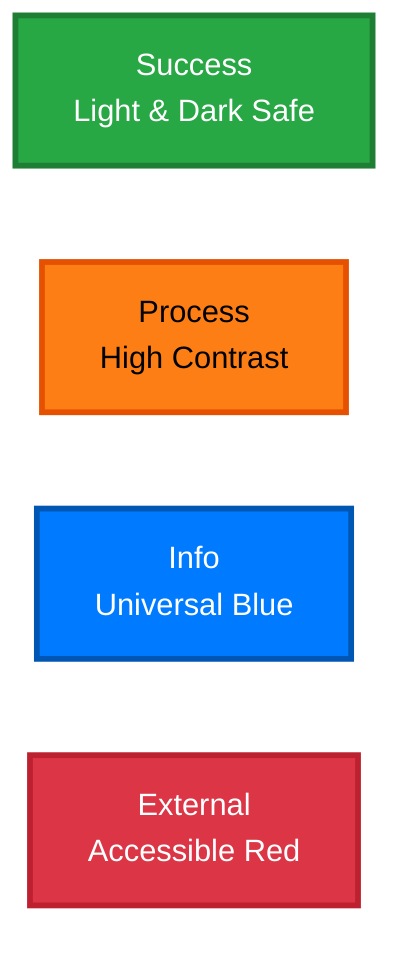
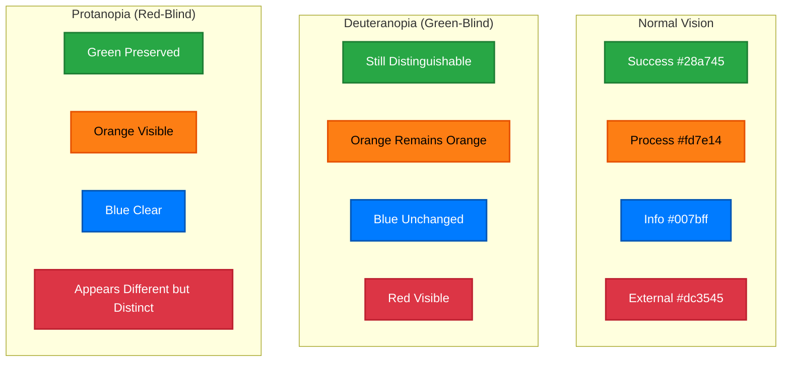
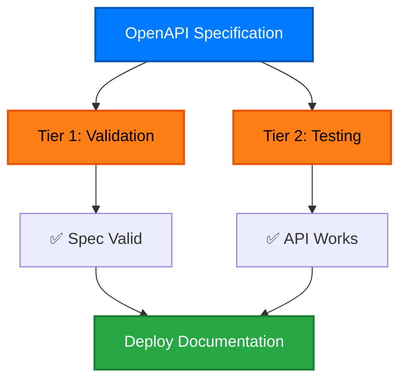
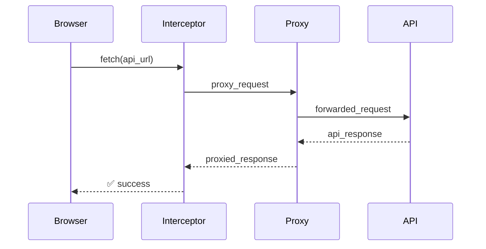

# Diagram Color Guide

This guide establishes accessible color standards for Mermaid diagrams throughout the cyber.trackr.live documentation, ensuring compatibility with both light/dark modes and color-blind accessibility, aligned with [MITRE's diagram color standards](https://mitre.github.io/kube-secure-scanner/contributing/diagram-color-guide/).

## Accessibility-First Color Palette

### Light/Dark Mode Compatible Colors



### Accessible Color Standards

| Purpose | Light Mode | Dark Mode | Color-Blind Safe | WCAG Compliant |
|---------|------------|-----------|------------------|----------------|
| **Success/Complete** | `#28a745` | `#28a745` | ✅ Deuteranopia | AAA (4.5:1) |
| **Process/Warning** | `#fd7e14` | `#fd7e14` | ✅ Protanopia | AAA (4.5:1) |
| **Info/Source** | `#007bff` | `#007bff` | ✅ Tritanopia | AAA (4.5:1) |
| **External/Error** | `#dc3545` | `#dc3545` | ✅ All Types | AAA (4.5:1) |

### Color-Blind Simulation



## Usage Examples

### Two-Tier Testing Architecture


### CORS Proxy Flow


## Best Practices

### 1. **Consistent Application**
- Always use the same color for the same concept across all diagrams
- Apply both fill and stroke colors for visual consistency
- Use 2px stroke width for standard diagrams

### 2. **Semantic Meaning**
- **Green**: Successful outcomes, working systems, final results
- **Yellow**: Intermediate processes, transformations, decision logic
- **Blue**: Input data, specifications, configuration sources
- **Red**: External dependencies, third-party services, potential failure points

### 3. **Accessibility**
- All colors provide sufficient contrast for readability
- Color meanings are reinforced with icons and text labels
- Diagrams remain understandable in grayscale

### 4. **Mermaid Syntax**
```
%% Standard color application syntax:
style NodeId fill:#colorcode,stroke:#strokecode,stroke-width:2px
```

## Diagram Types

### Architecture Diagrams
- Focus on system components and data flow
- Use green for stable/working components
- Use yellow for processing/transformation layers
- Use blue for data sources and specifications
- Use red sparingly for external dependencies

### Sequence Diagrams
- Participants colored by their role/ownership
- Success paths end in green
- Error conditions highlighted in red
- Processing steps in yellow

### Mind Maps
- Central concepts in blue (info)
- Branching categories in yellow (process)
- Implementation details in green (success)
- External factors in red (external)

## Integration with MITRE Standards

This color guide aligns with [MITRE's established standards](https://mitre.github.io/kube-secure-scanner/contributing/diagram-color-guide/) to:

- **Maintain consistency** across MITRE documentation
- **Improve readability** through familiar color associations
- **Support accessibility** with high-contrast combinations
- **Enable reuse** of patterns across projects

## Contributing

When adding new diagrams:

1. **Choose colors** based on semantic meaning, not aesthetics
2. **Apply consistently** throughout the entire diagram
3. **Test accessibility** by viewing in grayscale
4. **Document new patterns** if they don't fit existing categories

This ensures our documentation maintains professional standards while clearly communicating complex technical concepts.