# Development Guide

Comprehensive guide for contributors and maintainers working on the cyber.trackr.live OpenAPI project.

## 🚀 **Quick Start for New Contributors**

### **1. Environment Setup**
```bash
# Clone and setup
git clone https://github.com/mitre/cyber-trackr-live.git
cd cyber-trackr-live

# Install dependencies
bundle install              # Ruby dependencies
npm install                # Node.js dependencies (for docs)

# Verify setup
bundle exec rake test       # Run Ruby tests
npm run docs:validate       # Validate OpenAPI spec
```

### **2. Development Workflow**


### **3. Common Development Tasks**

**Update API Specification:**
```bash
# 1. Edit the spec
vi openapi/openapi.yaml

# 2. Validate changes  
npm run docs:validate

# 3. Regenerate Ruby client
./scripts/generate_client.sh

# 4. Run tests
bundle exec rake test
```

**Add New Endpoint:**
```bash
# 1. Add to OpenAPI spec
# 2. Regenerate client  
# 3. Add helper method (if needed)
vi lib/cyber_trackr_helper.rb
# 4. Add tests
vi test/cyber_trackr_helper_test.rb
# 5. Update documentation
npm run docs:build
```

## 📚 **Development Guides**

### **Core Development**
- **[OpenAPI Development](./openapi-development.md)** - Working with the specification, validation, and best practices
- **[API Testing](./api-testing.md)** - Two-tier testing strategy and implementation
- **[Release Process](./release-process.md)** - Complete automated release workflow

### **Architecture Deep Dives**
- **[System Integration](./architecture/system-integration.md)** - VitePress + Git-cliff + GitHub Actions integration
- **[Two-Tier Testing](./architecture/two-tier-testing.md)** - Spectral + Ruby testing separation
- **[Cross-Platform Support](./architecture/windows-compatibility.md)** - Windows, macOS, Linux compatibility
- **[HTTP Client Strategy](./architecture/faraday-migration.md)** - Faraday for maximum compatibility

## 🔧 **Development Workflows**

### **Feature Development Process**


### **Bug Fix Workflow**

1. **Reproduce the Issue**
   ```bash
   # Create minimal test case
   bundle exec ruby -I lib -I test test/debug_issue.rb
   ```

2. **Identify Root Cause**
   - OpenAPI specification issue?
   - Generated client issue?
   - Helper method issue?
   - Test coverage gap?

3. **Fix and Validate**
   ```bash
   # Fix the issue
   # Run targeted tests
   bundle exec rake test
   # Run full validation
   npm run docs:validate
   bundle exec rake test:all
   ```

### **Documentation Updates**

```bash
# For VitePress documentation
npm run docs:dev        # Start dev server
npm run docs:build      # Build static site

# For Ruby client docs
bundle exec yard doc    # Generate YARD docs
bundle exec yard server # Preview at localhost:8808
```

## 🧪 **Testing Strategy**

### **Two-Tier Testing Architecture**

```mermaid
graph TB
    subgraph tier1 ["🔍 Tier 1: Static Validation (Spectral)"]
        A["📋 OpenAPI Specification"]
        A --> A1["✅ OpenAPI 3.1.1 compliance"]
        A --> A2["✅ Syntax validation"]
        A --> A3["✅ Best practices"]
        A --> A4["✅ Custom DISA rules"]
    end
    
    subgraph tier2 ["💎 Tier 2: Dynamic Testing (Ruby)"]
        B["🌐 Live API Testing"]
        B --> B1["📦 Core gem functionality"]
        B --> B2["🛠️ Helper methods"]
        B --> B3["🔗 Integration tests"]
        B --> B4["📋 Business logic"]
    end
    
    tier1 --> C["✅ Complete Validation"]
    tier2 --> C
    
    style tier1 fill:#fff5e6,stroke:#fd7e14,stroke-width:2px
    style tier2 fill:#e8f5e8,stroke:#28a745,stroke-width:2px
```



### **Test Commands Reference**

```bash
# Tier 1: Spectral validation (< 1 second)
npm run docs:validate

# Tier 2: Ruby testing
bundle exec rake test           # Core tests (fast)
bundle exec rake test:all       # All tests including live API
bundle exec rake test:stage2b   # Live API only

# Full validation pipeline
npm run docs:validate && bundle exec rake test:all
```

## 🏗️ **Project Architecture**

### **Key Design Principles**

1. **OpenAPI-First Workflow**
   - Single source of truth: `openapi/openapi.yaml`
   - All clients generated from specification
   - Version synchronization across artifacts

2. **Separation of Concerns**
   - Spectral: Static specification validation
   - Ruby tests: Dynamic behavior validation
   - VitePress: Documentation generation
   - GitHub Actions: Automated deployment

3. **Cross-Platform Compatibility**
   - Faraday HTTP client (no external dependencies)
   - Docker-based client generation
   - CI/CD across Windows, macOS, Linux

### **File Structure Overview**

```
cyber-trackr-live/
├── openapi/
│   └── openapi.yaml              # Single source of truth
├── lib/
│   ├── cyber_trackr_client/      # Generated client (don't edit)
│   └── cyber_trackr_helper.rb    # Custom helper methods
├── test/
│   ├── cyber_trackr_helper_test.rb
│   └── live_api_validation_test.rb
├── docs/                         # VitePress documentation
├── scripts/
│   └── generate_client.sh        # Client generation script
└── tasks/
    └── release.rake              # Automated release process
```

## 🚀 **Release Engineering**

### **Automated Release Process**

Our release process is fully automated using the proven train-juniper pattern:

```bash
# Local development creates tags
bundle exec rake release:patch    # Bug fixes
bundle exec rake release:minor    # New features  
bundle exec rake release:major    # Breaking changes

# GitHub Actions handles publication
git push origin v{version}        # Triggers automated deployment
```

### **Release Components**

- **OpenAPI Specification Versioning** - Single source of truth
- **Ruby Client Generation** - Automated with version sync
- **Dual Changelog System** - Separate OpenAPI and gem changelogs
- **GitHub Pages Deployment** - Automated documentation updates
- **RubyGems Publication** - OIDC trusted publishing

## 💡 **Contributing Guidelines**

### **Before You Start**

1. **Read the docs** - Especially [Contributing Guide](../project/contributing.md)
2. **Check existing issues** - Avoid duplicate work
3. **Discuss major changes** - Open an issue first for big features

### **Development Best Practices**

- ✅ **Validate early** - Run `npm run docs:validate` frequently
- ✅ **Test thoroughly** - Both tiers of testing
- ✅ **Follow conventions** - OpenAPI 3.1.1 best practices
- ✅ **Document changes** - Update relevant documentation
- ✅ **Version consistency** - Keep all artifacts synchronized

### **Pull Request Checklist**

- [ ] OpenAPI specification validates with Spectral
- [ ] Ruby tests pass (both core and live API)
- [ ] Generated client updated (if spec changed)
- [ ] Documentation updated (if applicable)
- [ ] Changelog entries added (if applicable)
- [ ] Cross-platform compatibility verified

## 🆘 **Getting Help**

- **General Questions** - [GitHub Discussions](https://github.com/mitre/cyber-trackr-live/discussions)
- **Bug Reports** - [GitHub Issues](https://github.com/mitre/cyber-trackr-live/issues)
- **Security Issues** - Email saf-security@mitre.org
- **MITRE Internal** - Slack #saf-team channel

---

**Ready to contribute?** Start with the [Quick Start](#quick-start-for-new-contributors) section above!