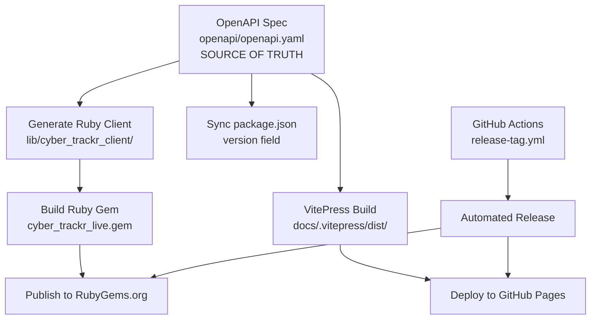

# Release Process Overview

This section documents the complete release process for the cyber-trackr-live project.

## Quick Links

- **[Quick Release Guide](./quick-release.md)** - Just the commands you need
- **[Architecture](./architecture.md)** - How the release system works
- **[First Release Setup](./first-release.md)** - One-time configuration
- **[Development Workflow](./development-workflow.md)** - Day-to-day changes
- **[Troubleshooting](./troubleshooting.md)** - Common issues and solutions

## Release Philosophy

The cyber-trackr-live project uses an **OpenAPI-first release process** where the OpenAPI specification serves as the single source of truth for versioning. All other components (Ruby gem, documentation, package.json) are synchronized from this source.

## System Overview

## Release Types

### Patch Release (1.0.0 → 1.0.1)
- Bug fixes in helper code
- Documentation improvements
- Test improvements
- Minor OpenAPI spec clarifications

### Minor Release (1.0.0 → 1.1.0)
- New OpenAPI endpoints
- New helper methods
- New features (backward compatible)
- Enhanced documentation

### Major Release (1.0.0 → 2.0.0)
- Breaking changes to OpenAPI spec
- Removing deprecated endpoints
- Major refactoring
- Incompatible changes

## Prerequisites

Before releasing, ensure you have:

1. **Docker installed** (for client generation)
2. **Write access** to the repository
3. **RubyGems account** (for first release only)
4. **Clean working directory** (`git status` shows no changes)

## Next Steps

- **Ready to release?** → [Quick Release Guide](./quick-release.md)
- **First time?** → [First Release Setup](./first-release.md)
- **Need help?** → [Troubleshooting](./troubleshooting.md)
- **Want to understand?** → [Architecture](./architecture.md)