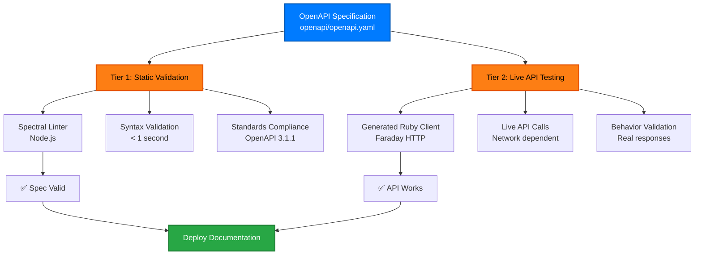

# Two-Tier Testing Architecture

## Overview

The cyber.trackr.live project implements a clean separation between OpenAPI specification validation and live API testing through a two-tier architecture.

## Architecture Design



### Tier 1: Static Validation (Node.js)
- **Tool**: Spectral OpenAPI linter
- **Purpose**: Validate OpenAPI specification structure and standards
- **Speed**: Fast (< 1 second)
- **Dependencies**: Node.js only

```bash
npm run docs:validate  # Runs spectral lint openapi/openapi.yaml
```

### Tier 2: Live API Testing (Ruby)
- **Tool**: Ruby test suite with Faraday HTTP client
- **Purpose**: Validate actual API behavior and responses
- **Speed**: Moderate (depends on network)
- **Dependencies**: Ruby + live API access

```bash
bundle exec rake test:live  # Tests against real API endpoints
```

## Benefits

### 1. **Separation of Concerns**
- OpenAPI validation is independent of Ruby environment
- API testing focuses on behavior, not specification syntax
- Each tool optimized for its specific purpose

### 2. **Development Workflow**
- Quick feedback loop: Spectral catches spec issues immediately
- Comprehensive testing: Ruby validates real API behavior
- Platform independence: Spectral works everywhere Node.js runs

### 3. **CI/CD Efficiency**
```yaml
# Fast pipeline for spec changes
- name: Validate OpenAPI
  run: npm run docs:validate

# Comprehensive testing for code changes  
- name: Test live API
  run: bundle exec rake test
```

### 4. **Tool Optimization**
- **Spectral**: Best-in-class OpenAPI validation with custom rules
- **Ruby**: Native HTTP testing with rich assertion libraries
- **No duplication**: Each tool handles what it does best

## Implementation Example

### Spectral Configuration (`.spectral.yml`)
```yaml
extends: ["@stoplight/spectral/rulesets/oas"]
rules:
  operation-operationId: error
  operation-summary: error
  operation-tags: error
```

### Ruby Test Structure
```ruby
class LiveApiValidationTest < Minitest::Test
  def test_stig_endpoint_returns_valid_data
    response = api_client.get_document('Juniper_SRX_Services_Gateway_ALG', '3', '3')
    assert response.success?
    assert_instance_of Hash, response.data
  end
end
```

## Key Insight

This pattern **eliminates the chicken-and-egg problem** common in OpenAPI-driven development:
- You need the gem to test the spec
- You need a valid spec to build the gem

Our solution: **Validate the spec independently, then test the implementation separately.**

## Broader Applicability

This two-tier pattern works for **any OpenAPI project**:

1. **Stage 1**: Validate specification syntax and standards
2. **Stage 2**: Test implementation behavior with generated clients

The pattern scales from simple APIs to complex enterprise systems while maintaining clean separation of concerns and optimal tooling for each validation layer.