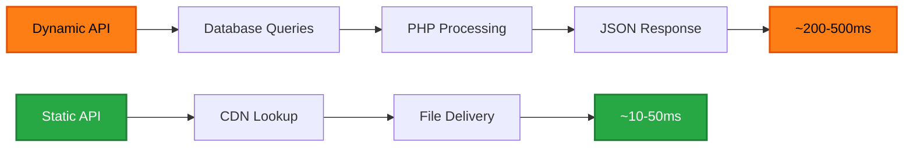

# API Provider Guide

Comprehensive guidance for API providers who want to adopt our **OpenAPI-first development approach** based on real-world experience with the cyber.trackr.live partnership.

## 🎯 **Who This Guide Is For**

- **API maintainers** looking to improve documentation and client experience
- **Development teams** considering OpenAPI-first architecture
- **Organizations** wanting to standardize API development practices
- **Technical leaders** evaluating specification-driven development

## 📋 **What You'll Learn**

This guide documents our complete methodology, lessons learned, and practical implementation strategies developed through the cyber.trackr.live partnership.

### **Core Concepts**
- Why OpenAPI-first beats code-first development
- How to implement two-tier testing (spec validation + behavior testing)
- Strategies for CORS-free documentation deployment
- Multi-language client coordination and versioning

### **Practical Implementation**
- Step-by-step migration strategies
- Platform-specific guidance (Laravel, Rails, etc.)
- Static API generation for maximum performance
- CI/CD pipeline integration

## 📖 **Guide Structure**

### **1. [OpenAPI-First Methodology](./openapi-first.md)**
- **The Problem**: Traditional code-first development challenges
- **The Solution**: Specification-driven development approach
- **Benefits**: Improved consistency, documentation, and client experience
- **Implementation**: Step-by-step adoption strategy

### **2. [Laravel Migration Guide](./laravel-migration.md)**
- **Laravel-Specific**: Detailed guidance for Laravel API providers
- **Migration Strategies**: Four approaches from simple to comprehensive
- **Performance Analysis**: Static generation vs dynamic APIs
- **Real Examples**: Practical implementation with code samples

### **3. [Static API Generation](./static-generation.md)**
- **High-Performance**: Static file generation for read-heavy APIs
- **Perfect Fit**: When and why to choose static generation
- **Implementation**: Technical details and tooling
- **Deployment**: GitHub Pages, CDN, and caching strategies

## 🚀 **Quick Start for API Providers**

### **Assessment: Is Your API Ready?**

```mermaid
graph TD
    A["Evaluate Your API"] --> B["Read-Heavy?<br/>80%+ GET requests"]
    A --> C["Stable Data?<br/>Infrequent changes"]
    A --> D["Public Access?<br/>No complex auth"]
    
    B --> E["✅ Great Fit for OpenAPI-First"]
    C --> E
    D --> E
    
    E --> F["Start with Guide Section 1"]
    
    style A fill:#007bff,stroke:#0056b3,stroke-width:2px,color:#ffffff
    style E fill:#28a745,stroke:#1e7e34,stroke-width:2px,color:#ffffff
    style F fill:#28a745,stroke:#1e7e34,stroke-width:2px,color:#ffffff
```

### **Implementation Path**

1. **Start Simple** - Add OpenAPI spec to existing API
2. **Validate Continuously** - Implement Spectral validation
3. **Generate Clients** - Create initial client libraries
4. **Deploy Documentation** - Set up interactive docs
5. **Optimize Performance** - Consider static generation

## 💡 **Real-World Success Story**

### **cyber.trackr.live Partnership Results**

**Before OpenAPI-First:**
- Manual STIG downloads
- Custom parsing scripts per organization
- Fragmented compliance tooling
- Inconsistent data access patterns

**After OpenAPI-First:**
- ✅ **1000+ STIGs** via unified API
- ✅ **15+ documented endpoints** with interactive try-it-out
- ✅ **Cross-platform compatibility** (Windows, macOS, Linux)
- ✅ **Zero authentication barriers** for public compliance data
- ✅ **Multi-language clients** (Ruby production, others planned)

### **Technical Achievements**
- **< 1 second** OpenAPI validation with Spectral
- **363 tests** across multiple platforms and Ruby versions
- **CORS-free documentation** working on GitHub Pages
- **Two-tier testing** eliminating spec-behavior inconsistencies

## 🔧 **Implementation Strategies**

### **Migration Approaches**

| **Approach** | **Effort** | **Benefits** | **Best For** |
|--------------|------------|--------------|--------------|
| **Documentation Only** | Low | Improved docs | Existing stable APIs |
| **Client Generation** | Medium | Multi-language support | APIs with developer users |
| **Full OpenAPI-First** | High | Complete consistency | New APIs or major refactors |
| **Static Generation** | High | Maximum performance | Read-heavy public APIs |

### **Technology Considerations**

#### **For Laravel APIs**
- Leverage existing route definitions
- Use Laravel OpenAPI generators
- Consider static file generation for performance

#### **For Rails APIs**
- Utilize Rails API documentation gems
- Implement specification-first validation
- Focus on JSON API standards compliance

#### **For Node.js APIs**
- Use Express OpenAPI middleware
- Implement request/response validation
- Consider Fastify for performance-critical applications

## 📊 **Performance Benefits**

### **Static vs Dynamic API Performance**

**When Static Generation Makes Sense:**
- Data changes infrequently (daily/weekly updates)
- Read-heavy traffic patterns (95%+ GET requests)
- Global audience benefits from CDN distribution
- High availability requirements

## 🎯 **Getting Started**

### **Choose Your Path**

1. **Read Overview** - [OpenAPI-First Methodology](./openapi-first.md)
2. **Platform-Specific** - [Laravel Migration](./laravel-migration.md) or apply concepts to your stack
3. **Performance Focus** - [Static Generation](./static-generation.md) for read-heavy APIs

### **Next Steps**
- 📋 **Assess your API** using our evaluation criteria
- 🧪 **Start with validation** - add Spectral to your CI/CD
- 📚 **Generate documentation** - create interactive API docs
- 💎 **Build clients** - generate client libraries for your users

### **Get Help**
- 💬 **[GitHub Discussions](https://github.com/mitre/cyber-trackr-live/discussions)** - Ask questions and share experiences
- 🐛 **[Issues](https://github.com/mitre/cyber-trackr-live/issues)** - Report problems with the guidance
- 🤝 **Partnership** - Learn from our [cyber.trackr.live collaboration](https://cyber.trackr.live)

---

**Ready to transform your API development?** Start with the [OpenAPI-First Methodology](./openapi-first.md) guide.