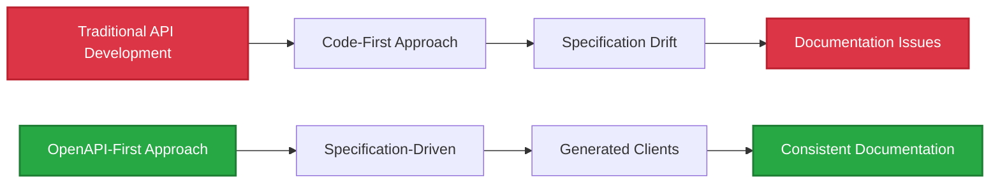
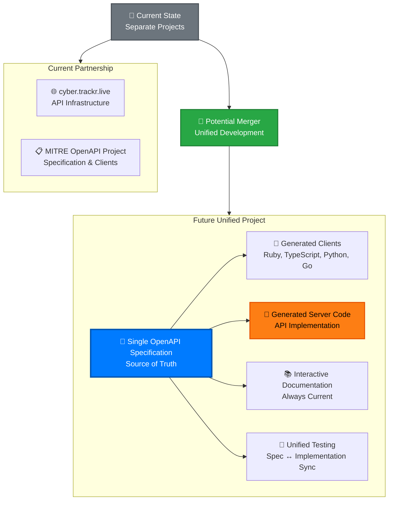
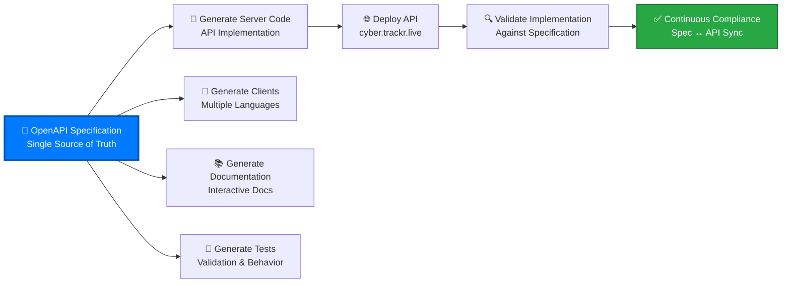

# Future Plans & Roadmap

Strategic direction, upcoming features, and guidance for API providers who want to adopt our OpenAPI-first approach.

## 🚀 **Project Roadmap**

### **Current Focus**
- ✅ **OpenAPI 3.1.1 Specification** - Complete and production-ready
- ✅ **Ruby Client** - Production-ready with comprehensive helper methods
- ✅ **Interactive Documentation** - VitePress with working CORS proxy
- ✅ **Cross-Platform Testing** - Windows, macOS, Linux compatibility

### **Near-Term (Next 6 Months)**
- 🔄 **Additional Language Clients** - TypeScript, Python, Go client generation
- 📚 **Enhanced Documentation** - More examples and use cases
- 🧪 **Extended Testing** - Additional API behavior validation
- 🔧 **Developer Tools** - Improved client generation and tooling

### **Medium-Term (6-12 Months)**
- 🌐 **Community Adoption** - Broader ecosystem integration
- 📊 **Analytics & Metrics** - Usage tracking and performance monitoring
- 🔄 **API Versioning** - Support for multiple API versions
- 🚀 **Performance Optimization** - Caching and response optimization

## 📖 **API Provider Guidance**

For organizations running APIs who want to adopt our **OpenAPI-first approach**, we've documented our complete methodology and lessons learned.

### **Available Guides**

#### **[OpenAPI-First Development](./api-provider-guide/)**
- **[Overview](./api-provider-guide/index.md)** - Introduction to OpenAPI-first methodology
- **[OpenAPI-First Approach](./api-provider-guide/openapi-first.md)** - Benefits and implementation strategy
- **[Laravel Migration Guide](./api-provider-guide/laravel-migration.md)** - Specific guidance for Laravel APIs
- **[Static API Generation](./api-provider-guide/static-generation.md)** - High-performance static API approach

### **Key Benefits for API Providers**

**Why API Providers Should Adopt This Approach:**
- 📋 **Specification as Source of Truth** - Single authoritative definition
- 💎 **Multi-Language Client Generation** - Automatic client creation
- 📚 **Interactive Documentation** - Always up-to-date API docs
- 🧪 **Two-Tier Testing** - Separate spec validation from behavior testing
- 🌐 **CORS-Free Documentation** - Deploy anywhere including static hosting

## 🎯 **Success Stories**

### **Real-World Implementation**
Our collaboration with cyber.trackr.live demonstrates the OpenAPI-first approach in production. [Learn more about the partnership](../guide/) and how it provides access to comprehensive DISA cybersecurity data.

### **Metrics & Impact**
- ⚡ **< 1 second** OpenAPI validation with Spectral
- 🧪 **363 tests** running across 3 platforms × 3 Ruby versions
- 📦 **15+ endpoints** fully documented and tested
- 🌐 **GitHub Pages deployment** with working try-it-out functionality

## 🔮 **Long-Term Vision**

### **Potential Project Merger Benefits**

Our successful partnership with cyber.trackr.live opens exciting possibilities for **unified spec-driven development**:

**Potential Merger Benefits:**
- 🔄 **Bidirectional Spec Sync** - Specification drives both client AND server implementation
- 🎯 **Guaranteed API Compliance** - Server implementation automatically matches specification
- 🚀 **Unified Development Workflow** - Single source of truth for entire ecosystem
- 📋 **Real-Time Validation** - Live API continuously validates against specification
- 💎 **Enhanced Client Generation** - Server changes automatically update all clients
- 🧪 **Comprehensive Testing** - Unified test suite covering specification, implementation, and clients

### **Spec-Driven API Development Vision**

If the projects merge, we envision a complete **specification-driven development lifecycle**:

**Revolutionary Development Approach:**
1. **Specification First** - All development begins with OpenAPI specification updates
2. **Automatic Generation** - Server code, clients, docs, and tests generated from spec
3. **Continuous Validation** - Live API continuously validates against specification
4. **Synchronized Releases** - Specification changes trigger coordinated client/server updates
5. **Zero Documentation Drift** - Documentation always matches implementation

### **Universal OpenAPI Patterns**
Our goal is to establish **universal patterns** that any OpenAPI project can adopt:

1. **OpenAPI-First Development** - Specification drives all artifacts
2. **Two-Tier Testing** - Separate static validation from behavior testing
3. **CORS-Free Documentation** - Interactive docs on static hosting
4. **Multi-Language Coordination** - Synchronized client releases
5. **Cross-Platform Compatibility** - Windows/macOS/Linux support

### **Community Adoption**
- 📚 **Educational Resources** - Workshops, guides, and best practices
- 🔧 **Tooling Ecosystem** - Reusable tools and templates
- 🤝 **Partnerships** - Collaboration with other API providers
- 🌐 **Standards Contribution** - Contributing back to OpenAPI community

## 🤝 **Get Involved**

### **For API Providers**
- 📖 **Read our guides** - Learn from our implementation experience
- 💬 **Join discussions** - Share your use case and challenges
- 🔧 **Contribute improvements** - Help refine the methodology

### **For Developers**
- 💎 **Try our clients** - Use Ruby client or generate your own
- 🐛 **Report issues** - Help us improve the approach
- 📚 **Improve documentation** - Share your integration experience

### **For Organizations**
- 🎯 **Pilot projects** - Test OpenAPI-first approach on new APIs
- 📊 **Share metrics** - Help demonstrate business value
- 🤝 **Partnership opportunities** - Collaborate on standards and tooling

---

**Questions about implementing OpenAPI-first development?** Check our [GitHub Discussions](https://github.com/mitre/cyber-trackr-live/discussions) or review the [API Provider Guide](./api-provider-guide/).