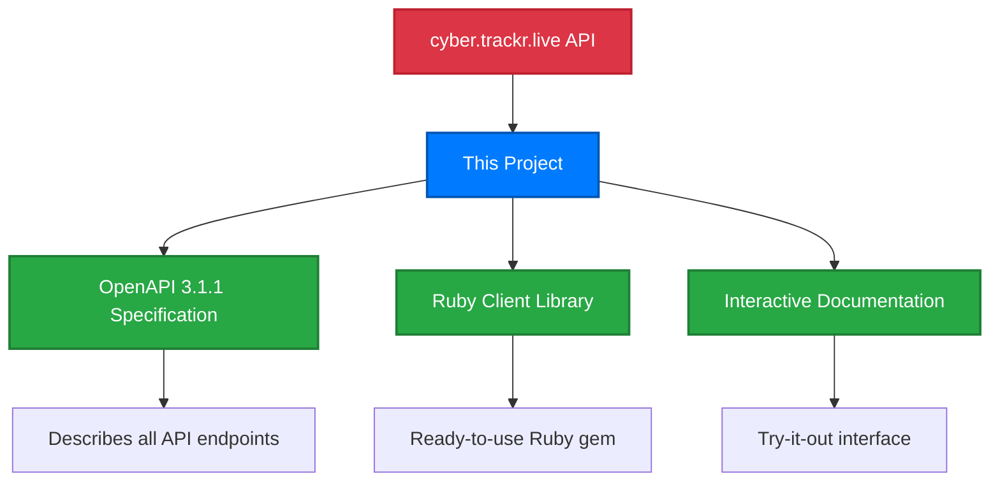

# Introduction

## What is the cyber.trackr.live OpenAPI Project?

This project provides tools and documentation for working with the cyber.trackr.live API, which offers programmatic access to DISA cybersecurity compliance data including STIGs, SRGs, and CCIs.

### Project Components



**What we provide:**
- **OpenAPI Specification** - Machine-readable description of all cyber.trackr.live API endpoints
- **Ruby Client** - Production-ready gem with helper methods for common tasks
- **Documentation** - Interactive interface to explore and test the API

**Data available through the API:** 1000+ STIGs, 300+ SRGs, 3000+ CCIs, RMF controls, and SCAP documents from [cyber.trackr.live](/project/collaboration).

## Technical Architecture

### OpenAPI-First Architecture
- **Single source of truth**: OpenAPI specification drives all generated artifacts
- **Version synchronization**: Consistent versioning across clients and documentation
- **Standards compliance**: OpenAPI 3.1.1 with comprehensive validation

### Multi-Language Client Libraries
- **Ruby Client**: Production-ready with comprehensive helper methods
- **Future Clients**: TypeScript, Python, Go (community-driven)
- **Coordinated Releases**: All clients share the same version from OpenAPI spec

### Interactive Documentation
- **Try-it-out functionality**: Test API calls directly from documentation
- **Static hosting support**: Works on GitHub Pages through CORS proxy
- **Live examples**: Real data from cyber.trackr.live API

### Development Patterns
- **Two-tier testing**: Separate spec validation from API behavior testing
- **Cross-platform compatibility**: Works on Windows, macOS, Linux
- **Reusable approaches**: Patterns that can be applied to other OpenAPI projects

## API Data Access

The cyber.trackr.live API provides access to:

- **1000+ DISA STIGs** (Security Technical Implementation Guides)
- **300+ SRGs** (Security Requirements Guides)  
- **3000+ CCIs** (Control Correlation Identifiers)
- **RMF Controls** (Risk Management Framework)
- **87 SCAP Documents** (Security Content Automation Protocol)

**No authentication required** - start using immediately:

```bash
curl https://cyber.trackr.live/api/stig
```

## Getting Started
1. **[Installation](./installation.md)** - Set up the Ruby client or development environment
2. **[Quick Start](./quick-start.md)** - Make your first API calls and understand basic workflows  
3. **[Testing](./testing.md)** - Learn our two-tier testing approach and CI/CD patterns

### Additional Resources
- **[API Reference](/api-reference/)** - Interactive documentation with try-it-out functionality
- **[Development](/development/)** - Architecture patterns and development guides
- **[Clients](/clients/)** - Ruby client documentation and client generation
- **[Patterns](/patterns/)** - Reusable patterns from this project

## Project Features

### For API Users
- Ready-to-use Ruby client with error handling and helper methods
- Interactive documentation for testing API endpoints
- Examples for common cybersecurity compliance workflows

### For Developers  
- OpenAPI-first patterns for consistent development
- Cross-platform compatibility (Windows, macOS, Linux)
- Two-tier testing architecture for maintainable code

### For Organizations
- Production-ready Ruby client with documentation
- Patterns that can be adapted for other projects
- Open source codebase with standard development practices

## Community & Support

- **Documentation**: Guides and examples throughout this site
- **Issues**: [GitHub Issues](https://github.com/mitre/cyber-trackr-live/issues) for bug reports and feature requests
- **Discussions**: [GitHub Discussions](https://github.com/mitre/cyber-trackr-live/discussions) for questions and ideas
- **Collaboration**: [Project details](/project/collaboration) about working with cyber.trackr.live

Ready to get started? Head to **[Installation](./installation.md)** to set up your development environment!