# Introduction

## What is the cyber.trackr.live OpenAPI Project?

This project solves a fundamental problem in cybersecurity compliance: **accessing and integrating DISA cybersecurity data programmatically**.

### The Problem We Solve

```mermaid
graph LR
    A["❌ Before This Project"] --> B["Manual STIG downloads"]
    B --> C["Custom parsing scripts"]
    C --> D["Fragmented integrations"]
    
    E["✅ With Our Project"] --> F["Unified OpenAPI spec"]
    F --> G["Generated clients"]
    G --> H["Seamless integration"]
    
    style A fill:#dc3545,stroke:#bd2130,stroke-width:2px,color:#ffffff
    style D fill:#dc3545,stroke:#bd2130,stroke-width:2px,color:#ffffff
    style E fill:#28a745,stroke:#1e7e34,stroke-width:2px,color:#ffffff
    style H fill:#28a745,stroke:#1e7e34,stroke-width:2px,color:#ffffff
```



**Before:** Organizations struggled with manual STIG downloads, custom parsing, and fragmented compliance tooling.

**Now:** One unified OpenAPI specification provides programmatic access to 1000+ STIGs, 300+ SRGs, and 3000+ CCIs from [cyber.trackr.live](/project/collaboration).

## Technical Architecture

### 🌐 **OpenAPI-First Architecture**
- **Single source of truth**: OpenAPI specification drives all generated artifacts
- **Version synchronization**: Consistent versioning across clients and documentation
- **Standards compliance**: OpenAPI 3.1.1 with comprehensive validation

### 💎 **Multi-Language Client Libraries**
- **Ruby Client**: Production-ready with comprehensive helper methods
- **Future Clients**: TypeScript, Python, Go (community-driven)
- **Coordinated Releases**: All clients share the same version from OpenAPI spec

### 📚 **Interactive Documentation**
- **Try-it-out functionality**: Test API calls directly from documentation
- **CORS-free deployment**: Works on GitHub Pages and static hosting
- **Real-time examples**: Live data from cyber.trackr.live API

### 🔧 **Universal Patterns**
- **Two-tier testing**: Separate spec validation from API behavior testing
- **Cross-platform compatibility**: Works on Windows, macOS, Linux
- **Reusable approaches**: Patterns applicable to any OpenAPI project

## API Data Access

The cyber.trackr.live API provides access to:

- **1000+ DISA STIGs** (Security Technical Implementation Guides)
- **300+ SRGs** (Security Requirements Guides)  
- **3000+ CCIs** (Control Correlation Identifiers)
- **RMF Controls** (Risk Management Framework)
- **87 SCAP Documents** (Security Content Automation Protocol)

**No authentication required** - start using immediately:

```bash
curl https://cyber.trackr.live/api/stig
```

## Quick Navigation

```mermaid
graph TD
    A[🏠 Introduction<br/>You are here] --> B[📦 Installation<br/>Ruby client]
    B --> C[🚀 Quick Start<br/>First API calls]
    C --> D[🧪 Testing<br/>CI/CD validation]
    
    A --> E[📖 API Reference<br/>Interactive docs]
    A --> F[🔧 Development<br/>Architecture]
    A --> G[💎 Clients<br/>Multiple languages]
    
    style A fill:#007bff,stroke:#0056b3,stroke-width:2px,color:#ffffff
    style B fill:#fd7e14,stroke:#e55100,stroke-width:2px,color:#000000
    style C fill:#fd7e14,stroke:#e55100,stroke-width:2px,color:#000000
    style D fill:#fd7e14,stroke:#e55100,stroke-width:2px,color:#000000
    style E fill:#28a745,stroke:#1e7e34,stroke-width:2px,color:#ffffff
    style F fill:#28a745,stroke:#1e7e34,stroke-width:2px,color:#ffffff
    style G fill:#28a745,stroke:#1e7e34,stroke-width:2px,color:#ffffff
```



### Getting Started Path
1. **[Installation](./installation.md)** - Set up the Ruby client or development environment
2. **[Quick Start](./quick-start.md)** - Make your first API calls and understand basic workflows  
3. **[Testing](./testing.md)** - Learn our two-tier testing approach and CI/CD patterns

### Explore Further
- **[API Reference](/api-reference/)** - Interactive documentation with try-it-out functionality
- **[Development](/development/)** - Architecture patterns and OpenAPI-first development
- **[Clients](/clients/)** - Ruby client guide and future language plans
- **[Patterns](/patterns/)** - Universal patterns for any OpenAPI project

## Key Benefits

### 🎯 **For API Consumers**
- **Ready-to-use clients** with built-in error handling and helpers
- **Interactive documentation** for immediate testing and exploration
- **Comprehensive examples** for common cybersecurity compliance workflows

### 🏗️ **For Developers**  
- **OpenAPI-first patterns** that solve universal development challenges
- **Cross-platform compatibility** with thorough Windows/macOS/Linux testing
- **Two-tier testing architecture** that separates concerns cleanly

### 🌐 **For Enterprise**
- **Production-ready solutions** with comprehensive documentation
- **Reusable patterns** for building other OpenAPI-driven projects
- **Open source foundation** with professional development practices

## Community & Support

- 📚 **Documentation**: Comprehensive guides and examples throughout this site
- 🐛 **Issues**: [GitHub Issues](https://github.com/mitre/cyber-trackr-live/issues) for bug reports and feature requests
- 💬 **Discussions**: [GitHub Discussions](https://github.com/mitre/cyber-trackr-live/discussions) for questions and ideas
- 🤝 **Project Details**: [Learn about our approach](/project/collaboration) and MITRE's role

Ready to get started? Head to **[Installation](./installation.md)** to set up your development environment!