# Installation

Choose your installation path based on how you want to use the cyber.trackr.live API:

```mermaid
graph TD
    A[Choose Installation Type] --> B[🎯 API Consumer<br/>Ruby Client]
    A --> C[🔧 Developer<br/>Contribute]
    A --> D[📚 Documentation Only<br/>No Install Needed]
    
    B --> E[gem install cyber_trackr_live]
    C --> F[git clone + bundle install]
    D --> G[Visit API Reference]
    
    style A fill:#007bff,stroke:#0056b3,stroke-width:2px,color:#ffffff
    style B fill:#28a745,stroke:#1e7e34,stroke-width:2px,color:#ffffff
    style C fill:#fd7e14,stroke:#e55100,stroke-width:2px,color:#000000
    style D fill:#28a745,stroke:#1e7e34,stroke-width:2px,color:#ffffff
```



## 🎯 For API Consumers (Ruby Client)

### Prerequisites

- **Ruby 3.2+** (check our [.ruby-version](https://github.com/mitre/cyber-trackr-live/blob/main/.ruby-version))
- **No additional dependencies** (pure Ruby using Faraday/Net::HTTP)

### Install the Gem

**Option 1: Direct installation**
```bash
gem install cyber_trackr_live
```

**Option 2: Add to Gemfile**
```ruby
gem 'cyber_trackr_live'
```

Then run:
```bash
bundle install
```

### Verify Installation

```ruby
require 'cyber_trackr_live'
helper = CyberTrackrHelper.new
puts "✅ Installation successful!"
```

**Ready to start?** See the [Ruby Client guide](/clients/ruby/) for complete examples and workflows, or head to [Quick Start](./quick-start.md) to make your first API calls!

## 🔧 For Developers (Project Contributors)

### Prerequisites

- **Ruby 3.2+** 
- **Node.js 22+** (for documentation and OpenAPI validation)
- **Git**

### Clone and Setup

```bash
# Clone the repository
git clone https://github.com/mitre/cyber-trackr-live.git
cd cyber-trackr-live

# Install Ruby dependencies
bundle install

# Install Node.js dependencies (for docs)
npm install

# Verify setup
bundle exec rake test
npm run docs:validate
```

### Development Workflow


### Development Commands

```bash
# OpenAPI validation
npm run docs:validate              # Spectral OpenAPI linting
npm run docs:validate-mermaid      # Mermaid diagram validation
npm run docs:validate-all          # Both validations

# Ruby testing  
bundle exec rake test              # Core gem tests
bundle exec rake test:live         # Live API integration tests

# Documentation
npm run docs:dev                   # Start VitePress dev server
npm run docs:build                 # Build static documentation

# Client generation
./scripts/generate_client.sh       # Regenerate Ruby client from OpenAPI
```

**Next**: See the [Testing Guide](./testing.md) to understand our two-tier testing approach.

## 📚 Documentation Only

No installation required! Use our interactive documentation:

- **[API Reference](/api-reference/)** - Try all endpoints directly in your browser
- **[OpenAPI Specification](https://github.com/mitre/cyber-trackr-live/blob/main/openapi/openapi.yaml)** - Download the raw OpenAPI 3.1.1 spec

### Generate Your Own Client

Use our OpenAPI specification to generate clients in any language:

```bash
# TypeScript/JavaScript
docker run --rm -v "${PWD}:/local" openapitools/openapi-generator-cli generate \
  -i https://raw.githubusercontent.com/mitre/cyber-trackr-live/main/openapi/openapi.yaml \
  -g typescript-fetch \
  -o ./cyber-trackr-client

# Python
docker run --rm -v "${PWD}:/local" openapitools/openapi-generator-cli generate \
  -i https://raw.githubusercontent.com/mitre/cyber-trackr-live/main/openapi/openapi.yaml \
  -g python \
  -o ./cyber-trackr-client

# Go  
docker run --rm -v "${PWD}:/local" openapitools/openapi-generator-cli generate \
  -i https://raw.githubusercontent.com/mitre/cyber-trackr-live/main/openapi/openapi.yaml \
  -g go \
  -o ./cyber-trackr-client
```

## Platform Support

### ✅ Fully Supported Platforms

| Platform | Ruby Versions | CI/CD Status |
|----------|---------------|--------------|
| **Ubuntu Linux** | 3.2, 3.3, 3.4 | ✅ All tests pass |
| **Windows** | 3.2, 3.3, 3.4 | ✅ All tests pass |
| **macOS** | 3.2, 3.3, 3.4 | ✅ All tests pass |

### Why Cross-Platform Works

```mermaid
graph TD
    A[Pure Ruby Dependencies] --> B[Faraday HTTP Client]
    B --> C[Built-in Net::HTTP]
    C --> D[No External Libraries]
    D --> E[✅ Works Everywhere]
    
    F[Alternative: typhoeus] --> G[Requires libcurl.dll]
    G --> H[❌ Windows Issues]
    
    style A fill:#28a745,stroke:#1e7e34,stroke-width:2px,color:#ffffff
    style E fill:#28a745,stroke:#1e7e34,stroke-width:2px,color:#ffffff
    style H fill:#dc3545,stroke:#bd2130,stroke-width:2px,color:#ffffff
```



Our **Faraday migration** eliminated Windows compatibility issues by using pure Ruby dependencies instead of native libraries.

## Troubleshooting

### Ruby Version Issues

```bash
# Check your Ruby version
ruby --version

# Install Ruby 3.2+ using rbenv (recommended)
rbenv install 3.2.8
rbenv global 3.2.8

# Or using RVM
rvm install 3.2.8
rvm use 3.2.8 --default
```

### Bundle Install Failures

```bash
# Clear bundle cache and retry
bundle clean --force
bundle install

# Check for platform-specific issues
bundle lock --add-platform ruby
bundle lock --add-platform x86_64-linux
bundle lock --add-platform x64-mingw32
bundle lock --add-platform arm64-darwin
```

### API Connection Issues

```ruby
# Test API connectivity
require 'net/http'
require 'json'

uri = URI('https://cyber.trackr.live/api/stig')
response = Net::HTTP.get_response(uri)

if response.code == '200'
  puts "✅ API is accessible"
  data = JSON.parse(response.body)
  puts "📋 Found #{data.size} documents"
else
  puts "❌ API connection failed: #{response.code}"
end
```

## Next Steps

- **API Consumer**: Continue to [Quick Start](./quick-start.md)
- **Developer**: Review [Testing Guide](./testing.md) 
- **Documentation**: Explore [API Reference](/api-reference/)
- **Architecture**: Learn about [Development Patterns](/development/)