# Quick Start

Get started with the cyber.trackr.live API in minutes! Choose your approach based on your needs.

## Choose Your Workflow

```mermaid
graph TD
    A["🚀 Choose Your Approach"] --> B["💎 Ruby Client<br/>Helper Methods"]
    A --> C["🌐 Direct API<br/>HTTP Calls"]
    A --> D["📚 Interactive Docs<br/>Try-it-out"]
    A --> E["🔧 Generate Client<br/>Your Language"]
    
    B --> F["📦 gem install"]
    C --> G["🔧 curl/fetch/axios"]
    D --> H["📖 Browse /api-reference/"]
    E --> I["🔮 OpenAPI Generator"]
    
    style A fill:#007bff,stroke:#0056b3,stroke-width:2px,color:#ffffff
    style F fill:#28a745,stroke:#1e7e34,stroke-width:2px,color:#ffffff
    style G fill:#28a745,stroke:#1e7e34,stroke-width:2px,color:#ffffff
    style H fill:#28a745,stroke:#1e7e34,stroke-width:2px,color:#ffffff
    style I fill:#28a745,stroke:#1e7e34,stroke-width:2px,color:#ffffff
```



## 💎 Ruby Client (Recommended)

### Install and Basic Usage

First, [install the Ruby client](./installation.md#ruby-gem) - it only takes a minute.

**Complete Ruby Examples**: See the [Ruby Client guide](/clients/ruby/) for comprehensive examples including basic usage, workflows, and error handling patterns.

### Common Workflow Patterns

```mermaid
graph LR
    A["🔍 Discover STIGs"] --> B["📋 Select STIG"]
    B --> C["📖 Fetch Requirements"]
    C --> D["🔧 Process Compliance"]
    
    E["🔍 Search by Technology"] --> F["📊 Filter by Severity"]
    F --> G["📝 Extract Controls"]
    G --> H["🤖 Automate Checks"]
    
    style A fill:#007bff,stroke:#0056b3,stroke-width:2px,color:#ffffff
    style E fill:#fd7e14,stroke:#e55100,stroke-width:2px,color:#000000
    style D fill:#28a745,stroke:#1e7e34,stroke-width:2px,color:#ffffff
    style H fill:#28a745,stroke:#1e7e34,stroke-width:2px,color:#ffffff
```



#### 1. Discovery Workflow

```ruby
# Find STIGs for specific technology
stigs = helper.list_stigs
juniper_stigs = stigs.select { |id, info| info[:title].include?('Juniper') }

puts "📡 Juniper STIGs found:"
juniper_stigs.each do |id, info|
  puts "  • #{info[:title]} (v#{info[:version]}.#{info[:release]})"
end
```

#### 2. Compliance Analysis Workflow

```ruby
# Get complete STIG data
stig = helper.fetch_complete_stig('Juniper_SRX_Services_Gateway_ALG', '3', '3')

# Analyze requirement severity distribution
severity_counts = stig[:requirements].group_by { |req| req[:severity] }
                                     .transform_values(&:count)

puts "📊 Severity Distribution:"
severity_counts.each { |severity, count| puts "  #{severity}: #{count}" }

# Find CAT I (high) requirements
cat1_requirements = stig[:requirements].select { |req| req[:severity] == 'high' }
puts "\n🚨 Critical (CAT I) Requirements: #{cat1_requirements.count}"
```

#### 3. Automation Integration Workflow

```ruby
# Extract check procedures for automation
stig[:requirements].each do |req|
  next unless req[:severity] == 'high'
  
  puts "\n🔍 #{req[:id]}: #{req[:title]}"
  puts "Check: #{req[:check_content]}"
  puts "Fix: #{req[:fix_text]}" if req[:fix_text]
end
```

## 🌐 Direct API Access

### Basic HTTP Requests

```bash
# List all documents
curl https://cyber.trackr.live/api/stig

# Get specific STIG metadata
curl https://cyber.trackr.live/api/stig/Juniper_SRX_Services_Gateway_ALG/3/3

# Get all requirements for a STIG
curl https://cyber.trackr.live/api/stig/Juniper_SRX_Services_Gateway_ALG/3/3/requirements
```

### JavaScript/TypeScript Example

```javascript
// Modern fetch API
const response = await fetch('https://cyber.trackr.live/api/stig');
const stigs = await response.json();

console.log(`📋 Found ${Object.keys(stigs).length} documents`);

// Get specific STIG
const stig = await fetch(
  'https://cyber.trackr.live/api/stig/Juniper_SRX_Services_Gateway_ALG/3/3/requirements'
).then(r => r.json());

console.log(`🛡️ ${stig.title} has ${stig.requirements.length} requirements`);
```

### Python Example

```python
import requests

# List STIGs
response = requests.get('https://cyber.trackr.live/api/stig')
stigs = response.json()
print(f"📋 Found {len(stigs)} documents")

# Get specific STIG
stig_response = requests.get(
    'https://cyber.trackr.live/api/stig/Juniper_SRX_Services_Gateway_ALG/3/3/requirements'
)
stig = stig_response.json()
print(f"🛡️ {stig['title']} has {len(stig['requirements'])} requirements")
```

## 📚 Interactive Documentation

**Zero setup required!** Use our interactive API documentation:

1. **[Visit API Reference](/api-reference/)** - Complete endpoint documentation
2. **Click any endpoint** - Detailed parameter descriptions  
3. **Use "Try it out"** - Make live API calls in your browser
4. **View responses** - Real data with example structures

**Best for:**
- 🔍 **API exploration** - Understand available data
- 🧪 **Quick testing** - Validate endpoints before coding
- 📖 **Learning** - See real request/response examples

## 🔧 Generate Your Own Client

Use our OpenAPI 3.1.1 specification to generate clients in any language:

### TypeScript/JavaScript
```bash
docker run --rm -v "${PWD}:/local" openapitools/openapi-generator-cli generate \
  -i https://raw.githubusercontent.com/mitre/cyber-trackr-live/main/openapi/openapi.yaml \
  -g typescript-fetch \
  -o ./cyber-trackr-client \
  --additional-properties=npmName=cyber-trackr-client
```

### Python
```bash
docker run --rm -v "${PWD}:/local" openapitools/openapi-generator-cli generate \
  -i https://raw.githubusercontent.com/mitre/cyber-trackr-live/main/openapi/openapi.yaml \
  -g python \
  -o ./cyber-trackr-client \
  --additional-properties=packageName=cyber_trackr_client
```

### Go
```bash
docker run --rm -v "${PWD}:/local" openapitools/openapi-generator-cli generate \
  -i https://raw.githubusercontent.com/mitre/cyber-trackr-live/main/openapi/openapi.yaml \
  -g go \
  -o ./cyber-trackr-client \
  --additional-properties=packageName=cybertrackr
```

## Real-World Use Cases

### 🏢 Enterprise Compliance

**Enterprise Compliance Examples**: See the [Ruby Client examples](/clients/ruby/examples.md) for automated compliance dashboard patterns and technology stack STIG processing.

### 🔧 Security Tool Integration

**Security Tool Integration Examples**: See the [Ruby Client examples](/clients/ruby/examples.md) for automated check extraction and security scanning tool integration patterns.

## Error Handling & Best Practices

### Robust Error Handling

See the [Ruby Client examples](/clients/ruby/examples.md) for comprehensive error handling patterns including API errors, timeouts, and retry logic.

### Rate Limiting & Performance

**Performance Examples**: See the [Ruby Client examples](/clients/ruby/examples.md) for rate limiting, batch processing, and performance optimization patterns.

## Next Steps

### 🎯 **For API Consumers**
- **[Ruby Client Guide](/clients/ruby/)** - Complete Ruby client documentation
- **[API Reference](/api-reference/)** - Interactive endpoint documentation

### 🏗️ **For Developers**  
- **[Testing Guide](./testing.md)** - Two-tier testing approach
- **[Development Patterns](/development/)** - Architecture and OpenAPI development

### 🌐 **For Enterprise**
- **[Universal Patterns](/patterns/)** - Reusable approaches for any OpenAPI project
- **[Contributing](/reference/contributing)** - Join the cyber.trackr.live ecosystem

**Questions?** Check our [GitHub Discussions](https://github.com/mitre/cyber-trackr-live/discussions) or browse the [complete documentation](/).