# Testing Guide

## Two-Tier Testing Architecture

Our testing approach **eliminates the chicken-and-egg problem** in OpenAPI development by separating static specification validation from dynamic API behavior testing.

```mermaid
graph TB
    A["🏗️ OpenAPI-First Development"] --> B["⚡ Tier 1: Spectral"]
    A --> C["🧪 Tier 2: Ruby Testing"]
    
    B --> D["📋 Specification Quality"]
    C --> E["🔧 API Behavior Verification"]
    
    D --> F["✅ Deploy Documentation"]
    E --> F
    F --> G["🚀 Production-Ready System"]
    
    style A fill:#007bff,stroke:#0056b3,stroke-width:2px,color:#ffffff
    style B fill:#fd7e14,stroke:#e55100,stroke-width:2px,color:#000000
    style C fill:#fd7e14,stroke:#e55100,stroke-width:2px,color:#000000
    style F fill:#28a745,stroke:#1e7e34,stroke-width:2px,color:#ffffff
    style G fill:#28a745,stroke:#1e7e34,stroke-width:2px,color:#ffffff
```



### Why Two-Tier Testing Matters

```mermaid
graph LR
    A["❌ Traditional Approach"] --> B["📝 Write Code First"]
    B --> C["📋 Generate Spec"]
    C --> D["❓ Spec Accuracy Issues"]
    
    E["✅ Our Two-Tier Approach"] --> F["📋 Validated Spec First"]
    F --> G["🧪 Test Independently"]  
    G --> H["🚀 Reliable System"]
    
    style A fill:#dc3545,stroke:#bd2130,stroke-width:2px,color:#ffffff
    style D fill:#dc3545,stroke:#bd2130,stroke-width:2px,color:#ffffff
    style E fill:#28a745,stroke:#1e7e34,stroke-width:2px,color:#ffffff
    style H fill:#28a745,stroke:#1e7e34,stroke-width:2px,color:#ffffff
```



## Testing Workflow

```mermaid
graph TD
    A["🎯 Choose Testing Level"] --> B["⚡ Quick Validation"]
    A --> C["🧪 Full Testing"]
    A --> D["🌐 Live API Only"]
    
    B --> E["npm run docs:validate"]
    C --> F["npm run test:all"]
    D --> G["bundle exec rake test:live"]
    
    E --> H["📋 Spec Quality Verified"]
    F --> I["✅ Production Ready"]
    G --> J["🔧 Live Behavior Confirmed"]
    
    style A fill:#007bff,stroke:#0056b3,stroke-width:2px,color:#ffffff
    style H fill:#28a745,stroke:#1e7e34,stroke-width:2px,color:#ffffff
    style I fill:#28a745,stroke:#1e7e34,stroke-width:2px,color:#ffffff
    style J fill:#28a745,stroke:#1e7e34,stroke-width:2px,color:#ffffff
```



## Running Tests

### ⚡ Tier 1: OpenAPI Validation (Spectral)

**Lightning-fast validation** of specification quality:

```bash
# Professional-grade OpenAPI validation
npm run docs:validate

# Validate Mermaid diagrams in documentation
npm run docs:validate-mermaid

# Run both validations
npm run docs:validate-all
```

**What Tier 1 Validates:**
- ✅ OpenAPI 3.1.1 syntax compliance
- ✅ Security scheme definitions
- ✅ Response schema consistency
- ✅ Parameter validation rules
- ✅ Documentation completeness

### 🧪 Tier 2: Ruby Testing

**Real API behavior validation** with live integration:

```bash
# Core gem functionality (fast - default)
bundle exec rake test           

# Complete testing including live API
bundle exec rake test:all       

# Live API integration tests only
bundle exec rake test:live   

# Run specific test file
bundle exec ruby test/cyber_trackr_helper_test.rb
```

**What Tier 2 Validates:**
- ✅ Helper method functionality
- ✅ Error handling and recovery
- ✅ Real API response parsing
- ✅ Rate limiting behavior
- ✅ Integration patterns

## CI/CD Pipeline Architecture

Our **cross-platform CI/CD pipeline** ensures reliability across all environments:

```mermaid
graph TB
    A["🔄 Git Push"] --> B["📊 GitHub Actions Matrix"]
    
    B --> C["🐧 Ubuntu Linux<br/>Ruby 3.2, 3.3, 3.4"]
    B --> D["🪟 Windows<br/>Ruby 3.2, 3.3, 3.4"]
    B --> E["🍎 macOS<br/>Ruby 3.2, 3.3, 3.4"]
    
    C --> F["⚡ Tier 1: Spectral"]
    D --> F
    E --> F
    
    C --> G["🧪 Tier 2: Ruby Tests"]
    D --> G
    E --> G
    
    F --> H["📋 Spec Validation Results"]
    G --> I["🔧 API Behavior Results"]
    
    H --> J["✅ All Platforms Pass"]
    I --> J
    
    J --> K["🚀 Deploy Documentation"]
    K --> L["📚 GitHub Pages"]
    
    style A fill:#007bff,stroke:#0056b3,stroke-width:2px,color:#ffffff
    style J fill:#28a745,stroke:#1e7e34,stroke-width:2px,color:#ffffff
    style L fill:#28a745,stroke:#1e7e34,stroke-width:2px,color:#ffffff
```



### Cross-Platform Success

**Why Our Tests Pass Everywhere:**

```mermaid
graph LR
    A["🔧 Pure Ruby Dependencies"] --> B["✅ Windows Compatible"]
    A --> C["✅ macOS Compatible"]
    A --> D["✅ Linux Compatible"]
    
    E["🌐 Faraday HTTP Client"] --> F["📦 Built-in Net::HTTP"]
    F --> G["🚫 No External Libraries"]
    G --> H["✅ Works Everywhere"]
    
    style A fill:#007bff,stroke:#0056b3,stroke-width:2px,color:#ffffff
    style H fill:#28a745,stroke:#1e7e34,stroke-width:2px,color:#ffffff
```



## Test Structure

### Directory Layout
```
test/
├── cyber_trackr_helper_test.rb  # Core gem functionality
├── live_api_validation_test.rb  # Live API integration  
├── test_helper.rb              # Shared test utilities
└── fixtures/                   # Test data and mocks
```

### Test Categories

| **Test Type** | **Purpose** | **Speed** | **Dependencies** |
|---------------|-------------|-----------|------------------|
| **Unit Tests** | Helper method validation | ⚡ < 1 second | Mock responses only |
| **Integration** | Live API behavior | 🐌 ~30 seconds | cyber.trackr.live API |
| **Spectral** | OpenAPI validation | ⚡ < 1 second | Node.js + OpenAPI spec |

## Writing Tests

### Unit Test Example

```ruby
class HelperTest < Minitest::Test
  def test_list_stigs_filters_srgs
    mock_documents_list  # Use test helpers
    
    stigs = @client.list_stigs
    
    assert_equal 2, stigs.size
    refute stigs.key?(:Application_Security_Requirements_Guide)
  end
end
```

### Using Test Helpers

Always use the test helpers from `test/test_helper.rb`:

```ruby
# Good - uses proper mock structure
mock_documents_list(sample_document_list)

# Bad - incomplete mock missing required fields
stub_request(:get, url).to_return(body: {}.to_json)
```

## CI/CD Testing

Our CI/CD pipeline tests across multiple platforms:

- **Platforms**: Ubuntu, Windows, macOS
- **Ruby Versions**: 3.2, 3.3, 3.4
- **Test Types**: Unit tests, live API integration, OpenAPI validation

### Platform-Specific Notes

**Windows Compatibility**: 
- Uses Faraday (pure Ruby) instead of typhoeus (requires libcurl.dll)
- No external dependencies required
- All tests pass on Windows GitHub Actions runners

## Coverage

Run tests with coverage reporting:

```bash
bundle exec rake test
# Coverage report generated in coverage/index.html
```

## Integration Testing

### Live API Tests

```ruby
# Test against live cyber.trackr.live API
bundle exec rake test:stage2b
```

**Note**: Live API tests may skip some endpoints due to:
- JSON control character issues in responses
- Rate limiting
- Network timeouts

These skips are expected and don't indicate test failures.

## Debugging Tests

### WebMock Issues

If you see WebMock conflicts:

```ruby
# Disable WebMock for specific tests
WebMock.allow_net_connect!
# ... run test
WebMock.disable_net_connect!
```

### Test Data

Test fixtures are stored as Ruby hashes in test files rather than separate fixture files for simplicity.

## Best Practices

1. **Mock API responses** for unit tests
2. **Use live API sparingly** for integration tests
3. **Handle expected failures** gracefully (JSON parsing issues)
4. **Test error conditions** not just success cases
5. **Keep tests fast** - use mocks for core functionality tests