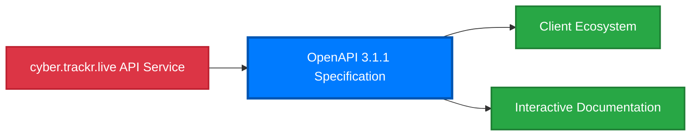
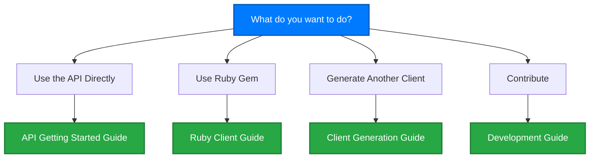

## OpenAPI-First Architecture

Our OpenAPI 3.1.1 specification is the foundation for accessing [cyber.trackr.live](https://cyber.trackr.live) API data and drives the entire client ecosystem. [Learn more about our approach](/project/collaboration).

## Getting Started

Choose your path based on what you want to do:

### Choose Your Path

#### 🌐 **I want to use the API directly**
→ **[API Getting Started Guide](/api-reference/getting-started)** - Make your first API call in 30 seconds with curl, JavaScript, Python, or PowerShell examples.

#### 💎 **I want to use the Ruby gem**
→ **[Ruby Client Guide](/clients/ruby/)** - Install the gem and use helper methods for STIG workflows. Production-ready with extensive examples.

#### 🔧 **I want to generate a client in another language**
→ **[Client Generation Guide](/clients/generation/overview)** - Generate TypeScript, Python, Go, Java, or 50+ other language clients from our OpenAPI spec.

#### 🤝 **I want to contribute or understand the architecture**
→ **[Development Guide](/development/)** - Learn about our OpenAPI-first approach, testing strategy, and how to contribute.

## Why OpenAPI-First Matters

Our specification-driven approach provides:

- **Single source of truth** - All clients and documentation generated from the OpenAPI spec
- **Consistent implementations** - Same behavior across Ruby, TypeScript, Python, Go clients
- **Always up-to-date documentation** - Interactive docs generated from the specification
- **Professional validation** - Spectral linting ensures specification quality

[Learn more about OpenAPI-first development](/openapi/benefits) and how it solves common API challenges.

## Quick Access

### For Users
- **[API Getting Started](/api-reference/getting-started)** - Your first API call
- **[Ruby Client](/clients/ruby/)** - Production-ready gem with helpers
- **[Generate Clients](/clients/generation/overview)** - Create clients for any language
- **[Interactive API Docs](/api-reference/)** - Try endpoints in your browser

### For Contributors
- **[Development Guide](/development/)** - Architecture and testing approaches
- **[OpenAPI Specification](/openapi/)** - Core specification details
- **[Project Information](/project/)** - Contributing, security, and governance

## Community & Support

- 📚 **Documentation**: Comprehensive guides throughout this site
- 🐛 **Issues**: [GitHub Issues](https://github.com/mitre/cyber-trackr-live/issues) for bugs and features
- 💬 **Discussions**: [GitHub Discussions](https://github.com/mitre/cyber-trackr-live/discussions) for questions
- 🤝 **Project Details**: [Learn about our approach](/project/collaboration) and MITRE's role

---

**The OpenAPI 3.1.1 specification is the foundation that drives everything else.** [Explore the specification](/openapi/) to understand how it powers the entire ecosystem.