## OpenAPI Specification Partnership

Our OpenAPI 3.1.1 specification provides the foundation for accessing [cyber.trackr.live](https://cyber.trackr.live) API data. [Learn more about our partnership](./guide/) and how the specification drives the entire client ecosystem.

## Getting Started

Choose your path to explore the OpenAPI specification and client ecosystem:

```mermaid
graph TD
    A["🚀 Start Here"] --> B["📋 OpenAPI Specification<br/>Core Project"]
    A --> C["💎 Ruby Client<br/>Production Ready"]
    A --> D["🔧 Generate Client<br/>Your Language"]
    A --> E["📚 Interactive Docs<br/>Try-it-out"]
    
    B --> F["Explore Specification"]
    C --> G["Quick Start Guide"]
    D --> H["Client Generation"]
    E --> I["API Reference"]
    
    style A fill:#007bff,stroke:#0056b3,stroke-width:2px,color:#ffffff
    style B fill:#007bff,stroke:#0056b3,stroke-width:2px,color:#ffffff
    style C fill:#28a745,stroke:#1e7e34,stroke-width:2px,color:#ffffff
    style D fill:#28a745,stroke:#1e7e34,stroke-width:2px,color:#ffffff
    style E fill:#28a745,stroke:#1e7e34,stroke-width:2px,color:#ffffff
```

### Primary Paths

1. **[OpenAPI Specification](/openapi/)** - Explore the core project and specification details
2. **[Installation Guide](/guide/installation)** - Set up the Ruby client or development environment
3. **[API Reference](/api-reference/)** - Interactive documentation with try-it-out functionality
4. **[Client Generation](/clients/)** - Generate clients in TypeScript, Python, Go, and other languages

## Why OpenAPI-First Matters

Our specification-driven approach provides:

- **Single source of truth** - All clients and documentation generated from the OpenAPI spec
- **Consistent implementations** - Same behavior across Ruby, TypeScript, Python, Go clients
- **Always up-to-date documentation** - Interactive docs generated from the specification
- **Professional validation** - Spectral linting ensures specification quality

[Learn more about OpenAPI-first development](/openapi/benefits) and how it solves common API challenges.

## Quick Access

- **[OpenAPI Specification](/openapi/)** - Core project and specification details
- **[Installation Guide](/guide/installation)** - Set up Ruby client or development environment  
- **[API Reference](/api-reference/)** - Interactive documentation with try-it-out
- **[Development Patterns](/development/)** - Architecture and testing approaches
- **[Project Information](/project/)** - Contributing, security, and governance

## Community & Support

- 📚 **Documentation**: Comprehensive guides throughout this site
- 🐛 **Issues**: [GitHub Issues](https://github.com/mitre/cyber-trackr-live/issues) for bugs and features
- 💬 **Discussions**: [GitHub Discussions](https://github.com/mitre/cyber-trackr-live/discussions) for questions
- 🏢 **MITRE**: Created and maintained by [MITRE Corporation](https://www.mitre.org/)

---

**The OpenAPI 3.1.1 specification is the foundation that drives everything else.** [Explore the specification](/openapi/) to understand how it powers the entire ecosystem.