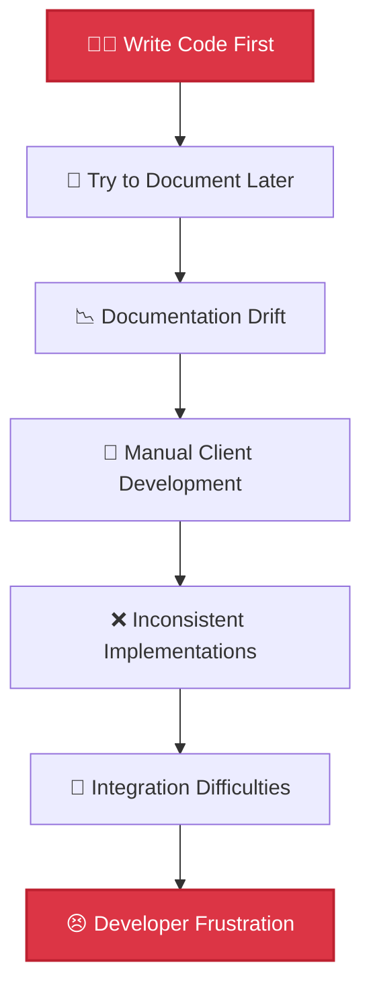
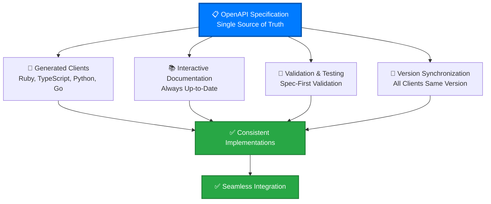
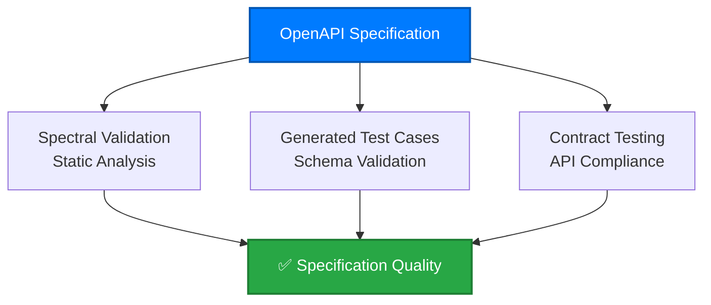
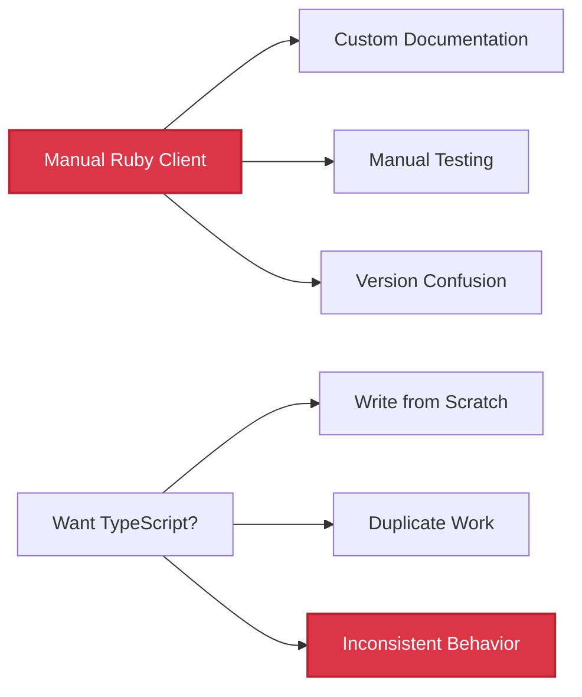
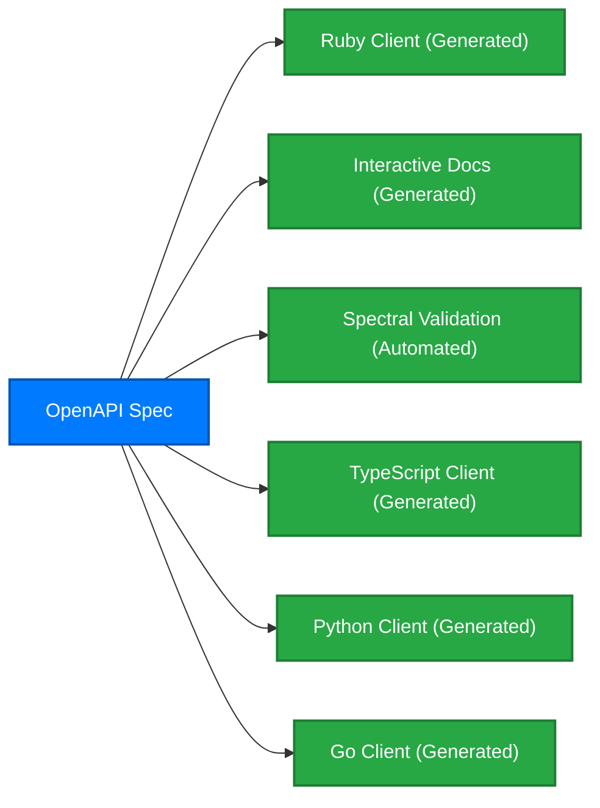
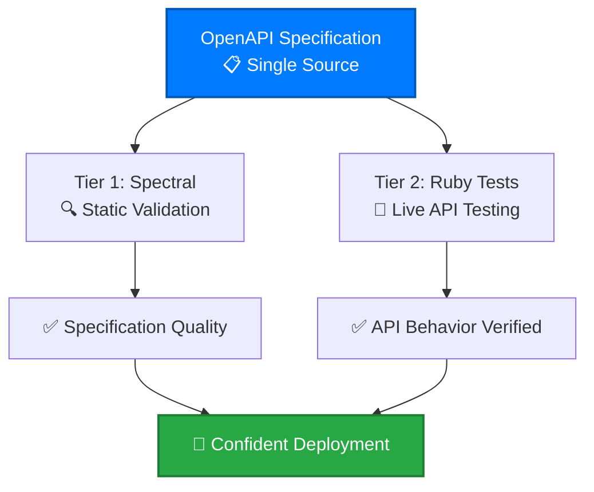
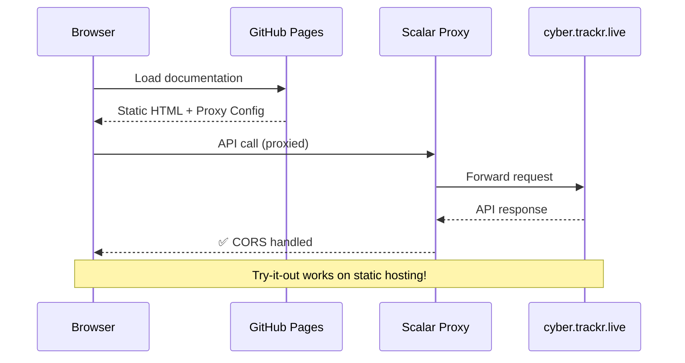
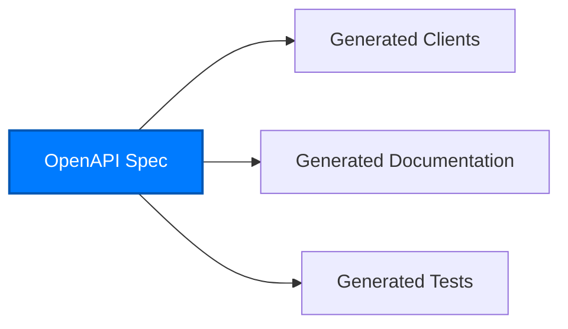
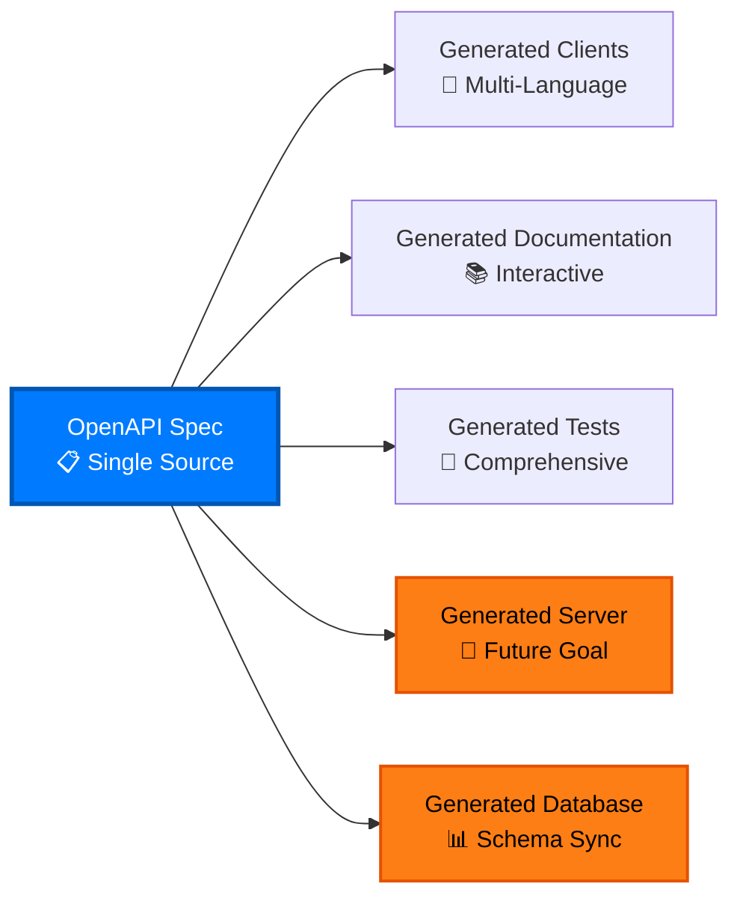

# OpenAPI-First Development Benefits

Why we chose OpenAPI-first development and how it solves fundamental API development challenges.

## 🎯 **The Problem with Traditional API Development**

### **Code-First Approach (Traditional)**


**Common Problems:**
- 📚 **Documentation always out of date** - Written after code changes
- 🔧 **Manual client development** - Every language requires custom work
- ❌ **Inconsistent implementations** - Different clients behave differently
- 🐛 **Integration surprises** - Undocumented edge cases and breaking changes
- 🕐 **Slow development cycles** - Changes require updates across multiple codebases

## 🚀 **OpenAPI-First Solution**

### **Specification-Driven Approach (Our Method)**


## 🏆 **Key Benefits of OpenAPI-First**

### **1. Single Source of Truth**
```yaml
# One specification defines everything
openapi: 3.1.1
info:
  title: cyber.trackr.live API
  version: 1.2.1
paths:
  /api/stig:
    get:
      summary: List all STIG documents
      # This drives client generation, docs, and validation
```

**Benefits:**
- 📋 **Centralized definition** - All API behavior in one place
- 🔄 **Synchronized updates** - Change spec, update everything
- 🎯 **Consistent behavior** - Same logic across all clients
- 📚 **Authoritative documentation** - Generated from the source of truth

### **2. Automatic Client Generation**
```bash
# Generate any language from the same specification
docker run --rm -v "${PWD}:/local" openapitools/openapi-generator-cli generate \
  -i /local/openapi/openapi.yaml \
  -g typescript-fetch \
  -o /local/generated/typescript

# Ruby, Python, Go, Java, C#, PHP, Rust, and 50+ more languages
```

**Benefits:**
- 💎 **Multi-language support** - 50+ languages supported
- ⚡ **Accelerated client development** - Automated generation vs manual development
- 🔧 **Consistent interfaces** - Same method names across languages
- 🐛 **Fewer bugs** - Generated code is tested and reliable

### **3. Interactive Documentation**


**Benefits:**
- 🔧 **Try-it-out functionality** - Test API calls directly in browser
- 📱 **Always up-to-date** - Generated from specification
- 🎯 **Real examples** - Actual API responses shown
- 📚 **Self-documenting** - Developers can explore independently

### **4. Specification-Driven Testing**


**Benefits:**
- 🧪 **Validate before implementation** - Catch issues early
- 🔍 **Automated compliance** - API matches specification
- 📊 **Quality metrics** - Specification completeness tracking
- 🛡️ **Regression prevention** - Changes validated against spec

### **5. Version Synchronization**
```yaml
# All clients use the same version from the specification
info:
  version: 1.2.1

# Ruby client gem version: 1.2.1
# TypeScript client npm version: 1.2.1
# Python client pip version: 1.2.1
```

**Benefits:**
- 🔄 **Coordinated releases** - All clients update together
- 📋 **Clear versioning** - Semantic versioning across ecosystem
- 🚀 **Simplified deployment** - Single version to track
- 🔧 **Easier debugging** - Know exactly what version is running

## 🌟 **Real-World Impact: cyber.trackr.live**

### **Before OpenAPI-First**


### **After OpenAPI-First**


### **Measurable Results**
- ⚡ **< 1 second** specification validation with Spectral
- 🧪 **363 tests** running across 3 platforms × 3 Ruby versions
- 📦 **15+ endpoints** fully documented and tested
- 🌐 **GitHub Pages deployment** with working try-it-out functionality
- 💎 **Production-ready Ruby client** with comprehensive helper methods

## 🔧 **Technical Implementation Benefits**

### **Two-Tier Testing Architecture**


**Benefits:**
- 🎯 **Separation of concerns** - Different tools for different validation
- 🚀 **Faster feedback** - Spectral validation in under 1 second
- 🔍 **Comprehensive coverage** - Static analysis + dynamic testing
- 📊 **Clear metrics** - Both specification quality and API behavior

### **CORS-Free Documentation**


**Benefits:**
- 🌐 **Static hosting compatibility** - Works on GitHub Pages
- 🔧 **Interactive functionality** - Try-it-out without CORS issues
- 💰 **Cost-effective** - No server required for documentation
- 📱 **Global CDN** - Fast loading worldwide

## 🔮 **Future Vision: Spec-Driven Everything**

### **Current State**


### **Future Vision**


**Future Possibilities:**
- 🚀 **Server generation** - API implementation from specification
- 📊 **Database schema generation** - Data models from OpenAPI schemas
- 🔄 **Bidirectional sync** - Specification ↔ Implementation
- 🧪 **Complete test automation** - End-to-end testing generated

## 📊 **Adoption Benefits by Role**

### **For API Consumers**
- 💎 **Ready-to-use clients** - No manual HTTP client coding
- 📚 **Interactive documentation** - Explore and test immediately
- 🔧 **Consistent experience** - Same patterns across all clients
- 🐛 **Fewer integration issues** - Generated code is tested

### **For API Developers**
- 🎯 **Design-first approach** - Think about API before implementation
- 🔍 **Automated validation** - Catch issues before deployment
- 📋 **Living documentation** - Always up-to-date
- 🚀 **Faster development** - Focus on business logic, not client code

### **For DevOps/Platform Teams**
- 🌐 **Consistent deployment** - Same patterns across all APIs
- 📊 **Quality metrics** - Specification completeness tracking
- 🔄 **Version management** - Clear semantic versioning
- 🧪 **Automated testing** - Specification-driven validation

### **For Enterprise Organizations**
- 📋 **Standardized approach** - Same patterns across all APIs
- 💰 **Cost reduction** - Less manual client development
- 🔧 **Improved developer experience** - Faster integration
- 🛡️ **Risk mitigation** - Fewer integration failures

## 🎯 **Getting Started with OpenAPI-First**

### **1. Start with the Specification**
```yaml
openapi: 3.1.1
info:
  title: Your API
  version: 1.0.0
paths:
  /api/example:
    get:
      summary: Example endpoint
      responses:
        '200':
          description: Success response
```

### **2. Validate Early and Often**
```bash
# Use Spectral for validation
spectral lint openapi.yaml

# Add custom rules for your domain
spectral lint openapi.yaml --ruleset .spectral.yml
```

### **3. Generate Everything**
```bash
# Generate clients
openapi-generator-cli generate -i openapi.yaml -g ruby

# Generate documentation
redoc-cli build openapi.yaml

# Generate tests
openapi-generator-cli generate -i openapi.yaml -g ruby-test
```

### **4. Iterate and Improve**
- 🔄 **Specification first** - Always update spec before implementation
- 🧪 **Test-driven** - Write tests based on specification
- 📚 **Documentation-driven** - Use interactive docs for feedback
- 🎯 **User-centered** - Focus on API consumer experience

## 📚 **Learn More**

- **[OpenAPI Specification Details](./specification.md)** - Technical implementation
- **[Spectral Validation](./validation.md)** - Our quality assurance approach
- **[Client Generation Guide](/clients/generation.md)** - How to generate your own clients
- **[Development Patterns](/development/)** - Apply these patterns to your APIs

---

**OpenAPI-first development isn't just about tools—it's about creating a better experience for everyone who builds with APIs.** Start with the specification, and everything else follows naturally.