# OpenAPI 3.1.1 Specification

The **OpenAPI 3.1.1 specification** is the core of our project - a comprehensive, production-ready API definition for the cyber.trackr.live service that drives our entire client ecosystem.

## 🎯 **The OpenAPI Specification as Our Core Project**

```mermaid
graph TB
    A["🎯 OpenAPI 3.1.1 Specification<br/>CORE PROJECT"] --> B["💎 Ruby Client<br/>Production Ready"]
    A --> C["🔮 TypeScript Client<br/>Planned"]
    A --> D["🔮 Python Client<br/>Planned"]
    A --> E["🔮 Go Client<br/>Planned"]
    A --> F["📚 Interactive Documentation<br/>VitePress + Scalar"]
    A --> G["🧪 Two-Tier Testing<br/>Spectral + Ruby"]
    A --> H["🔧 Development Patterns<br/>Universal OpenAPI"]
    
    style A fill:#007bff,stroke:#0056b3,stroke-width:3px,color:#ffffff
    style B fill:#28a745,stroke:#1e7e34,stroke-width:2px,color:#ffffff
    style C fill:#6c757d,stroke:#495057,stroke-width:2px,color:#ffffff
    style D fill:#6c757d,stroke:#495057,stroke-width:2px,color:#ffffff
    style E fill:#6c757d,stroke:#495057,stroke-width:2px,color:#ffffff
    style F fill:#28a745,stroke:#1e7e34,stroke-width:2px,color:#ffffff
    style G fill:#28a745,stroke:#1e7e34,stroke-width:2px,color:#ffffff
    style H fill:#28a745,stroke:#1e7e34,stroke-width:2px,color:#ffffff
```



**Everything flows from the OpenAPI specification**: clients, documentation, testing, and development patterns all generate from this single source of truth.

## 📋 **What Makes Our OpenAPI Specification Special**

### **Complete DISA Cybersecurity Data Coverage**
- **1000+ DISA STIGs** (Security Technical Implementation Guides)
- **300+ SRGs** (Security Requirements Guides)
- **3000+ CCIs** (Control Correlation Identifiers)
- **RMF Controls** (Risk Management Framework)
- **87 SCAP Documents** (Security Content Automation Protocol)

### **Production-Ready Quality**
- ✅ **OpenAPI 3.1.1 compliant** - Latest specification standard
- ✅ **15+ endpoints** fully documented with examples
- ✅ **Spectral validation** - Professional-grade specification linting
- ✅ **Real-world tested** - Validated against live cyber.trackr.live API
- ✅ **Cross-platform compatible** - Works on Windows, macOS, Linux

### **Developer-Friendly Features**
- 🔧 **Comprehensive examples** for every endpoint
- 🎯 **Detailed error responses** with proper HTTP status codes  
- 📚 **Rich descriptions** for complex cybersecurity data structures
- 🌐 **CORS-compatible** for browser-based applications
- 📖 **Interactive documentation** with try-it-out functionality

## 🚀 **Official Partnership with cyber.trackr.live**

```mermaid
graph LR
    A["cyber.trackr.live<br/>🌐 Live API Service<br/>Data & Infrastructure"] --> B["MITRE OpenAPI Project<br/>📋 Specification & Ecosystem<br/>Clients & Documentation"]
    
    B --> C["🎯 Single Source of Truth<br/>OpenAPI 3.1.1 Spec"]
    B --> D["💎 Multi-Language Clients<br/>Ruby, TypeScript, Python, Go"]
    B --> E["📚 Interactive Documentation<br/>Try-it-out Interface"]
    B --> F["🧪 Universal Patterns<br/>Reusable OpenAPI Approaches"]
    
    style A fill:#dc3545,stroke:#bd2130,stroke-width:2px,color:#ffffff
    style B fill:#007bff,stroke:#0056b3,stroke-width:2px,color:#ffffff
    style C fill:#28a745,stroke:#1e7e34,stroke-width:2px,color:#ffffff
    style D fill:#28a745,stroke:#1e7e34,stroke-width:2px,color:#ffffff
    style E fill:#28a745,stroke:#1e7e34,stroke-width:2px,color:#ffffff
    style F fill:#28a745,stroke:#1e7e34,stroke-width:2px,color:#ffffff
```



**Division of Responsibilities:**
- **cyber.trackr.live**: API infrastructure, data management, security, performance
- **MITRE OpenAPI Project**: Specification, client ecosystem, documentation, testing patterns

## 🔧 **How to Use the OpenAPI Specification**

### **1. View the Specification**
```bash
# Raw OpenAPI YAML
curl https://raw.githubusercontent.com/mitre/cyber-trackr-live/main/openapi/openapi.yaml

# Or browse in repository
https://github.com/mitre/cyber-trackr-live/blob/main/openapi/openapi.yaml
```

### **2. Generate Your Own Client**
```bash
# TypeScript/JavaScript
docker run --rm -v "${PWD}:/local" openapitools/openapi-generator-cli generate \
  -i https://raw.githubusercontent.com/mitre/cyber-trackr-live/main/openapi/openapi.yaml \
  -g typescript-fetch -o ./cyber-trackr-client

# Python
docker run --rm -v "${PWD}:/local" openapitools/openapi-generator-cli generate \
  -i https://raw.githubusercontent.com/mitre/cyber-trackr-live/main/openapi/openapi.yaml \
  -g python -o ./cyber-trackr-client

# Go
docker run --rm -v "${PWD}:/local" openapitools/openapi-generator-cli generate \
  -i https://raw.githubusercontent.com/mitre/cyber-trackr-live/main/openapi/openapi.yaml \
  -g go -o ./cyber-trackr-client
```

### **3. Use Our Production-Ready Ruby Client**
[Install the Ruby client](../guide/installation.md#ruby-gem) and start using it immediately.

**Complete Ruby Examples**: See the [Ruby Client guide](/clients/ruby/) for comprehensive usage examples - all generated from this same OpenAPI specification.

## 📚 **Learn More About the OpenAPI Specification**

### **Deep Dive into the Specification**
- **[Specification Details](./specification.md)** - Technical details, endpoints, and schemas
- **[OpenAPI-First Benefits](./benefits.md)** - Why we chose specification-driven development
- **[Validation & Quality](./validation.md)** - Our professional-grade specification linting approach

### **Using the Specification**
- **[Client Ecosystem](/clients/)** - Ruby client and code generation guidance
- **[API Reference](/api-reference/)** - Interactive documentation with try-it-out
- **[Development Patterns](/development/)** - Architecture and testing approaches

### **Contributing to the Specification**
- **[Development Guide](/development/openapi-development.md)** - How to modify the OpenAPI spec
- **[Testing Approach](/development/api-testing.md)** - Our two-tier testing methodology
- **[Contributing Guidelines](/project/contributing.md)** - How to contribute improvements

## 🌟 **Why OpenAPI-First Development Matters**

### **Before OpenAPI-First (Traditional Approach)**


### **With OpenAPI-First (Our Approach)**


**OpenAPI-First Benefits:**
- 🎯 **Single Source of Truth** - Specification drives everything
- 💎 **Automatic Client Generation** - Clients in any language
- 📚 **Always Up-to-Date Documentation** - Generated from the spec
- 🧪 **Specification-Driven Testing** - Validate before implementation
- 🔄 **Version Synchronization** - All clients use the same spec version

## 🔮 **Future Vision: Spec-Driven API Development**

Our partnership with cyber.trackr.live is exploring **bidirectional spec-driven development**:


**Potential Future Benefits:**
- 🔄 **Bidirectional Sync** - Specification drives both client AND server
- 🎯 **API Compliance** - Server implementation matches specification
- 🚀 **Unified Development** - One specification, complete ecosystem
- 📋 **Enhanced Validation** - Real-time spec-to-implementation verification

## 🚀 **Get Started with the OpenAPI Specification**

Ready to use our OpenAPI specification? Choose your path:

1. **[Use the Ruby Client](/clients/ruby/)** - Production-ready with helper methods
2. **[Generate Your Own Client](/clients/generation/overview)** - Any language you prefer
3. **[Explore the API](/api-reference/)** - Interactive documentation
4. **[Learn the Patterns](/development/)** - Apply to your own OpenAPI projects

---

**The OpenAPI 3.1.1 specification is the foundation of everything we do.** Explore how it can power your cybersecurity compliance automation!