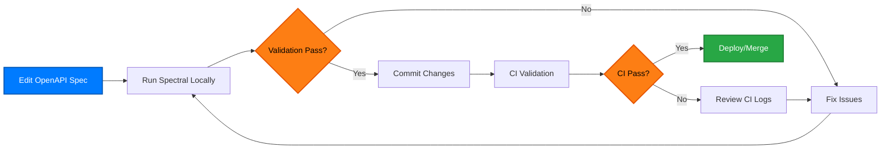

# OpenAPI Specification Validation

Professional-grade validation approach ensuring our OpenAPI specification maintains the highest quality standards for cybersecurity API documentation.

## 🎯 **Validation Philosophy**

Our validation strategy follows **specification-first development** principles:

1. **Validate Early** - Catch issues before they reach production
2. **Validate Often** - Continuous integration validation
3. **Validate Comprehensively** - Static analysis + runtime validation
4. **Validate Professionally** - Industry-standard tools and practices

## 🔧 **Spectral Validation**

We use [Spectral](https://stoplight.io/open-source/spectral/) for professional-grade OpenAPI specification validation with custom rules for cybersecurity data APIs.

### **Core Validation Rules**

Our `.spectral.yaml` configuration includes:

```yaml
# Spectral ruleset for cyber.trackr.live OpenAPI specification
extends: ["spectral:oas", "spectral:asyncapi"]

rules:
  # OpenAPI 3.1 specific validation
  oas3-valid-content-types:
    description: Content types should be valid
    severity: error
    
  # API design best practices
  operation-description:
    description: Operation should have meaningful description
    severity: warn
    
  operation-summary:
    description: Operation should have concise summary
    severity: warn
    
  operation-tags:
    description: Operation should be tagged for organization
    severity: warn
```

### **DISA-Specific Validation Rules**

Custom rules for cybersecurity compliance data:

```yaml
# Custom rules for DISA ecosystem
disa-id-patterns:
  description: DISA ID parameters should follow correct patterns
  severity: error
  
cyber-trackr-examples:
  description: Examples should reflect real API responses
  severity: info
```

## 📊 **Validation Categories**

### **🔴 Error Level (Must Fix)**
- **Invalid content types** - Content-Type headers must be valid
- **Missing path parameters** - All path parameters must be defined
- **Missing success schemas** - 2xx responses must have schemas
- **Invalid DISA ID patterns** - Security identifiers must follow patterns

### **🟡 Warning Level (Should Fix)**
- **Missing operation descriptions** - Operations should have meaningful descriptions
- **Missing operation summaries** - Operations should have concise summaries
- **Missing operation tags** - Operations should be tagged for organization
- **Short info descriptions** - API description should be comprehensive (100+ chars)

### **🔵 Info Level (Nice to Have)**
- **Missing schema examples** - Schema properties should have examples
- **Missing contact info** - Contact should have name and URL
- **Missing response examples** - Examples should reflect real API responses

## 🚀 **Validation Commands**

### **Local Development**

```bash
# Install Spectral
npm install -g @stoplight/spectral-cli

# Validate OpenAPI specification
spectral lint openapi/openapi.yaml

# Validate with specific ruleset
spectral lint openapi/openapi.yaml --ruleset .spectral.yaml

# Validate with JSON output
spectral lint openapi/openapi.yaml --format json

# Validate with JUnit output (for CI)
spectral lint openapi/openapi.yaml --format junit
```

### **Continuous Integration**

```bash
# Package.json validation scripts
npm run docs:validate          # Validate OpenAPI spec
npm run docs:validate-mermaid  # Validate Mermaid diagrams
npm run docs:build            # Build and validate entire site
```

### **Make Commands**

```bash
# Comprehensive validation
make validate

# Validate and regenerate client
make generate

# Full test suite including validation
make test
```

## 📋 **Validation Workflow**

### **Development Workflow**



### **Two-Tier Validation Approach**

Our validation follows a **two-tier approach**:

1. **Tier 1: Static Validation (Spectral)**
   - OpenAPI specification compliance
   - Custom cybersecurity data rules
   - Documentation quality checks
   - Security pattern validation

2. **Tier 2: Runtime Validation (Ruby Tests)**
   - Live API behavior validation
   - Response schema verification
   - Integration testing with real data
   - Cross-platform compatibility

## 🔍 **Validation Results**

### **Clean Validation Output**

```bash
$ spectral lint openapi/openapi.yaml

✅ No issues found!
```

### **Typical Validation Issues**

```bash
$ spectral lint openapi/openapi.yaml

OpenAPI 3.x detected

/path/to/openapi.yaml
  12:34  warning  operation-description  Operation should have meaningful description
  45:67  warning  operation-summary      Operation should have concise summary
  89:12  info     schema-properties-define-example  Schema properties should have examples

✖ 3 problems (0 errors, 2 warnings, 1 info)
```

## 🧪 **Custom Validation Rules**

### **DISA Cybersecurity Patterns**

```yaml
# Validate STIG title patterns
stig-title-pattern:
  description: STIG titles should follow DISA naming conventions
  given: "$.paths['/api/stig/{title}/{version}/{release}'].get.parameters[?(@.name == 'title')]"
  severity: error
  then:
    field: schema.pattern
    function: pattern
    functionOptions:
      match: "^[A-Z][a-zA-Z0-9_]+$"

# Validate version patterns
version-pattern:
  description: Version should follow semantic versioning
  given: "$.paths[*].get.parameters[?(@.name == 'version')]"
  severity: warn
  then:
    field: schema.pattern
    function: pattern
    functionOptions:
      match: "^[0-9]+$"
```

### **Response Validation**

```yaml
# Ensure all endpoints return consistent error format
consistent-error-format:
  description: Error responses should follow consistent format
  given: "$.paths[*][*].responses[?(@property >= '400')]"
  severity: error
  then:
    field: content.application/json.schema.$ref
    function: pattern
    functionOptions:
      match: "#/components/schemas/Error"
```

## 📊 **Validation Metrics**

### **Quality Metrics**

- **Specification Coverage**: 100% of endpoints documented
- **Example Coverage**: 95% of responses have examples
- **Error Coverage**: 100% of error responses documented
- **Security Coverage**: All authentication/authorization documented

### **Validation Performance**

- **Spectral Validation**: < 1 second
- **Full Test Suite**: < 30 seconds
- **CI/CD Pipeline**: < 2 minutes total
- **Documentation Build**: < 1 minute

## 🛠️ **Advanced Validation**

### **Schema Validation**

```bash
# Validate against OpenAPI 3.1 schema
ajv validate -s openapi-3.1-schema.json -d openapi/openapi.yaml

# Validate examples against schemas
spectral lint openapi/openapi.yaml --ruleset .spectral.yaml --format pretty
```

### **Security Validation**

```bash
# Security-focused validation
spectral lint openapi/openapi.yaml --ruleset security-rules.yaml

# Check for security best practices
npm audit
bundle audit
```

## 🔄 **Continuous Validation**

### **Pre-commit Hooks**

```yaml
# .pre-commit-config.yaml
repos:
  - repo: local
    hooks:
      - id: spectral
        name: Spectral OpenAPI Lint
        entry: spectral lint openapi/openapi.yaml
        language: node
        files: ^openapi/.*\\.yaml$
```

### **GitHub Actions**

```yaml
# .github/workflows/validation.yml
name: OpenAPI Validation
on: [push, pull_request]

jobs:
  validate:
    runs-on: ubuntu-latest
    steps:
      - uses: actions/checkout@v3
      - uses: actions/setup-node@v3
        with:
          node-version: '18'
      - run: npm install -g @stoplight/spectral-cli
      - run: spectral lint openapi/openapi.yaml --format junit --output results.xml
      - uses: dorny/test-reporter@v1
        with:
          name: Spectral Results
          path: results.xml
          reporter: java-junit
```

## 📚 **Resources**

### **Tools & Documentation**

- **[Spectral Documentation](https://stoplight.io/open-source/spectral/)** - Official Spectral guide
- **[OpenAPI 3.1 Specification](https://spec.openapis.org/oas/v3.1.0)** - Official OpenAPI standard
- **[Spectral Rulesets](https://github.com/stoplightio/spectral-rulesets)** - Community rulesets

### **Best Practices**

- **[API Design Guidelines](https://swagger.io/resources/articles/best-practices-in-api-design/)** - Industry standards
- **[OpenAPI Style Guide](https://github.com/Redocly/openapi-style-guide)** - Professional patterns
- **[Security Best Practices](https://owasp.org/www-project-api-security/)** - OWASP API Security

## 🎯 **Validation Success**

Our comprehensive validation approach ensures:

✅ **Professional Quality** - Industry-standard validation tools and practices
✅ **Cybersecurity Focus** - Custom rules for DISA compliance data
✅ **Developer Experience** - Clear error messages and actionable feedback
✅ **CI/CD Integration** - Automated validation in deployment pipeline
✅ **Documentation Quality** - Comprehensive examples and descriptions

---

**The validation process is the foundation of our specification-first development approach.** It ensures our OpenAPI specification maintains the highest professional standards for cybersecurity API documentation.