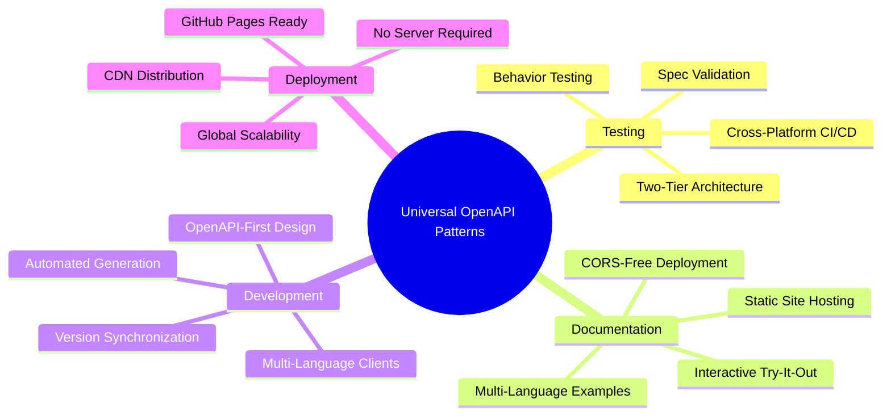

# Universal OpenAPI Project Patterns

## Overview

The cyber.trackr.live project demonstrates **proven patterns that work for ANY OpenAPI project**, from simple APIs to complex enterprise systems. These patterns solve common challenges in OpenAPI-driven development.

## Core Patterns



### 1. **Two-Tier Testing Architecture**

**Problem**: Chicken-and-egg dependency between spec validation and client testing

**Solution**: Separate static validation from behavioral testing
- **Tier 1**: Spectral validates OpenAPI specification (Node.js)
- **Tier 2**: Generated clients test live API behavior (Ruby/Python/TypeScript)

**Benefit**: Works for any language stack, eliminates circular dependencies

### 2. **OpenAPI-First Version Management**

**Problem**: Keeping spec version in sync with client libraries and documentation

**Solution**: Single source of truth in `openapi.yaml`
```yaml
# openapi/openapi.yaml
info:
  version: "1.2.3"  # Single source of truth
```

**Automation**: Version propagates to:
- Generated clients (`gemspec`, `package.json`)
- Documentation sites
- Git tags
- Release artifacts

### 3. **CORS-Free Documentation Deployment**

**Problem**: Static site hosting can't proxy API calls (CORS blocks try-it-out features)

**Solution**: Global fetch interceptor with external proxy
```javascript
// Transparent CORS handling for GitHub Pages
window.fetch = (input, init) => {
  if (isExternalAPI(input)) {
    return proxyFetch(input, 'https://proxy.scalar.com')
  }
  return originalFetch(input, init)
}
```

**Benefit**: Interactive API docs work on any static hosting platform

### 4. **Multi-Language Client Generation**

**Pattern**: One OpenAPI spec → Multiple client libraries
```bash
# Ruby client
openapi-generator-cli generate -g ruby --library=faraday

# TypeScript client  
openapi-generator-cli generate -g typescript-fetch

# Python client
openapi-generator-cli generate -g python --library=requests
```

**Coordination**: All clients share same version from OpenAPI spec

### 5. **Documentation Architecture**

**Structure**: Separate concerns by audience
- **API Reference**: Interactive docs for API consumers
- **Client Libraries**: Language-specific usage guides  
- **Development**: Implementation and architecture docs
- **Patterns**: Reusable approaches for other projects

## Real-World Implementation

### Project Structure Template
```
project-name/
├── openapi/
│   └── openapi.yaml              # Single source of truth
├── clients/
│   ├── ruby/                     # Generated Ruby client
│   ├── typescript/               # Generated TypeScript client  
│   └── python/                   # Generated Python client
├── docs/
│   ├── api/                      # Interactive API reference
│   ├── clients/                  # Client library guides
│   ├── development/              # Architecture docs
│   └── patterns/                 # This document!
├── scripts/
│   ├── generate-clients.sh       # Multi-language generation
│   └── sync-versions.sh          # Version consistency
└── tests/
    ├── spec-validation/          # Spectral tests
    └── integration/              # Live API tests
```

### Release Process Template
1. **Update version** in `openapi.yaml`
2. **Generate clients** for all target languages
3. **Run two-tier tests** (spec + integration)
4. **Build documentation** with interactive features
5. **Release coordinated** across all artifacts

## Why This Matters

### For Enterprise APIs
- **Consistency**: Same patterns across all API projects
- **Governance**: Centralized specification management
- **Quality**: Automated validation and testing
- **Documentation**: Self-service for API consumers

### For Open Source Projects
- **Accessibility**: Works with free hosting (GitHub Pages)
- **Multi-language**: Supports diverse contributor base
- **Maintainability**: Clear separation of concerns
- **Scalability**: Patterns grow with project complexity

### For Individual Developers
- **Speed**: Proven patterns eliminate trial-and-error
- **Reliability**: Battle-tested solutions
- **Learning**: Understanding transfers between projects
- **Future-proofing**: Patterns adapt to new requirements

## Adoption Guide

### Quick Start (Any Project)
1. **Structure your OpenAPI spec** as single source of truth
2. **Implement two-tier testing** (Spectral + your language)
3. **Set up interactive documentation** with CORS proxy
4. **Automate client generation** for your target languages

### Advanced Implementation
1. **Version management automation** across all artifacts
2. **Multi-language client libraries** with coordinated releases
3. **Enterprise-grade documentation** with examples and guides
4. **Comprehensive testing strategy** covering spec and behavior

## Key Insight

**These patterns solve universal problems in OpenAPI development:**
- Dependency management
- Version synchronization  
- Cross-platform compatibility
- Documentation deployment
- Multi-language support

**The cyber.trackr.live implementation proves these patterns work at scale** with:
- 15+ OpenAPI endpoints
- Windows/macOS/Linux compatibility
- Ruby client generation
- Interactive documentation
- Automated testing pipeline

## Getting Started

1. **Study this project**: See patterns in action
2. **Copy the structure**: Adapt to your needs
3. **Implement incrementally**: Start with two-tier testing
4. **Scale up**: Add multi-language support as needed

**Result**: Robust, maintainable OpenAPI projects that scale from prototype to enterprise.