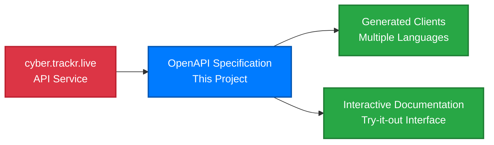

# Project Collaboration

## Collaboration with cyber.trackr.live

This project provides an **OpenAPI specification and client ecosystem** for the [cyber.trackr.live](https://cyber.trackr.live) API service.

### Project Structure

### What Each Component Provides

**cyber.trackr.live provides:**
- API service infrastructure
- Cybersecurity compliance data
- Hosting and performance
- Data collection and updates

**This project provides:**
- OpenAPI 3.1.1 specification
- Multi-language client libraries
- Interactive documentation
- Testing frameworks and patterns
- Development tools and examples

### Benefits of This Approach

This model provides:

- **Clear separation** - API service vs. developer tooling
- **Independent development** - Each project can evolve at its own pace
- **Community value** - Open source patterns applicable to other APIs
- **Comprehensive tooling** - Full developer ecosystem around the API

## MITRE Corporation

This project is developed and maintained by [MITRE Corporation](https://www.mitre.org/) as part of the [Security Automation Framework (SAF)](https://saf.mitre.org/).

### SAF Mission

The Security Automation Framework enables organizations to:
- Automate cybersecurity compliance and risk management
- Implement consistent security practices across environments
- Reduce manual security assessment overhead
- Build reusable security automation tools

### MITRE's Role

- **Technical leadership** in OpenAPI specification development
- **Open source community** building and maintenance
- **Universal patterns** development for broader ecosystem benefit
- **Industry best practices** implementation and documentation

## Community & Support

- 🐛 **Issues**: [GitHub Issues](https://github.com/mitre/cyber-trackr-live/issues)
- 💬 **Discussions**: [GitHub Discussions](https://github.com/mitre/cyber-trackr-live/discussions)
- 🔗 **API Service**: [cyber.trackr.live](https://cyber.trackr.live)
- 🏢 **MITRE Corporation**: [mitre.org](https://www.mitre.org/)
- 🛡️ **SAF Framework**: [saf.mitre.org](https://saf.mitre.org/)

---

This approach demonstrates how open source tooling can create comprehensive developer ecosystems around public APIs, benefiting the entire cybersecurity community.