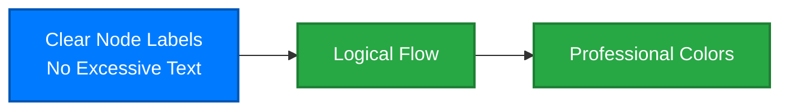

# Documentation Style Guide

Professional writing standards for the cyber.trackr.live OpenAPI project documentation.

## 🎯 **Core Principles**

### **1. Professional Tone**
- **Authoritative but accessible** - Expert knowledge presented clearly
- **Factual and precise** - Technical accuracy without marketing hyperbole
- **Helpful and practical** - Focus on user needs and real-world applications

### **2. OpenAPI-First Hierarchy**
- **OpenAPI specification is the core project** - Always emphasize this hierarchy
- **Clients are sub-projects** - Ruby (production), others (planned)
- **Future vision is spec-driven development** - Both client and server

### **3. Content Organization**
- **Single source of truth** - No duplicate content
- **Clear user journeys** - Logical paths for different user types
- **Consistent linking** - "See [Installation Guide](../guide/installation.md)" format

## 📝 **Writing Standards**

### **Language Guidelines**

#### **❌ AVOID: Overly Zealous Language**
- ~~"revolutionary"~~ → "innovative" or "advanced"
- ~~"perfect"~~ → "accurate" or "comprehensive"
- ~~"amazing"~~ → "effective" or "robust"
- ~~"incredible"~~ → "notable" or "significant"
- ~~"breakthrough"~~ → "advancement" or "improvement"
- ~~"game-changing"~~ → "impactful" or "substantial"

#### **✅ PREFER: Professional Alternatives**
- **"Production-ready"** instead of "perfect"
- **"Comprehensive"** instead of "amazing"
- **"Effective"** instead of "awesome"
- **"Robust"** instead of "incredible"
- **"Advanced"** instead of "revolutionary"

### **Technical Writing**

#### **API Data Numbers (Standardized)**
Always use these exact numbers consistently:
- **1000+ DISA STIGs** (Security Technical Implementation Guides)
- **300+ SRGs** (Security Requirements Guides)
- **3000+ CCIs** (Control Correlation Identifiers)
- **RMF Controls** (Risk Management Framework - no specific number)
- **87 SCAP Documents** (Security Content Automation Protocol)

#### **Project Terminology**
- **"OpenAPI 3.1.1 specification"** - The core project
- **"Ruby client"** - Production-ready sub-project
- **"Client ecosystem"** - All current and planned clients
- **"cyber.trackr.live"** - The API service (our partner)
- **"OpenAPI-first development"** - Our methodology

#### **Partnership Language**
- **"Official partnership"** - Describes our relationship
- **"Specification project"** - We provide the OpenAPI spec and clients
- **"API service"** - cyber.trackr.live provides the live API
- **"Collaboration"** - Working together, not competing

## 🎨 **Visual Standards**

### **Emoji Usage**
Use emojis **sparingly** and **professionally**:

#### **✅ APPROPRIATE:**
- 📋 **Documentation/specs** - OpenAPI specification
- 💎 **Production-ready** - Ruby client
- 🔧 **Tools/development** - Development tools
- 🌐 **Web/API** - Web services, APIs
- ✅ **Completed/validated** - Successful states
- 🎯 **Goals/objectives** - Key points
- 📚 **Learning/guides** - Documentation

#### **❌ AVOID:**
- 🎉 **Celebration** - Too enthusiastic
- 🚀 **Rocket** - Overused in tech
- 💯 **100 percent** - Too casual
- 🔥 **Fire** - Too casual
- ✨ **Sparkles** - Too decorative

### **Diagram Standards**

#### **Mermaid Diagrams**


#### **Color Scheme**
- **Primary (Blue)**: `#007bff` - Core concepts, OpenAPI spec
- **Success (Green)**: `#28a745` - Completed items, positive outcomes
- **Warning (Orange)**: `#fd7e14` - In progress, planned items
- **Secondary (Gray)**: `#6c757d` - Future/planned items
- **Danger (Red)**: `#dc3545` - Problems, before states

#### **Text in Diagrams**
- **Keep concise** - Maximum 2 lines per node
- **Use `<br/>` for line breaks** - Always quoted in Mermaid
- **No excessive emojis** - Maximum 1 per node
- **Clear hierarchy** - Visual emphasis on core concepts

## 📖 **Content Structure**

### **Page Layout Standards**

#### **Frontmatter (Required)**
```yaml
---
title: Page Title
description: Brief description of the page content
layout: doc
sidebar: true
---
```

#### **Page Structure**
1. **# Main Title** - Clear, descriptive
2. **Brief introduction** - 1-2 sentences explaining the page
3. **## Section Headers** - Logical organization
4. **### Subsections** - Detailed content
5. **Navigation links** - "Learn More" or "Next Steps"

### **Section Organization**

#### **Introduction Sections**
- **Problem statement** - What challenge does this solve?
- **Solution overview** - How does our approach address it?
- **Key benefits** - Why should users care?
- **Getting started** - Clear next steps

#### **Technical Sections**
- **Overview** - High-level explanation
- **Prerequisites** - What users need
- **Step-by-step instructions** - Clear, actionable
- **Examples** - Real-world usage
- **Troubleshooting** - Common issues

#### **Reference Sections**
- **Complete information** - Comprehensive coverage
- **Organized logically** - Easy to find specific details
- **Cross-references** - Links to related concepts
- **Examples** - Practical applications

### **Code Examples**

#### **Installation Commands**
```bash
# Always use the standard gem installation
gem install cyber_trackr_live

# Or for Gemfile
gem 'cyber_trackr_live'
```

#### **Ruby Code Examples**
```ruby
require 'cyber_trackr_live'

# Use descriptive variable names
helper = CyberTrackrHelper.new

# Show realistic examples
stigs = helper.list_stigs
puts "Found #{stigs.count} STIGs available"
```

#### **OpenAPI Examples**
```yaml
# Use proper YAML formatting
openapi: 3.1.1
info:
  title: cyber.trackr.live API
  version: 1.2.1
```

## 🔗 **Linking Strategy**

### **Internal Links**
- **Relative paths** - `../guide/installation.md`
- **Descriptive text** - `[Installation Guide](../guide/installation.md)`
- **Consistent format** - Always use descriptive link text

### **External Links**
- **Full URLs** - `https://cyber.trackr.live`
- **Professional descriptions** - `[cyber.trackr.live](https://cyber.trackr.live) API service`
- **Context provided** - Explain why linking externally

### **Cross-References**
- **Single source links** - Point to authoritative content
- **Brief context** - "See [Installation Guide](../guide/installation.md) for setup instructions"
- **No duplicate content** - Always link rather than repeat

## 🏗️ **File Organization**

### **Directory Structure**
```
docs/
├── openapi/           # Core project (OpenAPI spec)
├── guide/            # Getting started (user journey)
├── clients/          # Sub-projects (Ruby, generated)
├── development/      # Architecture and patterns
├── project/          # Governance and meta-information
└── future/           # Roadmap and vision
```

### **File Naming**
- **Lowercase with hyphens** - `openapi-benefits.md`
- **Descriptive names** - `installation.md` not `setup.md`
- **Consistent patterns** - `index.md` for section overviews

### **Content Hierarchy**
1. **`index.md`** - Landing page (brief overview)
2. **`/openapi/`** - Core project documentation
3. **`/guide/`** - User journey and getting started
4. **`/clients/`** - Sub-project documentation
5. **`/development/`** - Technical implementation
6. **`/project/`** - Governance and contribution
7. **`/future/`** - Vision and roadmap

## 🎯 **Quality Checklist**

### **Before Publishing**
- [ ] **Professional tone** - No zealous language
- [ ] **Accurate data** - Consistent API numbers
- [ ] **Clear hierarchy** - OpenAPI spec as core project
- [ ] **Single source** - No duplicate content
- [ ] **Working links** - All internal links functional
- [ ] **Proper frontmatter** - VitePress compatibility
- [ ] **Mermaid validation** - Diagrams render correctly
- [ ] **Code examples** - Tested and accurate

### **Content Review**
- [ ] **User-focused** - Addresses real needs
- [ ] **Logically organized** - Clear information flow
- [ ] **Appropriately detailed** - Neither too brief nor verbose
- [ ] **Consistent terminology** - Standard project language
- [ ] **Clear next steps** - Obvious user journey

### **Technical Validation**
- [ ] **Links work** - All internal and external links
- [ ] **Code runs** - All examples are functional
- [ ] **Diagrams render** - Mermaid syntax correct
- [ ] **Mobile friendly** - Responsive design
- [ ] **Search optimized** - Good titles and descriptions

## 📚 **Examples of Good Documentation**

### **✅ GOOD: Professional Introduction**
```markdown
# OpenAPI Specification

The OpenAPI 3.1.1 specification is the core of our project - a comprehensive, 
production-ready API definition for the cyber.trackr.live service that drives 
our entire client ecosystem.

## Key Features

Our specification provides:
- Complete coverage of 1000+ DISA STIGs
- Production-ready Ruby client generation
- Interactive documentation with try-it-out functionality
```

### **❌ AVOID: Overly Zealous Language**
```markdown
# 🚀 AMAZING OpenAPI Specification! 

Our REVOLUTIONARY OpenAPI 3.1.1 specification is the PERFECT solution for 
accessing the INCREDIBLE cyber.trackr.live API! 

## 🎉 AWESOME Features

This BREAKTHROUGH specification delivers:
- COMPLETE coverage of 1000+ STIGs (it's AMAZING!)
- The BEST Ruby client you've ever seen
- PERFECT documentation that will blow your mind!
```

## 🔄 **Continuous Improvement**

### **Style Guide Updates**
- **Document patterns** - Add new standards as we discover them
- **Learn from feedback** - Incorporate user suggestions
- **Stay current** - Update with industry best practices

### **Content Maintenance**
- **Regular reviews** - Check for outdated information
- **Link validation** - Ensure all links remain functional
- **Consistency audits** - Verify adherence to style guide

This style guide ensures our documentation maintains professional quality while effectively communicating the value of our OpenAPI-first approach.

---

**Follow this guide for all documentation updates and new content creation.**